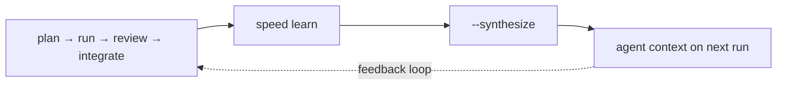

Without the learning system, feature 10 starts from zero. The agents carry the same blind spots, hit the same failure modes, and repeat the same mistakes that features 1 through 9 already surfaced. The Architect decomposes `lib/context/assembly.py` into oversized tasks again. The Developer reaches for raw `httpx` instead of the project wrapper again. The Reviewer flags the same false alarm again.

The learning system makes feature 10 start from where features 1 through 9 left off. After each feature completes the pipeline, `speed learn` extracts structured observations from every artifact the agents produced: task retries, reviewer findings, guardian verdicts, human corrections, context misses. Synthesis distills those observations into per-agent guidance, weighted by recency and consistency. On the next run, each agent receives learnings scoped to the files it's working on. The Developer sees "HTTP calls go through `lib/api/client.py:fetch()` — human corrected raw httpx in 2 prior features." The Architect sees "pipeline stage features follow a 5-task pattern; assembly tasks need smaller scope." Intelligence compounds because the structure retains it, not because someone remembered to update a wiki.



For CLI flags and options, see the [CLI Reference](/docs/api/cli/#learn). For the multiplayer knowledge collaboration workflow, see the [Multi-Player Reference](/docs/api/multiplayer-reference/#knowledge-pipeline).

## Extraction Pipeline

Running `speed learn` (no flags) against a feature triggers a 14-step extraction pipeline. Each step reads specific artifact files from the feature directory and produces typed observations.

### Steps 1-10: Core Extraction

| Step | Label | Source artifacts | Observation types produced |
|------|-------|-----------------|--------------------------|
| 1 | Task outcomes | `tasks/*.json`, gate logs | `retry`, `gate_failure`, `unattributed_changes` |
| 2 | Review findings | `logs/review-{task_id}.json` | `reviewer_finding` |
| 3 | Guardian verdicts | `logs/guardian-{task_id}.json` | `guardian_verdict` |
| 4 | Verify findings | `logs/plan-verification.log` | `verify_finding` |
| 5 | Coherence issues | `logs/coherence.log` | `coherence_issue` |
| 6 | Security findings | `logs/security-{task_id}.json` | `security_finding` |
| 7 | Context effectiveness | `.speed/context/tasks/{task_id}.md` vs git diff | `context_miss`, `context_waste` |
| 8 | Decomposition quality | Architect plan vs actual files changed | `decomposition_miss` |
| 9 | Success observations | Tasks with no issues in steps 1-8 | `success` |
| 10 | Pattern matching | Cross-feature observation recurrence (3+ occurrences) | `pattern_match` |

**Step 1** detects retries through explicit `retry_count` fields and implicit signals (review verdict of `request_changes`). Gate failures are correlated to tasks via a 60-second timestamp window against gate log files. Unattributed changes are git commits on the feature branch that don't correspond to any task output.

**Step 2** classifies free-text review findings into categories using a cascading classifier (see [Classifier](#classifier) below). Confirmed findings receive weight 1.5; dismissed findings drop to 0.5.

**Step 3** reads guardian verdicts (`pass`, `accept`, `reject`, `in_scope`, `out_of_scope`) and detects human overrides when `review_feedback` contains "GUARDIAN REJECTED".

**Steps 4-5** consume pre-parsed JSON from `plan-verification.log` and `coherence.log`. The bash bridge strips markdown fencing and prose preambles before passing clean JSON to Python.

**Step 7** compares files declared in the Architect's plan against files actually modified (from git diff). Files modified but absent from context produce `context_miss`; files provided but never touched produce `context_waste`.

**Step 8** compares planned file boundaries (from Architect output in `logs/Architect*.jsonl`) against actual changes per task.

### Steps 11-14: Human Correction Signals

These steps detect patterns in how humans intervened during the pipeline.

| Step | Label | Detection method | Observation type | change_type |
|------|-------|-----------------|-----------------|-------------|
| 11 | Retry guidance | `review_feedback` containing "Human guidance:" markers | `human_override` | `guidance` |
| 12 | Skip flags | `logs/skipped-gates.json` entries | `human_override` | `skip` |
| 13 | Forced approvals | Approved tasks with no review log or contradicting review verdict | `human_approved` | `forced_approval` |
| 14 | Defect rejections | Defect state transitions indicating human rejection | `human_override` | `defect_rejection` |

Human override observations carry weight 2.5, the highest authority signal in the system.

### Auto-triggered Convention Discovery

After extraction completes (non-dry-run), the system checks whether convention discovery should run. If triggered, it runs automatically as a non-blocking follow-up. See [Convention Discovery](#convention-discovery) for trigger conditions.

## Observation Types

Every observation is a single JSON line in `.speed/memory/observations/{feature}.jsonl` with this structure:

```json
{
  "id": "sha256(feature + task_id + stage + observation_type + content_hash)",
  "feature": "auth-flow",
  "stage": "review",
  "task_id": "task-3",
  "timestamp": "2026-03-22T14:30:22Z",
  "observation_type": "reviewer_finding",
  "detail": { ... },
  "weight": 1.5
}
```

IDs are deterministic. Re-running extraction on the same feature produces the same IDs, so duplicate writes are skipped automatically. Files are append-only and survive partial crashes.

### Type Reference

| Type | Default weight | Primary agent | Key detail fields |
|------|---------------|--------------|-------------------|
| `retry` | 3.0 | Developer | `retry_count`, `what_happened`, `resolution`, `files_involved`, `duration_seconds`, `timeout_count` |
| `reviewer_finding` | 1.5 (0.5 if dismissed) | Reviewer | `category`, `finding`, `confirmed`, `led_to_retry`, `file`, `line` |
| `human_override` | 2.5 | Developer | `change_type` (guidance/skip/defect_rejection), source details |
| `human_approved` | 0.5 | Developer | `change_type` (forced_approval), `tasks_approved`, `files_approved` |
| `guardian_verdict` | 2.0 | Guardian | `verdict`, `summary`, `flags[]`, `undeclared_files`, `scope_breadth_risk` |
| `gate_failure` | 2.0 | Developer | Gate type, correlated task, failure details |
| `context_miss` | 1.5 | Developer | `file`, `task_files_declared` |
| `context_waste` | 0.5 | Developer | `provided_count`, `used_count`, `waste_ratio` |
| `decomposition_miss` | 2.0 | Architect | `issue`, `planned_files`, `actual_files`, `analysis` |
| `verify_finding` | 2.0 | Architect | `finding_type`, `requirement`, `status`, `analysis` |
| `coherence_issue` | 2.0 | Coherence | `issue_type`, `task_a`, `task_b`, `description`, `severity` |
| `security_finding` | 1.5 | Developer | `finding_id`, `severity`, `category`, `title`, `file`, `recommendation` |
| `convention_violation` | 1.5 | Developer | Reserved for convention discovery integration |
| `unattributed_changes` | 1.0 | Developer | Files changed outside task scope |
| `agent_concern` | 1.0 | Developer | `concern`, `agent_model`, `task_status`, `predictive` |
| `success` | 0.5 | (excluded from synthesis) | `files_planned`, `files_actual`, `guardian`, `duration_seconds` |
| `pattern_match` | 2.0 | (excluded from synthesis) | `pattern`, `occurrences`, `frequency`, `severity` |

`success` and `pattern_match` are meta-observations. They inform the summary view but are excluded from synthesis routing.

### Reviewer Finding Categories

The classifier assigns each review finding to one of seven categories:

1. **convention** -- project pattern or style violation
2. **correctness** -- logic error or wrong behavior
3. **scope** -- work outside the task boundary
4. **testing** -- missing or inadequate test coverage
5. **style** -- formatting or naming issues
6. **performance** -- efficiency or resource concerns
7. **unclassified** -- classifier confidence below threshold

Prototype examples for each category live in `lib/learn/data/review_categories.jsonl`.

## Synthesis Pipeline

`speed learn --synthesize` distills raw observations into per-agent learnings. The pipeline is deterministic (no LLM calls) and runs in 11 stages.

### Incremental Check

Before processing, synthesis computes a SHA-256 hash of all observation IDs. If the hash matches `synthesis-meta.json`, the pipeline skips entirely. No wasted computation on unchanged data.

### Processing Stages

| Stage | What it does |
|-------|-------------|
| **Read** | Load all `.jsonl` files from `memory/observations/`. Exclude `success` and `pattern_match` types. |
| **Route** | Map each observation to its primary agent based on `observation_type` (see routing table below). |
| **Cross-agent reframe** | Generate secondary entries for non-primary agents via reframing rules. Secondary entries receive a 0.7x weight discount. |
| **Weight** | Apply modifiers: recency (1.5x for last 3 features), consistency (1.3x if present in every feature), high volume (1.2x for 5+ occurrences). |
| **Staleness** | Check referenced files against the working tree. Deleted files apply 0.5x; files rewritten >50% apply 0.5x. |
| **Deduplicate** | Within each agent, merge entries with same type and >80% file overlap (Jaccard similarity). Keep higher weight, union files, combine evidence. |
| **Conflict resolution** | Detect contradiction pairs (e.g., `context_miss` and `context_waste` on the same file with >50% overlap). Higher weight wins; within 10% difference, both go to `synthesis-conflicts.json`. |
| **Quality bar** | Reject entries without a file path containing "/" or without evidence citations. Failures go to `synthesis-rejects.json`. |
| **Format** | Template-based rendering of guidance text. One template per observation type, deterministic output. |
| **Token budget** | Drop lowest-weight entries per agent until within budget. |
| **Write** | Output `{agent}-learnings.json` files, metadata, rejects, and conflicts. |

### Agent Routing Table

| Observation type | Primary agent |
|-----------------|--------------|
| `retry`, `gate_failure`, `context_miss`, `context_waste`, `human_override`, `human_approved`, `security_finding`, `agent_concern`, `unattributed_changes` | Developer |
| `verify_finding`, `decomposition_miss` | Architect |
| `reviewer_finding` | Reviewer |
| `guardian_verdict` | Guardian |
| `coherence_issue` | Coherence |

### Cross-Agent Reframing Rules

When an observation is routed to its primary agent, secondary entries are generated for agents that should also be aware:

| Source observation | Condition | Secondary agent | Reframing context |
|-------------------|-----------|----------------|-------------------|
| `retry` | always | Architect | `downstream_feedback` -- your decomposition caused this |
| `retry` | always | Reviewer | `upstream_awareness` -- task was problematic, scrutinize harder |
| `reviewer_finding` | confirmed=true | Developer | `known_pitfall` -- known pattern, avoid proactively |
| `guardian_verdict` | pass/accept/in_scope | Reviewer | `missed_scope_issue` -- Guardian missed this |
| `gate_failure` | always | Architect | `gate_failure_signal` -- tasks in this area fail gates |
| `human_override` | transformative/additive | Reviewer | `missed_by_review` -- review didn't catch this |

Secondary entries carry a `source: "cross_agent"` tag and a `reframing_context` field explaining why the entry was forwarded.

### Token Budgets

Each agent has a fixed token budget for learnings. When entries exceed the budget, the lowest-weight entries are dropped first. Token estimation uses `len(json.dumps(detail)) // 4`.

| Agent | Budget |
|-------|--------|
| Developer | 3,000 |
| Architect | 3,000 |
| Reviewer | 2,000 |
| Guardian | 1,000 |
| Coherence | 1,000 |
| Debugger | 1,000 |

### Output Files

All written to `.speed/memory/learnings/` (single-player) or `.speed/shared/knowledge/` (multi-player):

| File | Contents |
|------|----------|
| `{agent}-learnings.json` | Per-agent guidance entries, scoped and weighted |
| `synthesis-meta.json` | Last run timestamp, features processed, observation hash, entry counts |
| `synthesis-rejects.json` | Entries that failed the quality bar, with rejection reasons |
| `synthesis-conflicts.json` | Contradictory entries that could not be auto-resolved |

## How Learnings Feed Into Agents

Synthesized learnings are injected into agent prompts during context assembly. Each agent receives its own learnings file, filtered by task scope.

| Agent | Section header | Position in prompt | Scoping |
|-------|---------------|-------------------|---------|
| Developer | `### Learned Patterns` | After cross-cutting constraints, before code context | Task-scoped: file overlap with current task |
| Reviewer | `### Review Calibration` | After assumptions to verify, before instructions | Task-scoped: file overlap |
| Architect | `### Project History` | After domain architecture, before instructions | Feature-scoped: all entries within budget |
| Guardian | `### Scope Calibration` | Between product vision and input to evaluate | Feature-scoped |
| Coherence | `### Integration History` | Before instructions | Feature-scoped |
| Debugger | `### Known Failure Patterns` | Before diagnostic instructions | Task-scoped: files in failing task |

**Task-scoped filtering:** Direct file match (entry's files contain the task's files) or directory match (same parent directory). When zero entries match the task scope, the top 3 entries by weight are injected as a fallback.

## Convention Discovery

`speed learn --conventions` identifies project conventions from accumulated observations and the codebase semantic graph.

### Trigger Conditions

Convention discovery runs automatically after extraction when any of these conditions hold. It can also be triggered manually with `--conventions`.

| Trigger | Condition |
|---------|-----------|
| `first_run` | No `conventions-meta.json` exists |
| `files_changed` | 50+ git-changed files since last run |
| `features_completed` | 3+ features completed since last run |
| `csg_restructured` | Semantic graph cluster checksums changed |
| `violations_threshold` | 5+ `convention_violation` observations since last run |

### Pipeline

Discovery runs in four phases:

1. **Config extraction** -- pull conventions from project configuration files
2. **Mechanical extractors** -- co-modification patterns (files changed together), import/naming patterns, dependency graph analysis, package usage patterns
3. **Observation integration** -- enrich raw patterns with observation evidence, track `recent_trend` (toward/away/stable)
4. **Template formatting** -- convert to `ConventionEntry` with id, convention text, scope, confidence, and evidence citations

### Confidence Levels

Convention entries use a separate confidence model from the proposal pipeline:

| Level | Meaning |
|-------|---------|
| `established` | Consistent pattern across multiple features |
| `emerging` | Recently detected, not yet confirmed |
| `decaying` | Previously established but recent violations increasing |
| `conflict` | Contradictory signals, requires human review |

### Output Files

| File | Contents |
|------|----------|
| `conventions.json` | Confirmed conventions with agent-specific views (developer, reviewer, architect) |
| `conventions-meta.json` | Last run timestamp, trigger reason, file/cluster checksums, counts |
| `conventions-candidates.json` | Below-bar entries that didn't meet confidence thresholds |

## Post-Merge Corrections

`speed learn --post-merge` compares task branch tips against the merged HEAD to detect what humans changed after agents finished. Four change types are classified:

| change_type | Detection method |
|-------------|-----------------|
| `guidance` | `review_feedback` markers with "Human guidance:" or retry attempt separators |
| `skip` | Entries in `logs/skipped-gates.json` |
| `forced_approval` | Tasks approved without a review log or against a `request_changes` verdict |
| `defect_rejection` | Defect state transitions indicating human rejection |

Observations are written to the same `observations/{feature}.jsonl` file as extraction output, with types `human_override` or `human_approved`.

## Project Knowledge Seeding

`speed learn --seed-knowledge` scans the project and generates draft knowledge entries. Output goes to `project-knowledge-drafts.json` for human review. Promoted entries move to `project-knowledge.json` and become part of agent context assembly.

## Classifier

Review findings (step 2) are classified using a 3-stage cascading classifier. No LLM calls are involved.

| Stage | Method | Threshold | Fallback |
|-------|--------|-----------|----------|
| 1 | TF-IDF prototype matching (cosine similarity vs category prototypes) | similarity >= 0.20 | Proceed to stage 2 |
| 2 | fastembed embedding (`BAAI/bge-small-en-v1.5`) | similarity >= 0.20 | Proceed to stage 3 |
| 3 | sklearn SGDClassifier (trained on 200+ reviewer_finding observations) | predict_proba >= 0.70 | Return `unclassified` |

The TF-IDF vectorizer uses `ngram_range=(1,2)` with `sublinear_tf=True` and up to 5,000 features. Stage 2 is optional and requires the `fastembed` package. Stage 3 trains incrementally as observations accumulate.

The trained model is cached at `.speed/memory/models/review_classifier.pkl` and retrained after each extraction run.

## Multiplayer Learning

In multi-player mode, the learning lifecycle adds a proposal and merge layer between extraction and shared knowledge. The commands below are documented here in the context of the learning pipeline. For the broader collaboration workflow, see the [Multi-Player Reference](/docs/api/multiplayer-reference/#knowledge-pipeline).

### How Extraction Differs

When `MP_ENABLED=true`, `learn_extract()` writes a proposal file instead of appending to `observations/*.jsonl`:

```
.speed/shared/proposals/{timestamp}_{actor-slug}_{feature}.json
```

The proposal contains the same observation objects plus any proposed convention entries, tagged with the actor and feature name. An `learn.extracted` event is emitted to the shared event log.

### Merging Proposals (`--merge`)

`speed learn --merge` reads all pending proposals from `.speed/shared/proposals/` and reconciles them against `.speed/shared/knowledge/conventions.json`:

- **No conflict:** Convention is auto-merged. Starting confidence is `low` (single observation from one actor) or `medium` (multiple observations or actors).
- **Same key, same value:** Confidence tier bumps (low to medium, medium to high).
- **Same key, different value:** Written to `conflicts.json` for human resolution.
- **Locked conventions:** Never auto-modified. Proposals matching a locked key are skipped.

Processed proposals are marked `status: "merged"` and their observations are appended to `knowledge/observations.jsonl`.

### Confidence Tiers (Proposals)

The proposal pipeline uses a four-tier confidence model for shared conventions:

| Tier | Condition | Auto-modified? |
|------|-----------|----------------|
| `low` | Single observation, one actor | Yes |
| `medium` | Multiple observations or multiple actors | Yes |
| `high` | Consistent across 3+ features | Yes (resistant to contradiction) |
| `locked` | Human-curated via `--curate` | Never |

These tiers are distinct from the convention discovery confidence levels (`established`/`emerging`/`decaying`/`conflict`), which describe pattern strength. The proposal tiers describe consensus strength across the team.

### Curating Conflicts (`--curate`)

`speed learn --curate` walks through each entry in `conflicts.json` interactively:

- **Keep existing** -- retain the current convention, discard the proposal
- **Accept proposed** -- replace the current convention with the proposal
- **Skip** -- leave the conflict unresolved for later

Resolved entries are set to `locked` confidence, preventing future auto-modification.

### Viewing Pending Proposals (`--pending`)

`speed learn --pending` lists all proposal files in `.speed/shared/proposals/` with `status: "pending"`, showing actor, feature, observation count, convention count, and timestamp.

### Pruning Events (`--prune`)

`speed learn --prune` archives event files older than the configured threshold (default: 30 days, set via `[multiplayer] prune_days` in `speed.toml`). Archived events are appended to per-feature archive files (`{feature}-archive.jsonl`) and the originals are deleted. Archive files are never re-pruned.

## Summary View

`speed learn --summary` aggregates statistics across all observed features without running extraction or synthesis. Output includes feature count, total observations, breakdown by type, and top recurring patterns.

## File Locations

| Artifact | Single-player path | Multi-player path |
|----------|--------------------|-------------------|
| Observations | `.speed/memory/observations/{feature}.jsonl` | `.speed/shared/proposals/{ts}_{actor}_{feature}.json` |
| Learnings | `.speed/memory/learnings/{agent}-learnings.json` | `.speed/shared/knowledge/{agent}-learnings.json` |
| Conventions | `.speed/memory/conventions.json` | `.speed/shared/knowledge/conventions.json` |
| Classifier model | `.speed/memory/models/review_classifier.pkl` | `.speed/shared/knowledge/models/review_classifier.pkl` |
| Synthesis metadata | `.speed/memory/learnings/synthesis-meta.json` | `.speed/shared/knowledge/synthesis-meta.json` |
| Conflicts | `.speed/memory/learnings/synthesis-conflicts.json` | `.speed/shared/knowledge/conflicts.json` |
| Knowledge drafts | `.speed/memory/project-knowledge-drafts.json` | `.speed/shared/knowledge/project-knowledge-drafts.json` |
