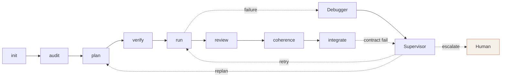
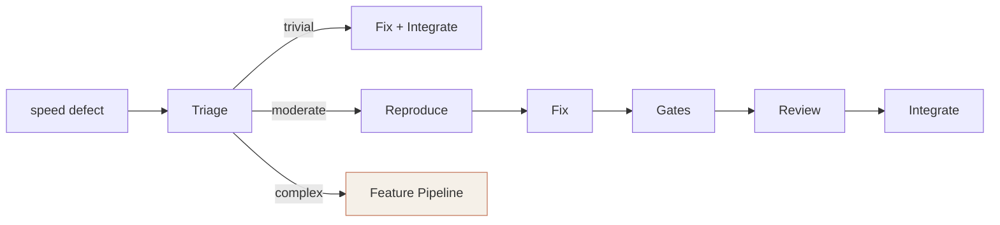

For CLI flags and options, see the [CLI Reference](/docs/api/cli/). For individual agent behavior, see the [Agent Fleet](/docs/api/agents/) pages. This page documents what each command reads, writes, and invokes.

## Pipeline Overview

The standard SPEED lifecycle follows this sequence:



The defect pipeline branches from the standard lifecycle:



## Setup Phase

### `speed init`

| Property | Value |
|----------|-------|
| Agents | None |
| Reads | Existing project structure |
| Writes | `.speed/` directory, `CLAUDE.md` scaffold, `speed.toml`, product vision template, `src/` and `tests/` directories, `.gitignore` entries, `state.json`, initial git commit |
| Prerequisites | None |

Creates the runtime directory and scaffolds project configuration files. Sets up source and test directories, writes `.gitignore` entries, initializes `state.json`, and creates an initial git commit. No agents invoked.

### `speed validate <specs-dir>`

| Property | Value |
|----------|-------|
| Agents | [Validator](/docs/api/agents/validator/) |
| Reads | All spec files in `specs/`, product vision |
| Writes | Consistency report (stdout) |
| Prerequisites | `speed init` |

The Validator reads every spec file and cross-references them for entity relationships, traceability, and data model integrity. Output is a JSON report with critical gaps, warnings, and an entity map.

### `speed new <type> <name>`

| Property | Value |
|----------|-------|
| Agents | None |
| Reads | Spec templates from `speed/templates/` |
| Writes | Spec file in the appropriate `specs/` subdirectory |
| Prerequisites | `speed init` |

Scaffolds a new spec file from a type-specific template. Supported types and their output paths:

| Type | Output Path |
|------|-------------|
| `prd` | `specs/product/<name>.md` |
| `rfc` | `specs/tech/<name>.md` |
| `design` | `specs/design/<name>.md` |
| `defect` | `specs/defects/<name>.md` |

Name validation enforces lowercase alphanumeric characters and hyphens only, with no leading or trailing hyphens. Opens the created file in `$EDITOR` after scaffolding.

## Planning Phase

### `speed audit <spec-file>`

| Property | Value |
|----------|-------|
| Agents | [Spec Auditor](/docs/api/agents/spec-auditor/) |
| Reads | Spec file, type template from `speed/templates/`, product vision, existing spec list, linked PRD (for RFC/Design) |
| Writes | Audit report (stdout), timestamped audit JSON in `.speed/features/<feature>/logs/` |
| Prerequisites | `speed init` |

Runs four check levels (structural, completeness, cross-spec consistency, sizing) against the spec's type template. Defect specs trigger cross-referencing with the related feature spec extracted from the `**Related Feature:**` field. Output is a JSON report with per-section issues, a sizing recommendation, and (for large specs) a split advisory when estimated tasks exceed the single-phase threshold.

### `speed plan <spec-file>`

| Property | Value |
|----------|-------|
| Agents | [Spec Auditor](/docs/api/agents/spec-auditor/) (unless `--skip-audit`), [Product Guardian](/docs/api/agents/product-guardian/) (pre-plan gate), [Architect](/docs/api/agents/architect/) |
| Reads | Product/tech/design specs, Layer 1 context (CSG clusters, project map, spec alignment), related specs (TF-IDF scored), product vision |
| Writes | Task JSONs in `.speed/features/<feature>/tasks/`, `contract.json`, `cross_cutting_concerns.json`, validation report |
| Prerequisites | `speed init`, spec files exist |

The most complex command in the pipeline. Runs through several stages:

```
spec file ──► Spec Auditor ──► Product Guardian ──► Architect
                                  (pre-plan)         │
                                                      ├──► tasks/*.json
                                                      ├──► contract.json
                                                      ├──► cross_cutting_concerns.json
                                                      └──► validation report
```

Plans are cached by spec content hash. Subsequent runs with an unchanged spec skip the guardian and architect stages. The `--force` flag bypasses the cache entirely.

Given a tech spec path like `specs/tech/<name>.md`, the planner auto-derives sibling specs (`specs/product/<name>.md`, `specs/design/<name>.md`) as additional context when they exist. See [Multiple Specs for One Feature](/docs/writing-specs/#multiple-specs-for-one-feature) for naming requirements and child RFC patterns. For features whose audit sizing recommendation exceeds the per-phase task threshold, the Architect runs in two phases: Phase 1 generates foundation infrastructure tasks, Phase 2 generates feature implementation tasks. Task sets, contracts, and cross-cutting concerns are merged across phases.

After task generation, a decomposition quality gate validates cluster size, cross-cluster coordination, file ownership overlap, and bridge symbols. If only bridge-symbol dependency edges are missing, the planner auto-patches `depends_on` fields in the task JSONs and re-validates without requiring a full re-plan.

### `speed verify`

| Property | Value |
|----------|-------|
| Agents | [Plan Verifier](/docs/api/agents/plan-verifier/), Fix Agent (on failure) |
| Reads | Product spec (without Architect reasoning), task plan, contract, cross-cutting concerns, spec traceability |
| Writes | Verification report (stdout), modified task JSONs (when auto-fixing) |
| Prerequisites | `speed plan` |

An adversarial audit. The Plan Verifier reads the original spec and the generated plan independently, checking for missing requirements, semantic drift, and contract gaps.

When the verifier finds fixable issues, a Fix Agent modifies task JSONs directly and the verifier re-runs. The loop continues for up to N iterations with convergence detection: if the same failures persist across iterations, the system escalates to human review rather than retrying. Issues classified as `needs_human` skip the auto-fix loop entirely.

## Execution Phase

### `speed run`

| Property | Value |
|----------|-------|
| Agents | [Developer](/docs/api/agents/developer/) (per task), [Debugger](/docs/api/agents/debugger/) (on failure), [Supervisor](/docs/api/agents/supervisor/) (on failure) |
| Reads | Task JSONs, Layer 2 context (touched files, 1-hop callers, 2-hop skeletons), upstream decisions, spec references, cross-cutting concerns |
| Writes | Code changes on worktree branches, completion/blocked summaries, gate results |
| Prerequisites | `speed plan` (or `speed verify` recommended) |

Executes pending tasks in parallel using isolated git worktrees. Each Developer agent receives its Layer 2 context package scoped to declared files. On failure, the Debugger diagnoses the root cause and the Supervisor decides recovery (retry, escalate, replan, or halt).

Startup includes stale state auto-recovery, resetting any "running" tasks left behind by a previous crashed session to pending. Dependencies between tasks use deferred dependency merging, with conflict retry when upstream branches produce merge conflicts. When a task times out, the orchestrator auto-escalates the model tier (sonnet to opus) before retrying. A halt threshold (default: 30% failure rate) stops the entire run to prevent cascading failures. The Supervisor performs pattern failure detection across the failure log to identify systemic issues rather than treating each failure independently.

### `speed run --defect <name>`

| Property | Value |
|----------|-------|
| Agents | [Developer](/docs/api/agents/developer/) (reproduce mode and/or fix mode) |
| Reads | Triage output, defect report, affected file contents |
| Writes | Failing test (reproduce stage), fix code (fix stage) |
| Prerequisites | `speed defect` (triage must complete first) |

Runs the defect pipeline instead of the standard task pipeline. For trivial defects, skips the reproduce stage and goes directly to fix. For moderate defects, writes a failing test first, then fixes the code.

### `speed review`

| Property | Value |
|----------|-------|
| Agents | [Reviewer](/docs/api/agents/reviewer/), [Product Guardian](/docs/api/agents/product-guardian/) (post-review gate) |
| Reads | Git diff from worktree branch, task acceptance criteria, product spec, blast radius data, spec verification matrix, cross-cutting concerns |
| Writes | Review report (stdout), review JSON in logs directory, `review-nits.json` (aggregated nits from approved tasks) |
| Prerequisites | Task completion via `speed run` |

Two-stage process per task:

```
task diff ──► Reviewer ──► Product Guardian
               │             (post-review)
               │                  │
               ▼                  ▼
           approve/reject    aligned/flagged/rejected
```

The Reviewer checks the diff against the product specification (not just the task description). Traces every code change back to a spec requirement. Flags over-engineering and out-of-scope code. If the Reviewer approves, the Product Guardian runs a vision-alignment check on the same diff. A Guardian rejection overrides the approval and sends the task back to `request_changes`.

Nits and minor issues from approved tasks are collected into `review-nits.json` for batch resolution via `speed fix-nits`.

### `speed coherence`

| Property | Value |
|----------|-------|
| Agents | [Coherence Checker](/docs/api/agents/coherence-checker/) |
| Reads | All "done" task diffs, spec, contract, cross-cutting concerns |
| Writes | Coherence report in logs directory |
| Prerequisites | `speed review` for tasks under check |

Cross-task composition check. The Coherence Checker examines how independently developed task branches interact when combined, looking for interface mismatches, duplicated logic, and contradictory assumptions.

When a previous coherence report exists, the checker runs a delta comparison: archiving the prior report and categorizing issues as fixed, remaining, or new. Subsequent runs after targeted fixes can verify resolution without re-checking the entire feature.

### `speed gates --task ID`

| Property | Value |
|----------|-------|
| Agents | None (deterministic) |
| Reads | Task source code in worktree |
| Writes | Gate results (stdout) |
| Prerequisites | Task code exists |

Runs quality gates manually. `--fast` mode (default): syntax + lint + typecheck. `--full` mode: all quality gates including grounding gates and tests. The `--worktree <path>` flag overrides the auto-detected worktree location.

In `--full` mode, passing all gates on a previously failed task promotes it to "done" status.

## Integration Phase

### `speed integrate`

| Property | Value |
|----------|-------|
| Agents | [Integrator](/docs/api/agents/integrator/) (merge), [Product Guardian](/docs/api/agents/product-guardian/) (post-integration) |
| Reads | All completed task branches, contract, product spec, regression test config |
| Writes | Merged code on feature branch, integration report, contract verification results |
| Prerequisites | `speed review` for all tasks, `speed coherence` recommended |

```
completed branches ──► Integrator ──► regression tests ──► CSG rebuild ──► contract check ──► Product Guardian
                        (merge)                                              (Supervisor on fail)  (post-integration)
```

The Integrator merges branches in dependency order. After merging, regression tests run automatically (skip with `--skip-tests`). The Layer 1 codebase index (CSG) is rebuilt against the merged result for an accurate contract check. If the contract check fails, the Supervisor is invoked to diagnose and decide recovery. The Product Guardian performs a final vision check on the integrated result.

`speed integrate --defect <name>` integrates a defect fix. For moderate defects in "fixed" state, review runs first automatically before integration.

## Utility Phase

### `speed security`

| Property | Value |
|----------|-------|
| Agents | [Security Auditor](/docs/api/agents/security-auditor/) |
| Reads | Task file lists, code diffs, dependency manifests, product spec, tech spec, CLAUDE.md |
| Writes | `.speed/features/<feature>/logs/security-audit.json`, optionally defect specs in `specs/defects/` |
| Prerequisites | Feature code exists |

Scans feature code for OWASP vulnerabilities. With `--create-defects`, generates defect specs for findings above the configured severity threshold. Cached results are reused if less than 1 hour old.

### `speed defect <spec-path>`

| Property | Value |
|----------|-------|
| Agents | [Triage](/docs/api/agents/triage/) |
| Reads | Defect spec, related feature spec, related tech spec, CLAUDE.md, full codebase |
| Writes | Triage result (JSON) |
| Prerequisites | Defect spec exists |

Investigates the defect in the codebase (Phase 1), then classifies complexity and routes to the appropriate fix pipeline (Phase 2). Trivial defects auto-continue through fix and integration within the same command invocation, completing the entire defect lifecycle without manual intervention. Moderate and complex defects pause after triage for human review before proceeding to `speed run --defect`.

### `speed guardian [file]`

| Property | Value |
|----------|-------|
| Agents | [Product Guardian](/docs/api/agents/product-guardian/) |
| Reads | Product vision, artifact under review |
| Writes | Vision alignment report (stdout) |
| Prerequisites | Product vision exists |

Ad-hoc mode: evaluates any file against the product vision. Feature mode: evaluates the current feature's spec and task plan.

### `speed retry --task-id ID --context "instructions"`

| Property | Value |
|----------|-------|
| Agents | [Developer](/docs/api/agents/developer/) |
| Reads | Task JSON, human-provided context, previous failure data, review feedback history |
| Writes | Code changes on worktree branch |
| Prerequisites | Task is failed or blocked |

Restarts a failed or blocked task with human guidance. The `--context` flag is required to prevent blind retries without diagnostic input. `--escalate` upgrades the model tier through the ladder: haiku to sonnet to opus.

`speed retry --defect <name>` retries a defect fix with stage-aware re-entry, resuming from the stage that failed rather than restarting the entire defect pipeline.

### `speed status`

| Property | Value |
|----------|-------|
| Agents | None |
| Reads | `.speed/` state directory, `security-audit.json`, `sast-findings.json`, `sca-findings.json` |
| Writes | Status display (stdout) |
| Prerequisites | `speed init` |

Displays orchestration state. Shows a multi-feature overview with done/running/failed counts per feature, then detailed state for the active feature including:

- Task dependency graph and completion summary
- Security findings aggregated from three sources (audit, SAST, SCA) broken down by severity
- Timed-out tasks flagged for potential decomposition
- Failure classification breakdown (pipeline vs. complexity, with per-subclass counts)
- Latest Supervisor analysis (diagnosis, detected patterns, root cause, recommendations)

The `--defects` flag switches to defect state display instead of task state.

### `speed clean`

| Property | Value |
|----------|-------|
| Agents | None |
| Reads | `.speed/` state directory |
| Writes | Removes logs (`clean logs`), entire state (`clean all`), or feature state (`clean feature <name>`) |
| Prerequisites | None |

`clean logs` clears log files. `clean all` removes the entire `.speed/` state directory. `clean feature <name>` removes a specific feature's state and associated worktrees. When a feature is active, log cleaning is scoped to that feature's logs only.

### `speed fix-nits [--task-id ID]`

| Property | Value |
|----------|-------|
| Agents | None (creates a task for Developer) |
| Reads | `review-nits.json` from last review |
| Writes | New task JSON in `.speed/features/<feature>/tasks/` |
| Prerequisites | `speed review` (nits must exist) |

Reads nits collected during review and creates a new task containing all minor fixes. The generated task includes file paths, line numbers, severity, and suggested changes from the reviewer. Dependencies are set to the source tasks that produced the nits. The optional `--task-id` flag filters nits to a single source task.

### `speed recover`

| Property | Value |
|----------|-------|
| Agents | None |
| Reads | `.speed/` state directory, process table |
| Writes | Resets running tasks to pending, cleans stale state |
| Prerequisites | None |

Emergency recovery from a crashed session. Breaks stale locks, kills orphan agent processes, resets tasks stuck in "running" state back to pending, cleans the running and support directories, resets SPEED state to idle, and removes orphaned worktrees.

### `speed add-language <language>`

| Property | Value |
|----------|-------|
| Agents | LLM-assisted rule generation |
| Reads | Tree-sitter grammar `node-types.json` |
| Writes | ast-grep YAML rules (`definitions.yml`, `references.yml`), `extraction.toml` entry |
| Prerequisites | `tree-sitter-<language>` grammar package installed |

Adds tree-sitter extraction support for a new programming language. Validates the grammar package, reads its `node-types.json`, generates draft ast-grep YAML rules via LLM, and registers the language in `extraction.toml`. Review generated rules with `speed test-rules <language>`.

### `speed test-rules [language | --all]`

| Property | Value |
|----------|-------|
| Agents | None |
| Reads | ast-grep rules, fixture files, expected output JSONs |
| Writes | Test results (stdout) |
| Prerequisites | `ast-grep` (`sg`) installed |

Runs ast-grep rules against fixture files and compares output to expected results. Without arguments, tests the active language. With `--all`, tests every registered language. Reports PASS/FAIL/OK per fixture, with FAIL indicating a mismatch against the expected output.

### `speed dashboard`

| Property | Value |
|----------|-------|
| Agents | None |
| Reads | Project root, `.speed/` state files |
| Writes | PID files, dashboard database |
| Prerequisites | Dashboard dependencies installed |

Manages the monitoring dashboard. Subcommands:

| Subcommand | Behavior |
|------------|----------|
| `start [--port PORT] [--frontend-port PORT] [--api-only]` | Launches FastAPI backend (default port 4440) and Next.js frontend (default port 3000). Concurrent frontends use isolated build caches. `--api-only` skips the frontend. |
| `stop` | Graceful shutdown with 5-second timeout, then force-kills. |
| `status` | Shows running/dead state of dashboard processes. |
| `ingest` | Backfills the dashboard database from state files without starting the server. |

## Maintenance Phase

### `speed self-update`

| Property | Value |
|----------|-------|
| Agents | None |
| Reads | `receipt.json` (managed install metadata) |
| Writes | Updated installation in `~/.speed/` |
| Prerequisites | Managed install (not a git clone) |

Atomic self-update using a staging directory and symlink swap. Rebuilds the Python venv only when `requirements.txt` has changed. Retains the previous version alongside the current one and cleans older versions. Safe for concurrent processes (POSIX atomic swap).

### `speed self-uninstall`

| Property | Value |
|----------|-------|
| Agents | None |
| Reads | Shell rc files (`.zshrc`, `.bashrc`, `.bash_profile`, fish config) |
| Writes | Removes `~/.speed/` installation, cleans PATH entries from shell rc files |
| Prerequisites | None |

Removes the SPEED installation directory and cleans up shell configuration files that reference it.

## Artifact Map

Every persistent artifact, the command that creates it, and the commands that consume it.

| Artifact | Path | Created By | Consumed By |
|----------|------|------------|-------------|
| Runtime directory | `.speed/` | `init` | All commands |
| Project config | `speed.toml` | `init` | All commands |
| Product vision | `specs/product/overview.md` | User (scaffolded by `init`) | `audit`, `plan`, `guardian`, `security` |
| Spec files | `specs/{product,tech,design}/<feature>.md` | User or `new` | `validate`, `audit`, `plan`, `verify`, `review` |
| Task JSONs | `.speed/features/<feature>/tasks/*.json` | `plan`, `fix-nits` | `run`, `verify`, `review`, `integrate` |
| Contract | `.speed/features/<feature>/contract.json` | `plan` | `verify`, `integrate` (contract check) |
| Cross-cutting concerns | `.speed/features/<feature>/cross_cutting_concerns.json` | `plan` | `verify`, `run`, `review`, `coherence` |
| Worktree branches | `.speed/worktrees/<task>/` | `run` | `review`, `integrate` |
| Gate results | `.speed/features/<feature>/gates/<task>/` | `run`, `gates` | `review`, `supervisor` |
| Security audit | `.speed/features/<feature>/logs/security-audit.json` | `security` | `status`, `defect` (via `--create-defects`) |
| SAST findings | `.speed/features/<feature>/logs/sast-findings.json` | `security` | `status` |
| SCA findings | `.speed/features/<feature>/logs/sca-findings.json` | `security` | `status` |
| Defect specs | `specs/defects/<name>.md` | User, `new`, or `security --create-defects` | `defect` |
| Triage result | `.speed/features/<feature>/triage.json` | `defect` | `run --defect` |
| Review nits | `.speed/features/<feature>/logs/review-nits.json` | `review` | `fix-nits` |
| Coherence report | `.speed/features/<feature>/logs/coherence.log` | `coherence` | `supervisor` |
| Integration report | `.speed/features/<feature>/integration.json` | `integrate` | `status` |
| Audit reports | `.speed/features/<feature>/logs/audit-<timestamp>.json` | `audit` | (diagnostic) |
