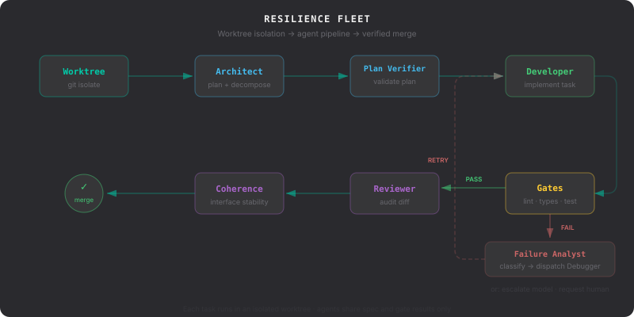

The Control and Execution planes handle the lifecycle of autonomous code implementation.

## Control Plane: Worktree Management

SPEED avoids "dirtying" the main working directory by executing every task in an isolated `git worktree`.

### Worktree Lifecycle

1.  **Creation**: For a given task, SPEED creates a new branch and matches it to a physical worktree path in `.speed/worktrees/`.
2.  **Dependency Injection**: To avoid slow `npm install` or `pip install` cycles, SPEED symlinks `node_modules` or `.venv` from the project root into the worktree.
3.  **Execution**: The developer agent runs its toolset entirely within this sandbox.
4.  **Integration**: Upon success, the branch is merged back to the feature branch and the worktree is pruned.

## Execution Plane: The Resilience Fleet

The "Resilience Fleet" is a set of deterministic agent roles combined with automated quality gates.

### Specialization of Roles

| Role | Responsibility |
|---|---|
| **Architect** | High-level planning and dependency mapping. |
| **Plan Verifier** | Mathematical and logical validation of the Architect's output. |
| **Developer** | Atomic implementation of a single task. |
| **Reviewer** | Auditing the Developer's diff against the [Technical Schemas](./schemas/#architect-output-schema) and original product spec. |
| **Debugger** | Root cause analysis on failed tasks. Produces diagnosis and fix instruction for retries. |
| **Coherence** | Final check of interface stability across all tasks in a feature. |

For the full I/O specification of each role (what it receives, what it produces, which model tier), see the [Agent Fleet](/docs/api/agents/) reference.

### Quality Gates

Quality gates are the primary grounding mechanism for agents.

| Gate | Type | Description |
|---|---|---|
| **Syntax** | Fact | Ensures code parses (AST validation). No LLM required. |
| **Schema** | Fact | Verifies changes against DB schemas or API contracts. |
| **Lint/Types** | Quality | Runs `eslint`, `tsc`, or `mypy`. |
| **Tests** | Quality | Runs the project's test suite (Vitest, Pytest, etc.). |
| **SAST** | Security | Semgrep static analysis for code-level vulnerabilities. OWASP-mapped. |
| **SCA** | Security | Dependency scanning for known CVEs in third-party packages. |
| **Secrets** | Security | Pattern-based detection of leaked credentials and API keys. |

### Scope Enforcement

Developer agents are scoped to the files declared by the Architect in `files_touched`. SPEED enforces this with graduated severity:

| Undeclared Files | Behavior |
|-----------------|----------|
| 1-2 | Warning logged. Agent continues. |
| 3+ | Classified as `decomposition_error`. Task fails. |

The `SCOPE_STRICT` environment variable overrides this behavior (strict = any undeclared file fails, disabled = no enforcement).

### Failure Classification

When a task fails, the system classifies it into one of six subclasses using budget data, gate results, and agent output patterns. The classification drives recovery:

| Class | Subclass | Recovery |
|-------|----------|----------|
| Pipeline | `context_cut`, `exploration_death`, `decomposition_error`, `spec_gap` | Fix the pipeline input (budget, spec, decomposition). |
| Complexity | `exceeded_capacity`, `implementation_error` | Retry with guidance, escalate model, or split the task. |

For the full classification system and recovery recipes, see [Troubleshooting](/docs/troubleshooting/).
