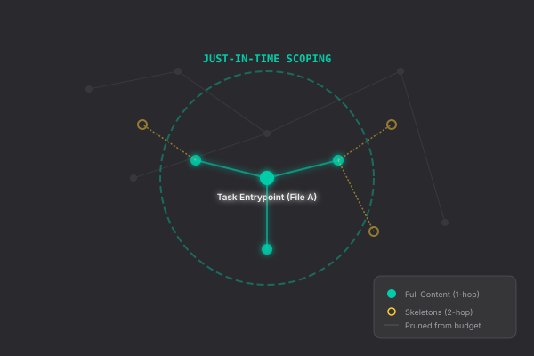

The data plane's primary responsibility is the Context Pipeline. It transforms raw source code and specifications into high-fidelity markdown prompts optimized for specific agent roles.

For the conceptual overview (what each layer does, why), see [The Context Pipeline](/docs/context-pipeline/). This page covers the implementation reference: artifacts, scoping process, assembly functions, and budget model.

## Layer 1: Global Indexing (The World Model)

Layer 1 runs once per feature or on git head moves. It builds a persistent model of the codebase using the following artifacts:

| Artifact | Purpose |
|---|---|
| [Project Map](./schemas/#project-map-schema) | Canonical file registry and metadata. |
| [CSG](./schemas/#csg-json-structure) | A semantic graph of symbols, references, and domain clusters. |
| **Skeletons** | Structural outlines (signatures only) of every file. |
| [Spec Alignment](./schemas/#spec-alignment-schema) | A mapping of product requirements to existing code artifacts. |

## Layer 2: Per-Task Scoping

Layer 2 runs per-task, just-in-time. It narrows the global Layer 1 index into a context package sized for one task's context window. Outputs are written to `.speed/features/{feature}/context/task-{id}/`.

### The 5-Step Scoping Process

1.  **Symbol Resolution**: Resolves all `files_touched` from the task definition to their corresponding symbols in the CSG.
2.  **Graph Walk**: Breadth-first search on the reference graph. The delivery strategy depends on graph distance from the task's touched files:

| Distance | Delivery | Rationale |
|----------|----------|-----------|
| **0 hops** (files_touched) | Full content, never cut | The files the task will modify. Inviolable. |
| **1 hop** | Full content (downgrade to skeleton if >2000 lines) | Direct callers/callees the agent needs to understand. |
| **2 hops** | Skeleton only | Interface awareness without consuming the token budget. |
| **3+ hops** | Dropped | Distant code unlikely to be relevant. |

3.  **Decision Collection**: Upstream decisions and architectural concerns from completed dependency tasks are injected into the task context.
4.  **Spec Narrowing**: Filters global spec-alignment claims down to the specific symbols relevant to the current task.
5.  **Budget Balancing**: Applies the token budget. The cut strategy preserves the most valuable context:
    *   Never cut `files_touched` (distance 0).
    *   Drop 2-hop files first.
    *   Downgrade large 1-hop files from full content to skeletons.
    *   Truncate the most distant skeletons as a last resort, leaving a pointer for the agent to use a "Read" tool if necessary.

Every cut is recorded in `budget.json` with the file path, original tier, downgraded tier, tokens saved, and reason. The [failure classification system](/docs/troubleshooting/) uses this data to detect `context_cut` failures.

### Budget Dimensions

Each task's budget is split across three dimensions plus a reserve:

| Dimension | Default | Contents |
|-----------|---------|----------|
| `code_context` | 60% of total | Full source for touched files, skeletons for neighbors. |
| `task_context` | 15% | Upstream decisions, dependency data, cross-cutting concerns. |
| `spec_context` | 15% | Relevant requirements and alignment status. |
| `reserve` | 10% | Headroom for agent tool outputs during execution. |

The total budget is per-stage (developer, reviewer, coherence, etc.) and configured in `speed.toml`.

## Layer 3: Assembly Templates

Layer 3 consists of stage-specific assembly functions. Each function accepts the Layer 2 artifacts and projects them into a markdown prompt.

### Assembly Logic

Every assembly follows the **Context before Content** principle:
1.  **Identity**: What this task is and why it exists.
2.  **Constraints**: Assumptions, cross-cutting concerns, and budget warnings.
3.  **Material**: The pre-loaded code, diffs, and analysis.
4.  **Traceability**: Spec references and current alignment status.

| Function | Primary Responsibility |
|---|---|
| `assemble_architect` | Global mapping and decomposition. |
| `assemble_verifier` | Validating the plan against requirements. |
| `assemble_developer` | Implementing the task using scoped context. |
| `assemble_reviewer` | Auditing the diff against criteria. |
| `assemble_coherence` | Ensuring cross-task consistency. |
| `assemble_debugger` | Root cause analysis with budget logs and context. |
