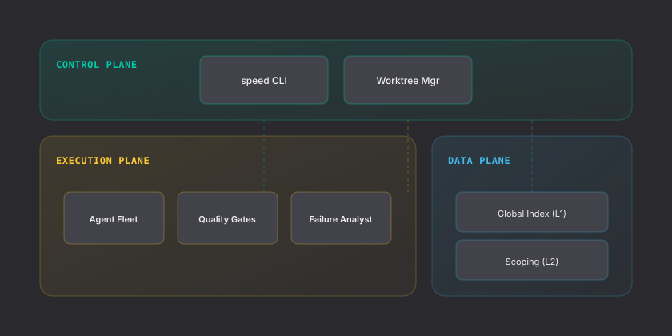
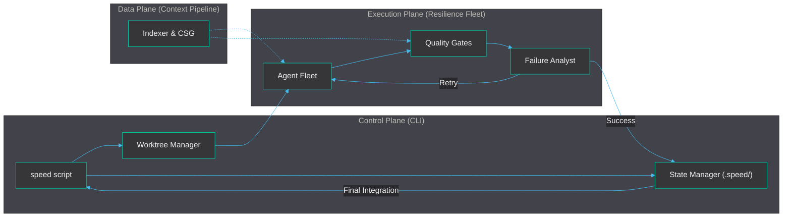

SPEED is a distributed orchestration framework split into three distinct planes: **Control**, **Execution**, and **Data**. This separation ensures that high-latency LLM calls and complex file analysis do not block the orchestration logic.

## High-Level Overview

### 1. Control Plane (The Orchestrator)
The control plane is managed by the `speed` CLI and a set of core service scripts. It handles the lifecycle of a feature implementation, from initial planning to final git integration.

*   **Worktree Manager**: Spawns isolated `git worktree` environments for every task. It symlinks heavy dependencies like `node_modules` or `.venv` from the project root to ensure near-zero setup time for agents.
*   **State Manager**: Maintains the `.speed/` directory, tracking task statuses, agent PIDs, and the Codebase Semantic Graph (CSG).

### 2. Execution Plane (The Resilience Fleet)
This plane contains the "brains" of the system:the autonomous agents and the quality gates that keep them grounded.

*   **Resilience Fleet**: A collection of specialized agent roles (Architect, Plan Verifier, Developer, Reviewer, Coherence, and Debugger) that work together to implement a feature.
*   **Quality Gates**: A tiered verification system. **Grounding gates** verify basic facts (file existence, non-empty diffs), while **Quality gates** run domain-specific tools like linters, type-checkers, and test suites.
*   **Failure Analyst**: An intelligence layer that classifies failures. It can distinguish between a regression caused by the agent and a pre-existing failure in the codebase, preventing unnecessary retries.
*   **Provider System**: A pluggable abstract layer that interfaces with LLM providers (Anthropic, OpenAI, or local hooks). It manages token pacing, rate-limit retries, and JSON extraction.

### 3. Data Plane (The Context Pipeline)
The data plane provides the semantic context that powers the execution plane. It is structured into three layers that progressively narrow the codebase into a high-fidelity prompt. See the [Context Pipeline](./context-pipeline/) for technical details.
