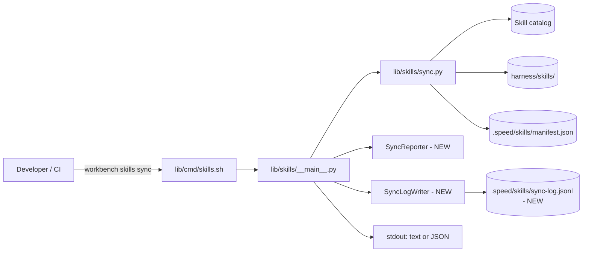
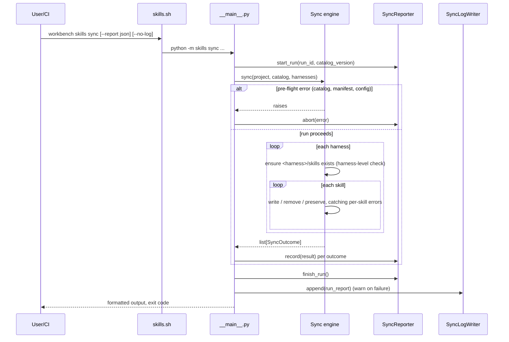

# Design: Skills Sync Run Reporting and Failure Logging

> Spec set: `requirements.md` -> **`design.md`** -> `tasks.md`
> Feature ID: `WB-SYNC-REPORT`
> Related ADRs: ADR-0002 (proposed, see section 9)
> Revision 2: reconciled with the existing engine. Every change from the
> original draft is tagged `[A#]` and listed in section 11.

---

## 1. Overview

`workbench skills sync` copies skills from the catalog into each configured
harness (`.claude/`, `.agents/`, `.github/skills/`) and records the result in
`.speed/skills/manifest.json`. Today a sync run gives limited signal when
something goes wrong: a partially failed sync is hard to diagnose, and there
is no machine-readable record of what happened in each run.

This design adds a structured **sync report** for every run, a persistent
**sync log**, and **meaningful exit codes**, so that humans, CI pipelines, and
agents can tell exactly which skills were added, updated, skipped, or failed,
and why.

### Goals

- Every sync run produces a structured, per-skill result.
- Failures are logged with enough context to reproduce them.
- CI can gate on the exit code without parsing human-readable output.

### Non-goals

- Changing how skills are resolved from the catalog.
- Changing harness detection or `workbench init` behaviour.
- Remote log shipping or telemetry.

---

## 2. Requirements Traceability

Every requirement in `requirements.md` must map to at least one design
element below. Agents must not implement behaviour that is not traceable to
a requirement.

| Req ID | Requirement (summary)                                   | Design element        |
|--------|---------------------------------------------------------|-----------------------|
| REQ-1  | Sync reports per-skill outcome                          | 4.2 SyncReporter, 5   |
| REQ-2  | Failures are logged with reason and context             | 4.3 SyncLogWriter, 6  |
| REQ-3  | Exit code reflects overall outcome                      | 4.1 sync command, 6.2 |
| REQ-4  | Report available as JSON for CI                         | 4.1 `--report json`   |
| REQ-5  | A failure in one harness does not abort other harnesses | 3.2 flow, 6.1, 6.3    |
| REQ-6  | Customer files outside sync targets are never touched   | 7 constraints         |

---

## 3. Architecture

### 3.1 Context



### 3.2 Sync flow with reporting  `[A5]`



Key point: a skill-level failure is recorded and the loop **continues**. Only
pre-flight failures (see 6.1) stop the run before any writes.

---

## 4. Components and Interfaces

### 4.1 `workbench skills sync` (CLI, `lib/cmd/skills.sh`)

New flags (existing flags unchanged):

| Flag               | Default | Behaviour                                         |
|--------------------|---------|---------------------------------------------------|
| `--report text`    | yes     | Human-readable table plus a trailing summary line |
| `--report json`    | no      | Prints the `SyncRunReport` JSON to stdout only    |
| `--no-log`         | no      | Skip writing to `sync-log.jsonl` (for dry trials) |

The legacy `--json` flag keeps emitting the per-row `SyncOutcome` array that
`workbench init` and existing scripts consume. When both are given,
`--report json` wins. `[A6]`

### 4.2 `SyncReporter` (new, `lib/skills/reporter.py`)

```python
class SyncReporter:
    def start_run(self, run_id: str, catalog_version: str, harnesses=()) -> None: ...
    def record(self, result: SkillSyncResult) -> None: ...
    def abort(self, error_type: str, message: str) -> None: ...   # [A3]
    def finish_run(self) -> SyncRunReport: ...
    def exit_code(self) -> int: ...

def result_from_outcome(outcome: SyncOutcome) -> SkillSyncResult: ...
```

- Pure in-memory aggregation; no file I/O.
- Must be safe to call `record` for zero skills (empty catalog).
- `result_from_outcome` is the single place engine actions map to report
  outcomes (see 5).

### 4.3 `SyncLogWriter` (new, `lib/skills/log_writer.py`)

```python
class SyncLogWriter:
    def __init__(self, path: Path, max_bytes: int = 5 * 1024 * 1024, keep: int = 3): ...
    def append(self, report: SyncRunReport) -> bool: ...
```

- The path is always `<project_root>/.speed/skills/sync-log.jsonl`, taken
  from `skills.PATHS.sync_log`; never relative to the working directory. `[A4]`
- Append-only JSON Lines; one line per run.
- Rotates when the file reaches 5 MB, keeping 3 files in total:
  `sync-log.jsonl`, `.1`, `.2`.
- A failure to write the log is a **warning**, never a sync failure.
  `append` returns `False` and the caller prints the warning.

---

## 5. Data Models

```python
from dataclasses import dataclass
from typing import Literal, Optional

Outcome = Literal["added", "updated", "removed", "unchanged", "skipped", "failed"]  # [A2]

@dataclass
class SkillSyncResult:
    skill_id: str
    harness: str            # "claude", "codex" or "copilot"  [A1]
    outcome: Outcome
    reason: Optional[str]   # required when outcome is "skipped" or "failed"
    error_type: Optional[str]
    duration_ms: int
    final_state: str        # engine SkillState after the run  [A3]

@dataclass
class SyncRunReport:
    run_id: str             # UUID4
    started_at: str         # ISO-8601 UTC
    finished_at: str
    catalog_version: str    # release version, or "dev" for source checkouts
    harnesses: list[str]
    results: list[SkillSyncResult]
    summary: dict[Outcome, int]
    status: Literal["success", "partial", "failed"]
    exit_code: int          # [A3]
    error: Optional[dict]   # {"type", "message"} for a pre-flight abort  [A3]
```

Mapping from the engine's existing actions:

| Engine action / state            | Report outcome | Reason                                     |
|----------------------------------|----------------|--------------------------------------------|
| `installed`                      | `added`        |                                            |
| `updated`                        | `updated`      |                                            |
| `removed` (orphan)               | `removed`      |                                            |
| `conflict` (local edit kept)     | `skipped`      | finding codes + "rerun with --force"       |
| no action, `unsupported`         | `skipped`      | no supported harness detected              |
| no action, `current`             | `unchanged`    |                                            |
| `failed` (NEW engine action)     | `failed`       | exception message                          |

Status: `failed` when the run aborted or every result failed, `partial` when
at least one failed, otherwise `success`.

Example JSON output (`--report json`):

```json
{
  "run_id": "3f6c...",
  "catalog_version": "dev",
  "harnesses": ["claude"],
  "summary": {"added": 3, "updated": 1, "removed": 0, "unchanged": 37, "skipped": 0, "failed": 1},
  "status": "partial",
  "exit_code": 1,
  "error": null,
  "results": [
    {"skill_id": "code-review", "harness": "claude", "outcome": "failed",
     "reason": "permission denied writing .claude/skills/code-review/SKILL.md",
     "error_type": "PermissionError", "duration_ms": 4, "final_state": "stale"}
  ]
}
```

---

## 6. Error Handling

### 6.1 Error classes

| Class              | Examples                                         | Behaviour                              |
|--------------------|--------------------------------------------------|----------------------------------------|
| Pre-flight         | Catalog unreadable, invalid manifest, invalid `speed.toml`, unknown harness | Abort before any write; exit 3 `[A1]` |
| Skill-level        | Permission denied, rename blocked by an open handle | Record `failed`, continue           |
| Harness-level      | `<harness>/skills` cannot be created             | Mark every planned write in that harness `failed`, continue other harnesses |
| Reporting          | Log file not writable                            | Warn on stderr; do not change exit code |

"No harness detected" keeps its existing behaviour: rows are reported as
`skipped` with exit 0, because `workbench init` and harness detection are out
of scope (constraint 4). `[A1]`

### 6.2 Exit codes  `[A1]`

| Code | Meaning                                                | Origin   |
|------|--------------------------------------------------------|----------|
| 0    | All skills synced (no `failed`, no conflicts)          | existing |
| 1    | Partial: at least one `failed`                         | **new**  |
| 2    | No failures, but local edits preserved as conflicts    | existing |
| 3    | Pre-flight failure or usage error, nothing written     | existing |

`failed` outranks conflicts: a run with both exits 1. `workbench init` already
treats every code other than 0 and 2 as a failure, so it needs no change.

### 6.3 Manifest consistency

The manifest is updated **only for skills whose outcome is not `failed`**, so
a failed skill is retried on the next sync rather than being recorded as
current.

---

## 7. Constraints and Guardrails (for agents)

These are hard rules. A task that violates any of them fails review.

1. Sync may only write to `<harness>/skills/`, `.speed/skills/manifest.json`,
   `.speed/skills/events.jsonl`, `.speed/skills/sync.lock` and
   `.speed/skills/sync-log.jsonl*`. No other paths (REQ-6). `[A7]`
2. No new runtime dependencies; standard library only.
3. Existing CLI output in `--report text` mode must remain backward
   compatible for the summary line (the `catalog <v> · N row(s)` header).
4. Do not change harness detection logic or `workbench init`.
5. All new modules require unit tests; no network calls in tests.

---

## 8. Testing Strategy

| Level        | What to test                                              | Maps to      |
|--------------|-----------------------------------------------------------|--------------|
| Unit         | `SyncReporter` aggregation, status and exit code logic    | REQ-1, REQ-3 |
| Unit         | `SyncLogWriter` append, rotation, write-failure warning   | REQ-2        |
| Integration  | Sync where one skill's write raises -> exit 1, others synced, manifest omits it | REQ-5 |
| Integration  | Harness whose `skills` path is a file -> that harness failed, other harness synced | REQ-5 |
| Integration  | `--report json` output validates against the data model   | REQ-4        |
| Integration  | Snapshot of files outside sync targets unchanged after sync | REQ-6      |
| Scenario     | New repo install, existing onboarded repo, vendored engine (`catalog_version = dev`) | All |

---

## 9. Decisions

| ID       | Decision                                         | Status   |
|----------|--------------------------------------------------|----------|
| ADR-0002 | Continue on skill-level failure instead of fail-fast | Accepted |
| ADR-0003 | JSON Lines for the sync log instead of a single JSON file (append-safe, easy to tail) | Accepted |
| ADR-0004 | Keep the existing exit codes 2 and 3; add 1 for partial failure | Proposed `[A1]` |

---

## 10. Open Questions

- Should `--report json` also be written to a file path (`--report-file`)?
- Should failed skills be retried automatically within the same run?
- Should the log record the triggering user or CI job ID?

---

## 11. Amendments (revision 2)

Found while grounding the draft against `lib/skills/` and `lib/cmd/`.

| Tag  | Draft said                                   | Code reality                                                 | Resolution |
|------|----------------------------------------------|--------------------------------------------------------------|------------|
| A1   | Exit 2 = pre-flight; harnesses `agents`, `github` | Sync already exits 2 for preserved conflicts and 3 for errors; `init` branches on 2. Harness IDs are `claude`, `codex`, `copilot` | Keep 2 and 3, add 1 (ADR-0004). Use real harness IDs |
| A2   | Outcomes lack `removed`                      | Sync deletes orphaned projections                            | Add `removed` outcome |
| A3   | `SkillSyncResult` / `SyncRunReport` fields   | Exit code needs to know about conflicts; aborted runs need an error | Add `final_state`, `exit_code`, `error`, `abort()` |
| A4   | Log path relative to the working directory   | CLI runs from anywhere with `--project-root`                 | Anchor at `PATHS.sync_log` under the project root |
| A5   | Engine calls the reporter                    | The engine is a pure planner/applier used by `init` too      | `__main__` feeds outcomes to the reporter; the engine stays I/O-scoped |
| A6   | `--report json` only                         | `--json` already exists and `init` consumes it               | Keep `--json` as the legacy array |
| A7   | Write list omits events, lock                | Sync already writes both                                     | List them. Also add `sync-log.jsonl*` to the managed ignore policy so a per-machine log is never committed (data-only change to `bootstrap.py`; init logic unchanged) |
