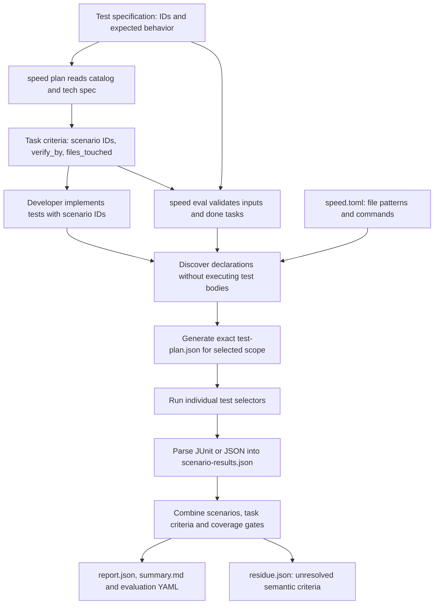

# SPEED evaluation: end-to-end walkthrough

## Goal

Evaluate whether the tests required by a feature or a completed task actually executed and passed. A shared test file is only a place to look; it is not evidence that every scenario in the file passed.

The lifecycle is **test specification → task plan → implementation → evaluation**. The test specification exists before task IDs. It defines stable scenario IDs and expected outcomes. Planning assigns those IDs to existing task acceptance criteria. Implementation carries the same IDs into test identifiers. Eval joins these records and generates the executable mapping at run time.

## Inputs and their shape

### 1. Scenario catalog: `specs/tests/payments.md`

```markdown
## Scenario Catalog
| ID | Scenario | Level | Expected outcome |
|---|---|---|---|
| AC-03 | Repeated authorisation uses the same idempotency key | integration | Original payment returned; no duplicate |
| AC-04 | Capture posts fee and net | integration | Fee and net sum to the capture |
```

This is the required behavior, not an execution plan. It does not need task IDs, test filenames or exact test titles. Traceability connects scenarios to product/technical requirements; classification identifies automated/manual scenarios; Out of Scope records explicit deferrals.

### 2. Task JSON: `.speed/features/payments/tasks/<id>.json`

Illustrative task using the existing field names and structured criteria:

```json
{
  "id": "9",
  "status": "done",
  "files_touched": ["src/payments/service.ts", "test/service.test.ts"],
  "acceptance_criteria": [
    {"criterion": "[AC-03] Repeated authorisation returns the original payment", "verify_by": "test"},
    {"criterion": "[AC-04] Capture posts fee and net", "verify_by": "test"}
  ]
}
```

The planner schemas now require an array of objects, and the task writer preserves that array in JSON. Earlier bullet strings and JSON arrays serialized inside strings remain readable for compatibility. Eval normalizes legacy inputs in memory; it does not rewrite task files.

`files_touched` identifies candidate files. The bracketed ID establishes scenario ownership. `verify_by: test` says execution evidence is required. The prose need not exactly equal a test title.

### 3. Test declarations

```typescript
test('[AC-03] idempotent authorise returns the original payment', () => {
  // Assert the same payment ID and exactly one stored payment.
});
test('[AC-04] capture splits into net and fee, and both post', () => {
  // Assert the captured total and balanced ledger.
});
```

Python uses a valid function identifier such as `test_ac_03_returns_original_payment`. IDs belong on individual tests, not just in comments or suite names. One scenario may have several tests across files. Each matching test must supply passing evidence.

### 4. Runner configuration: `speed.toml`

```toml
[eval]
test_command = "node --experimental-strip-types --test --test-reporter=junit --test-reporter-destination=\"$SPEED_EVAL_JUNIT_FILE\" {selectors}"
test_file_patterns = ["test/*.test.ts"]
```

The file patterns distinguish tests from application files. Configured commands and subsystem routing choose the runner. Multiple commands can cover backend and frontend files, provided each file has one unambiguous supported runner.

## Flow and code evidence



1. **Planning reads the catalog.** `lib/cmd/plan.sh::cmd_plan` locates the test specification beside the technical specification, or uses the feature's recorded path. It includes the catalog in the cache hash. `_run_architect_phase`, the coverage verifier and coverage repair receive it. `agents/architect.md` asks the planner to preserve IDs in criteria; `agents/developer.md` asks implementation to tag individual tests. Planning is LLM-assisted. Mapping during eval is deterministic.
2. **Eval checks scope and state.** `lib/cmd/eval.sh` handles CLI flags and locks. `lib/eval_runtime.py::prepare` reads tasks and rejects a selected task whose status is not `done`. A feature run requires every task to be done; a task run checks the selected task. This is the source of `Evaluation requires done tasks`.
3. **Normalize criteria and choose the mapping source.** `lib/eval_criteria.py` reads the existing criterion representations. In `prepare`, the key decision is:

   ```python
   from_tasks = not plan_path and has_tagged_criteria(tasks)
   ```

   Tagged criteria use `select_task_plan`. Older specs without tagged criteria retain legacy mapping support. An explicit `--test-plan` is a deliberate override, not the normal new flow.
4. **Derive exact mappings.** `lib/eval_selection.py::select_task_plan` joins criterion IDs to discovered IDs:

   ```python
   tests = [t for t in discovery[key] if t["scenario_ids"] & automated]
   ```

   `lib/eval_discovery.py` uses Python AST or the existing JS/TS tree-sitter parsers. It does not import test files or run test bodies during discovery. Python selectors contain class/function nodes. JS/TS selectors retain the exact full title, including literal enclosing suites. Missing files, missing matches, duplicate identities and ambiguous runner routing become gaps.
5. **Execute and retain evidence.** `lib/eval_execution.py::render_command` supplies exact pytest nodes or anchored, escaped JS title filters. `run_command` reads runner reports and checks that the selected tests actually ran. `lib/eval_runtime.py::execute` reuses identical executions rather than running them again for each criterion. Empty reports, skipped tests and zero matching tests cannot establish a pass.
6. **Build acceptance and publish outputs.** `lib/eval_report.py::build_report` aggregates scenario evidence, then task criteria reuse their own task's scenario evidence. Missing required tests remain unverified. Feature evaluation also checks the entire catalog and requirement coverage, including scenarios no task claimed. `write_report` creates JSON, Markdown and YAML; `lib/eval_runtime.py::finish` publishes completed outputs and preserves each attempt under `runs/<id>/`.

All source paths above are relative to the Workbench repository. The responsibilities are separated: discovery identifies tests, selection scopes them, execution obtains evidence, and reporting decides acceptance.

| Source | Responsibility |
|---|---|
| [plan.sh](../../lib/cmd/plan.sh), [architect instructions](../../agents/architect.md) | Supply the pre-existing catalog to planning and preserve scenario IDs in task criteria. |
| [developer instructions](../../agents/developer.md) | Carry task scenario IDs into individual tests. |
| [eval_criteria.py](../../lib/eval_criteria.py) | Normalize the existing criterion formats and extract IDs. |
| [eval_discovery.py](../../lib/eval_discovery.py) | Parse actual test declarations into stable identities. |
| [eval_selection.py](../../lib/eval_selection.py) | Join task criteria, declared files and discovered identities. |
| [eval_execution.py](../../lib/eval_execution.py) | Route runners, render exact filters and parse execution evidence. |
| [eval_runtime.py](../../lib/eval_runtime.py), [eval.sh](../../lib/cmd/eval.sh) | Validate state, orchestrate execution, snapshot and publish artifacts. |
| [eval_report.py](../../lib/eval_report.py) | Aggregate evidence, acceptance, semantic residue and JSON/Markdown/YAML outputs. |
| [regression tests](../../tests/test_eval_task_criteria.py) | Verify task isolation, planner persistence and missing-evidence behavior. |

## Your five-test example

Suppose one file contains AC-01 through AC-05 and AC-02 fails. Task 9 owns only AC-03 and AC-04.

| Invocation | Test bodies executed | Effect of AC-02 failure |
|---|---|---|
| `speed eval -f payments --task 9` | AC-03 and AC-04 | None; AC-02 is outside this task's scope |
| `speed eval -f payments` | All mapped feature tests | AC-02 fails the feature evaluation |

Test file imports and shared setup still execute as required by the runner. An import/setup failure preventing AC-03/04 from running cannot be ignored. Unsupported selection never silently expands to running the whole file. An independent regression verifies executed side effects are exactly `34`, then verifies the feature catches test 2.

## Generated files and their purpose

Feature outputs live under `.speed/features/payments/`. Task outputs use `eval/task-<id>/` and `evaluation-task-<id>.yaml`.

| Artifact | Producer and purpose |
|---|---|
| `eval/test-plan.json` | `prepare` writes the generated scenario → task → exact test mapping and selection gaps. It is derived output, not the authored source of ownership. |
| `eval/runs/<id>/test-spec.md`, `tasks/`, `context.json` | Input snapshots and build/scope information for that attempt. Original task JSON and test spec remain unchanged. |
| `eval/runs/<id>/commands/<id>/` | Runner command result, output log and JUnit/JSON evidence for an actual execution. |
| `eval/scenario-results.json` | `execute` records evidence per scenario, including missing mappings and execution status. |
| `eval/report.json` | Aggregated scenario, criterion and gate results; selection, provenance, summaries and accepted verdict. |
| `eval/summary.md` | Readable report, beginning with a three-column table: scenario ID; test/file results and scenario verdict; expected behavior alongside runner evidence and output-log links. |
| `eval/residue.json` | Remaining semantic/manual criteria for optional evaluator judgment. Missing automated tests are not handed to an LLM to turn into passes. |
| `evaluation.yaml` | The report serialized as a workflow handoff, consumed downstream when defining defects. It carries evidence, scope, results and verdict. |
| `eval/latest-attempt.json` | Latest attempt ID and completion/failure information. Failed attempts do not replace a completed report with partial output. |
| `eval/gaps.json` | **Not written by this current runtime.** A file with this name left from an older experiment is not a current input or authoritative report. Current gaps appear in plan selection and report results. |

A generated test case resembles:

```json
{
  "scenario_id": "AC-03",
  "task_id": "9",
  "selector": "test/service.test.ts",
  "test_name": "[AC-03] idempotent authorise returns the original payment",
  "runner": "node",
  "command": "node --test",
  "source": "task_criteria"
}
```

The full document wraps cases in `test_cases` and includes `selection` with mode, scenario IDs, criterion associations and missing mappings. A report includes both scenario rows and criterion rows that reuse the same test evidence. **Result-row totals are not the number of executed tests.**

For example, a trimmed execution record inside `scenario-results.json` has this shape:

```json
{
  "results": [{
    "scenario_id": "AC-03", "task_id": "9", "source": "task_criteria",
    "selector": "test/service.test.ts",
    "test_name": "[AC-03] idempotent authorise returns the original payment",
    "status": "pass", "exit_code": 0, "selection_level": "test",
    "tests": [{"id": "test::[AC-03] idempotent authorise returns the original payment", "status": "pass"}]
  }]
}
```

The live payments task-1 report has three passing scenario rows and three passing criterion rows, backed by only three test executions. Its YAML starts with these fields (other provenance, selection and result fields omitted):

```yaml
feature: payments
task: "1"
run_id: "95439694d7d34f1da7fc0259d9b459e5"
accepted: true
summary:
  total: 6
  pass: 6
  fail: 0
  unverifiable: 0
```

The scenario table includes missing tests as unverified rows and shows each selected test when a scenario spans several files. It separates the expected outcome from runner evidence and does not claim to independently compare them.

The JSON report uses `task_id`; the YAML uses `task`. Both include the same result statuses and verdict. With no unresolved semantic criteria, this run's residue is `{"feature":"payments","results":[]}`. The feature can still have missing automated tests while residue is empty, because those gaps belong in deterministic results.

Default exit is 0 after a completed evaluation regardless of acceptance. `--strict` returns 2 when the verdict is unaccepted. Invalid inputs, unfinished selected tasks or operational errors return 3.

## Payments interpretation and limits

The live fixture is `/Users/mohitpatel/Desktop/inrhythm/payments-validation-fixture`, branch `test/speed-eval`, based on `round-0`. Its tracked setup seeds done tasks for a reproducible eval; it does not claim a real LLM planning/development/integration cycle occurred. See that repository's `docs/speed-eval.md` for fresh run IDs and clickable artifacts.

Task 1 owns AC-01, AC-02 and VAL-01 across two files. Task 2 owns the remaining scenarios across four files. Four required scenarios have no tests: RISK-01, RISK-02, AC-12 and EDGE-01. Feature evaluation also reports the TR12 coverage gap and incomplete integration.

AC-01 asserts an authorised amount of 2500 and two balanced ledger entries whose net is zero. It does **not** assert a customer's card balance was 2500 and became zero. RETRY-01 only characterizes the existing two-refund assertion; it does not prove the retry helper or resolve the refund idempotency product decision.

A passing test proves only that its assertions passed. IDs establish attribution, not assertion quality. Discovery currently supports pytest and literal Node/Jest/Vitest declarations. Dynamic JS titles, `test.each`, aliases and custom wrappers need an adapter or explicit supported mapping. Python parameterized functions select their parameter cases. JS/TS discovery needs the existing grammar packages available in `SPEED_PYTHON`. These gaps remain visible instead of broadening a task run.
