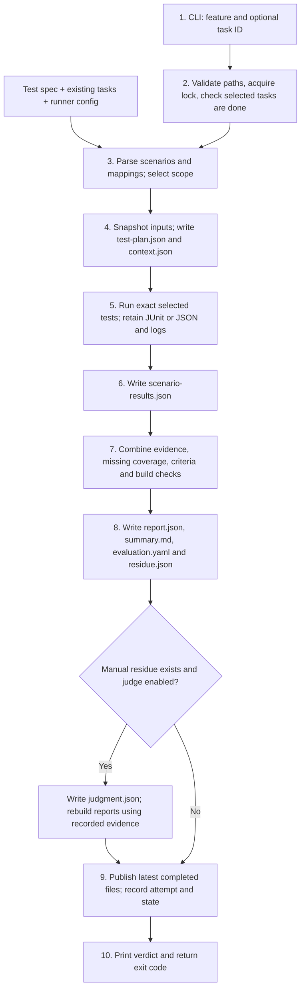
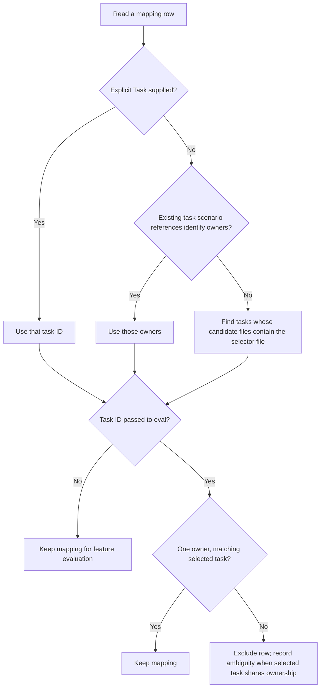

# How `speed eval` works: an end-to-end walkthrough

**For:** Mohit's explanation to Sanjay. **Code baseline:** `e7eed1b`, branch `feat/eval-test-spec-template`. **Written:** 2026-09-20.

This document follows three questions: **What is the goal? What goes in and comes out? How does the code connect them?** Read sections 1–4 for the main explanation; use the later sections for evidence and questions. JSON/YAML examples are labeled excerpts, with paths and run IDs shortened. Code links point to the implementation checkout on this machine.

## 1. Goal

`speed eval` checks whether the **declared expectations for a feature or task have supporting evidence**. It connects each scenario in the test spec to the exact test that should verify it, runs that test, and produces an acceptance report. Missing tests remain visible even when every existing test passes.

The two scopes are:

| Command | What it evaluates |
|---|---|
| `speed eval -f payments` | Every declared feature scenario, task criteria, coverage gaps and feature gates |
| `speed eval -f payments --task 1` | Scenarios and criteria attributable to task `1`, using its individual test mappings |

`--task-id 1` is equivalent to `--task 1`. Feature scope means the feature's declared coverage; it does not automatically discover and run every test in the repository.

The task JSON schema stays unchanged. Individual test mappings live in the test spec. Parsing, ownership selection and plan generation are deterministic. The optional LLM evaluator is used later for unresolved manual criteria.

### Three terms to keep separate

| Term | Meaning | Payments example |
|---|---|---|
| Scenario | A behavior we require | AC-01: authorisation records 2500 and posts a balanced pair |
| Test | Executable code checking that behavior | `authorise records the amount and posts a balanced pair` |
| Evidence | The result of executing the selected test on a particular build | Test identity, pass/fail, command, timestamp, JUnit/JSON and log |

A filename identifies a container of tests. A scenario ID identifies a requirement. The mapping connects them to a particular test identity.

## 2. Inputs and their shape

### A. Existing task JSON: task ownership and readiness

The following is the minimal shape used in the copied-payment validation. Task `2` can list the same files.

```json
{
  "id": "1",
  "status": "done",
  "files_touched": ["test/service.test.ts", "test/money.test.ts"],
  "acceptance_criteria": []
}
```

Eval reads the task ID, status, touched files and criteria. Where already present, it also understands `required_test_cases`, criterion `scenario_ids`, and legacy `test_selectors`. New fields do not need to be added to task JSON.

`files_touched` supplies candidate files. It cannot identify which individual tests belong to a task when several tasks share a file.

**Code evidence:** [task validation and existing scenario references](/Users/mohitpatel/Desktop/inrhythm/Workbench/.claude/worktrees/task-scoped-eval/lib/eval_runtime.py:70).

### B. Test spec: expected behavior and executable mapping

The **Scenario Catalog** states what must be checked. These are selected rows, rather than the full payments catalog:

| ID | Scenario | Level | Expected outcome |
|---|---|---|---|
| AC-01 | Authorise 2500 | integration | Authorised amount 2500; balanced ledger pair |
| AC-02 | Inspect the stored payment | integration | Last four digits retained; full PAN absent |
| VAL-01 | Construct fractional minor units | unit | Rejected with RangeError |
| AC-03 | Retry authorisation with the same key | integration | Original payment returned |
| AC-12 | Retry capture with the same key | integration | No duplicate capture |

The **Execution and Evidence** table connects those scenarios to tests:

| Scenario | Task | Selector | Test name | Runner |
|---|---|---|---|---|
| AC-01 | 1 | test/service.test.ts | authorise records the amount and posts a balanced pair | node |
| AC-02 | 1 | test/service.test.ts | authorise never stores a full PAN | node |
| VAL-01 | 1 | test/money.test.ts | money rejects fractional minor units | node |
| AC-03 | 2 | test/service.test.ts | idempotent authorise returns the original payment | node |
| AC-12 | 2 | | | |

This is the mapping used in a **temporary copy** for validation. The original payment repository has not been migrated.

Task `1` has two tests in one file and one in another. Task `2` shares the service file. The empty AC-12 selector declares missing coverage; keeping its Task cell ensures that gap appears in task-2 evaluation.

Other spec sections add requirement-to-scenario traceability, manual/automated classification, release gates and explicit exclusions. Optional mapping columns are **Command**, **Criterion** and scenario dependencies. Criterion is the 1-based position of an existing task acceptance criterion; Command must match a configured allowed command.

**Code evidence:** [catalog parser](/Users/mohitpatel/Desktop/inrhythm/Workbench/.claude/worktrees/task-scoped-eval/lib/test_spec.py:152), [execution mapping parser](/Users/mohitpatel/Desktop/inrhythm/Workbench/.claude/worktrees/task-scoped-eval/lib/test_spec.py:443), [ownership of empty rows](/Users/mohitpatel/Desktop/inrhythm/Workbench/.claude/worktrees/task-scoped-eval/lib/test_spec.py:479).

### C. Runner configuration: how to execute tests

```toml
[eval]
test_command = "node --experimental-strip-types --test"
test_file_patterns = ["*.test.ts", "*.test.tsx", "test_*.py"]
```

`test_file_patterns` classifies touched files as test candidates. It does not search their contents for task ownership. Multiple runners can be listed under `test_commands`; an explicit Command cell resolves ambiguity. The `SPEED_EVAL_TEST_COMMAND` environment override takes precedence over TOML. Without eval commands, configured test gates in the selected project agent file are used.

**Code evidence:** [configuration and candidate discovery](/Users/mohitpatel/Desktop/inrhythm/Workbench/.claude/worktrees/task-scoped-eval/lib/eval_execution.py:48), [command routing and allowlist](/Users/mohitpatel/Desktop/inrhythm/Workbench/.claude/worktrees/task-scoped-eval/lib/eval_execution.py:125).

### D. State and optional inputs

| Input | Shape and purpose |
|---|---|
| Feature state | JSON object containing feature status and existing integration/evaluation metadata; read from the active feature state file |
| Git working tree | Commit, source files and dirty state; used to fingerprint the build being evaluated |
| `--test-spec PATH` | Explicit Markdown spec instead of the feature's resolved spec |
| `--test-plan PATH` | JSON object with a `test_cases` array; overrides executable mappings from the Markdown table |
| `--manual-results PATH` | JSON with `build_fingerprint` and `results`; each observation identifies scenario, reviewer, status, evidence and execution time |

Manual observations must match the current build fingerprint and refer to scenarios classified as manual. The implementation validates input paths before reading them. **Evidence:** [prepare()](/Users/mohitpatel/Desktop/inrhythm/Workbench/.claude/worktrees/task-scoped-eval/lib/eval_runtime.py:165).

## 3. The complete flow



### Steps 1–2: establish scope and readiness

The shell command resolves the feature and spec, validates paths and acquires a lock. `prepare()` loads task files and chooses either the requested task or all feature tasks.

Actual code:

```python
selected = [t for t in tasks if task_id is None or str(t["id"]) == task_id]
if any(t.get("status") != "done" for t in selected):
    raise RuntimeError("Evaluation requires done tasks")
```

This explains the earlier error: at least one task in the selected scope was not `done`. It is a readiness stop, not a failed test. Another pending task does not block a task-1 run if task 1 is done. A feature run checks all its tasks. A feature with no task files can still evaluate its catalog and report missing coverage.

**Evidence:** [CLI orchestration](/Users/mohitpatel/Desktop/inrhythm/Workbench/.claude/worktrees/task-scoped-eval/lib/cmd/eval.sh:305), [readiness guard](/Users/mohitpatel/Desktop/inrhythm/Workbench/.claude/worktrees/task-scoped-eval/lib/eval_runtime.py:190).

### Step 3: create the plan and select task-owned tests

Actual code:

```python
plan = read_object(plan_path) if plan_path else {"test_cases": parse_execution_mapping(spec_text)}
```

The parser reads table cells and creates one entry per selector. It does not ask an LLM to decide which test proves AC-01. That relationship must already be declared.

Task ownership follows this flow:



If nothing is attributable to a selected task, that is a visible selection gap. Empty mapping rows retain their scenario/task association for reporting even though they create no runnable entry.

**Evidence:** [select_plan()](/Users/mohitpatel/Desktop/inrhythm/Workbench/.claude/worktrees/task-scoped-eval/lib/eval_selection.py:27), [plan construction](/Users/mohitpatel/Desktop/inrhythm/Workbench/.claude/worktrees/task-scoped-eval/lib/eval_runtime.py:193).

### Step 4: write `test-plan.json` and freeze the inputs

The actual filename is **`test-plan.json`**, including the hyphen. It is generated inside a unique attempt directory before execution.

One-entry excerpt from a task-1 plan; the full plan has three entries:

```json
{
  "test_cases": [
    {
      "scenario_id": "AC-01",
      "selector": "test/service.test.ts",
      "task_id": "1",
      "test_name": "authorise records the amount and posts a balanced pair",
      "runner": "node",
      "command": "",
      "depends_on_scenarios": []
    }
  ],
  "selection": {
    "mode": "task",
    "task_id": "1",
    "scenario_ids": ["AC-01", "AC-02", "VAL-01"],
    "candidate_files": ["test/money.test.ts", "test/service.test.ts"],
    "gaps": [],
    "criterion_scenarios": {},
    "missing_mappings": []
  }
}
```

An empty Command means “resolve an allowed configured command.” `test_cases` is the executable work list. `selection` explains its scope and preserves gaps. Consequently, missing scenarios can appear in a report even though they are absent from the executable work list.

The runtime also snapshots the spec, selected task JSON, runner configuration, optional manual observations, and build metadata. Original task files are not updated with new mapping fields.

**Evidence:** [snapshot writes](/Users/mohitpatel/Desktop/inrhythm/Workbench/.claude/worktrees/task-scoped-eval/lib/eval_runtime.py:235), [context and attempt metadata](/Users/mohitpatel/Desktop/inrhythm/Workbench/.claude/worktrees/task-scoped-eval/lib/eval_runtime.py:255).

### Step 5: execute the individual tests

`execute()` resolves the command for each mapping. In task mode, a mapping that selects only a whole file/group is reported as unverified without running it. A valid individual mapping reaches `run_command()`.

| Runner | How one test is selected | How results are collected |
|---|---|---|
| pytest | `tests/test_payment.py::test_authorise` | Automatically written JUnit |
| Node | File plus anchored `--test-name-pattern` | JUnit |
| Vitest | File plus anchored `--testNamePattern` | JSON assertion results |
| Jest | `--runTestsByPath` plus anchored `--testNamePattern` | JSON assertion results |

Actual JavaScript filter construction:

```python
pattern = "^" + re.escape(test_name) + "$"
```

This matches the complete literal title. Nested JavaScript tests use the full title including suite/describe names. Pytest parameters can be selected individually with their parameter suffix, or together by selecting their function.

The runner's report is then checked for the selected identity and status. Zero process exit alone cannot establish a pass. For named JavaScript tests, unrelated filtered/skipped records do not count as skipped selected tests.

Identical resolved command/selector/name/runner mappings reuse one execution within the attempt. One task can therefore select three tests across two files; several scenarios can also share one exact test without running it repeatedly.

**Evidence:** [execution and cache](/Users/mohitpatel/Desktop/inrhythm/Workbench/.claude/worktrees/task-scoped-eval/lib/eval_runtime.py:270), [runner filters and result checks](/Users/mohitpatel/Desktop/inrhythm/Workbench/.claude/worktrees/task-scoped-eval/lib/eval_execution.py:339), [report parsing](/Users/mohitpatel/Desktop/inrhythm/Workbench/.claude/worktrees/task-scoped-eval/lib/eval_execution.py:285).

### Steps 6–7: map evidence back to scenarios and decide acceptance

Each execution is associated with its scenario ID, task ID and selector, then written to `scenario-results.json`.

One-result excerpt:

```json
{
  "results": [
    {
      "scenario_id": "AC-01",
      "task_id": "1",
      "selector": "test/service.test.ts",
      "test_name": "authorise records the amount and posts a balanced pair",
      "selection_level": "test",
      "source": "mapping",
      "status": "pass",
      "tests": [
        {
          "id": "test::authorise records the amount and posts a balanced pair",
          "name": "authorise records the amount and posts a balanced pair",
          "status": "pass"
        }
      ],
      "exit_code": 0,
      "artifact_dir": "<attempt>/commands/<execution-id>"
    }
  ]
}
```

Actual records additionally retain the command, evidence description, run ID and execution time. The report builder combines all required executions for each scenario. A failing required test keeps that scenario failed even if another mapped test passes. A test failing in the same file affects another scenario only if that scenario also maps to that test. Whole-file legacy evidence has a coarser attribution limit, described in section 7.

The builder also adds missing scenarios, selection gaps, task criteria, declared feature gates, requirement coverage gaps and build checks. Feature mode includes committed/integrated-build checks; both scopes check that the tested source tree remained unchanged. Declared dependencies annotate which prerequisites also failed; they do not establish causality or erase an executed failure.

Task criteria are processed according to their existing `verify_by` value:

| Criterion type | What the report step does |
|---|---|
| `test` | Uses explicitly associated scenario results; missing association stays unverified |
| `lint` | Runs the configured lint command against existing touched files |
| `file_exists`, `schema_check` | Uses the corresponding structural verifier |
| `manual` or plain-text criterion | Starts unverified and may enter the optional judgment step |

Criteria already carrying `scenario_ids` are represented by those scenario rows. Criterion-index mappings can add a separate criterion row using the same recorded evidence. **Evidence:** [criterion processing](/Users/mohitpatel/Desktop/inrhythm/Workbench/.claude/worktrees/task-scoped-eval/lib/eval_report.py:222), [structural verifier dispatch](/Users/mohitpatel/Desktop/inrhythm/Workbench/.claude/worktrees/task-scoped-eval/lib/criteria_verify.py:103), [dependency annotations](/Users/mohitpatel/Desktop/inrhythm/Workbench/.claude/worktrees/task-scoped-eval/lib/eval_report.py:356).

Actual acceptance rule:

```python
accepted = bool(applicable) and all(
    result["status"] == "pass" for result in applicable
)
```

There must be at least one applicable result, and every applicable result must pass. Required unverified evidence blocks acceptance. Report totals count **scenario/criterion/gate results**, which may differ from the number of test functions executed.

**Evidence:** [report assembly](/Users/mohitpatel/Desktop/inrhythm/Workbench/.claude/worktrees/task-scoped-eval/lib/eval_report.py:398), [status aggregation](/Users/mohitpatel/Desktop/inrhythm/Workbench/.claude/worktrees/task-scoped-eval/lib/eval_execution.py:188), [build checks and acceptance](/Users/mohitpatel/Desktop/inrhythm/Workbench/.claude/worktrees/task-scoped-eval/lib/eval_report.py:530).

### Step 8: produce the report, summary, residue and YAML

`report.json` is the combined machine-readable verdict. A task-1 excerpt is:

```json
{
  "feature": "payments",
  "task_id": "1",
  "run_id": "<run-id>",
  "accepted": true,
  "summary": {
    "total": 3,
    "pass": 3,
    "fail": 0,
    "unverifiable": 0,
    "examined": 3,
    "not_examined": 0
  },
  "results": [
    {"id": "AC-01", "kind": "scenario", "status": "pass", "task_id": "1"},
    {"id": "AC-02", "kind": "scenario", "status": "pass", "task_id": "1"},
    {"id": "VAL-01", "kind": "scenario", "status": "pass", "task_id": "1"}
  ]
}
```

Full reports also include build fingerprints, commit/spec metadata, selection, traceability, evidence, executions and exclusions. `summary.md` presents these results as readable tables, including the selected tests.

The `evidence_type` field describes the kind of support: `statistical` for passing test examples, `counterexample` for a failure, `silence` for unverified evidence, `proof` for structural/lint checks within their rules, and `opinion` for human or evaluator judgments. These labels are not a numerical quality score. [Evidence classification code](/Users/mohitpatel/Desktop/inrhythm/Workbench/.claude/worktrees/task-scoped-eval/lib/eval_report.py:330).

**`residue.json` means “manual criteria still requiring judgment.”** Its filter is specifically:

```python
if result["tier"] == "semantic" and result["status"] == "unverifiable"
```

For example, a manual criterion about whether a flow is understandable may remain after all executable tests finish. A residue excerpt would be:

```json
{
  "feature": "payments",
  "results": [
    {
      "id": "TASK-1-CRIT-01",
      "kind": "criterion",
      "tier": "semantic",
      "status": "unverifiable",
      "title": "The payment failure explanation is understandable",
      "evidence": "Manual review required"
    }
  ]
}
```

This is a separate illustrative manual criterion, not an extra result in the three-test example. Missing automated tests remain in the report as gaps; they are not sent to the evaluator to be guessed as passing.

If judgment is enabled and residue exists, the evaluator receives the residue and relevant spec context. Its response becomes `judgment.json`. The report is rebuilt using cached deterministic criteria and recorded execution results; the tests are not rerun. Judgment can update only unresolved semantic results. With `--skip-judge`, those remain unverified.

The final **evaluation YAML is a serialization of the same report**, not another test execution or an LLM-generated verdict. A shortened YAML excerpt is:

```yaml
feature: payments
task: "1"
run_id: "<run-id>"
accepted: true
summary:
  total: 3
  pass: 3
  fail: 0
  unverifiable: 0
selection:
  mode: task
  task_id: "1"
  scenario_ids: [AC-01, AC-02, VAL-01]
results:
  - id: AC-01
    kind: scenario
    status: pass
    task: "1"
    tests:
      - selector: test/service.test.ts
        test_name: authorise records the amount and posts a balanced pair
        selection_level: test
        status: pass
```

This excerpt shows only one result; the complete YAML includes all three, plus evidence, commands, traceability, logs, build metadata and the individual runner records. The implementation uses JSON flow collections for some nested YAML fields; this expanded form has the same structure.

**Evidence:** [write_report(): four output files](/Users/mohitpatel/Desktop/inrhythm/Workbench/.claude/worktrees/task-scoped-eval/lib/eval_report.py:779), [YAML serialization](/Users/mohitpatel/Desktop/inrhythm/Workbench/.claude/worktrees/task-scoped-eval/lib/eval_report.py:698), [optional judge](/Users/mohitpatel/Desktop/inrhythm/Workbench/.claude/worktrees/task-scoped-eval/lib/cmd/eval.sh:118), [judgment restrictions](/Users/mohitpatel/Desktop/inrhythm/Workbench/.claude/worktrees/task-scoped-eval/lib/eval_report.py:303), [criteria cache](/Users/mohitpatel/Desktop/inrhythm/Workbench/.claude/worktrees/task-scoped-eval/lib/eval_report.py:825).

### Steps 9–10: publish the attempt and return a result

Every attempt has its own run directory. Completed reports are copied atomically to the corresponding latest locations; previous attempt evidence is retained.

| Scope | Attempt directory | Latest report | Published YAML |
|---|---|---|---|
| Feature | `.speed/features/payments/eval/runs/<run-id>/` | `eval/report.json` | `.speed/features/payments/evaluation.yaml` |
| Task 1 | `.speed/features/payments/eval/task-1/runs/<run-id>/` | `eval/task-1/report.json` | `.speed/features/payments/evaluation-task-1.yaml` |

The Latest report column is relative to `.speed/features/payments/`. The attempt itself also contains `evaluation.yaml`. A task verdict does not overwrite the feature verdict or update feature state. Full feature attempts record evaluation metadata; when integration is verified, the resulting feature status becomes `accepted` or `integrated_not_accepted`.

Default successful completion returns exit `0` even when acceptance is false. `--strict` returns `2` for a completed but unaccepted evaluation. Rejected inputs or an evaluation that could not run return `3`. Optional defect filing applies to failed/partial results in feature mode; `--no-defects` disables it. Missing evidence by itself is not filed as a test failure defect.

**Evidence:** [finish(): output locations and state transitions](/Users/mohitpatel/Desktop/inrhythm/Workbench/.claude/worktrees/task-scoped-eval/lib/eval_runtime.py:350), [completion, defects and exit behavior](/Users/mohitpatel/Desktop/inrhythm/Workbench/.claude/worktrees/task-scoped-eval/lib/cmd/eval.sh:443).

## 4. File-by-file purpose

All generated paths below are relative to an attempt directory unless stated otherwise.

| File | Created by | Purpose / next consumer |
|---|---|---|
| Original task JSON | Existing planning workflow | Supplies task scope/readiness; read by `prepare()` |
| Original test spec | Spec authoring workflow | Declares scenarios, mappings and gaps; read by parser/report builder |
| `test-spec.md`, `tasks/*.json` | `prepare()` | Frozen copies for this attempt; task snapshots can hold fresh scenario results |
| `test-plan.json` | `prepare()` using parser and scope selector | Executable work list and selection metadata; read by `execute()` and report builder |
| `runner-config.json` | `prepare()` | Effective allowed commands/configuration for this attempt |
| `context.json` | `prepare()` | Run/scope/source paths, spec hash, initial build fingerprint and integration status |
| `manual-results.json` | `prepare()` | Validated manual observations, or an empty result list |
| `commands/<id>/junit.xml` or `tests.json` | Test runner/reporting adapter | Individual test outcomes; parsed by `run_command()` |
| `commands/<id>/output.log`, `result.json` | `run_command()` | Raw output and normalized execution record |
| `scenario-results.json` | `execute()` | Execution records associated with scenario/task IDs; read by report builder |
| `criteria-results.json` | Report CLI | Cached criterion results so optional judgment does not rerun deterministic checks |
| `report.json` | `write_report()` | Combined verdict, all result rows and evidence |
| `summary.md` | `write_report()` | Human-readable verdict, gaps and execution-scope tables |
| `residue.json` | `write_report()` | Still-unverified manual criteria for optional evaluator input |
| `judgment.json` | Optional shell judge step | Validated evaluator results; used to rebuild the report |
| `evaluation.yaml` | `write_report()` | Machine-readable verdict and evidence; published at the feature/task path by `finish()` |
| `attempt.json` | `prepare()` and `finish()`/abort | Running/completed/failed lifecycle for this attempt |
| `latest-attempt.json` | `finish()`/abort, at output root | Identifies the latest attempt and its status |

**There is no `gaps.json` writer in this eval flow.** Missing coverage lives in `test-plan.json`/`context.json` selection metadata and the final report rows. YAML is the handoff artifact; this walkthrough verifies its production, not a separate downstream consumer's behavior.

## 5. What the payments example proves

For AC-01, the real test creates a service, authorises 2500, then checks:

```typescript
assert.equal(p.authorised, 2_500);
assert.equal(p.status, 'authorised');
assert.equal(s.ledger.net(), 0);
assert.equal(s.ledger.forPayment(p.id).length, 2);
```

`ledger.net() === 0` means the ledger entries balance. It does not establish a starting card balance or show that a customer's remaining card balance is zero. **Evidence:** [actual AC-01 assertions](/Users/mohitpatel/Desktop/inrhythm/payments-validation-fixture/test/service.test.ts:11).

Observed outcomes from the earlier implementation validation:

| Evaluation | What ran | Result |
|---|---|---|
| Task 1 | AC-01, AC-02 and VAL-01: three tests across two files | Accepted |
| Task 2 | Its mapped tests, excluding task-1 scenarios | Not accepted: its four declared missing scenarios remain |
| Full feature | All 17 implemented mapped tests | All 17 passed; report still not accepted |

The feature report had **22 result rows: 17 pass and 5 unverified**. Four were missing scenarios: RISK-01, RISK-02, AC-12 and EDGE-01. The fifth was the existing TR12 requirement coverage gap. This is why “all existing tests pass” and “all declared requirements have been evaluated” produce different answers.

Regression evidence: [three tests across two payments files](/Users/mohitpatel/Desktop/inrhythm/Workbench/.claude/worktrees/task-scoped-eval/tests/test_eval_payments_fixture.py:88), [feature tests and missing scenarios](/Users/mohitpatel/Desktop/inrhythm/Workbench/.claude/worktrees/task-scoped-eval/tests/test_eval_payments_fixture.py:98), [real CLI task/feature separation](/Users/mohitpatel/Desktop/inrhythm/Workbench/.claude/worktrees/task-scoped-eval/tests/test_eval_payments_fixture.py:117).

The recorded validation contains 204 Python cases plus 3 subtests and 81 shell checks. It includes real pytest, Node, Vitest, Jest and copied-payment runs. These are the previously recorded results; creating this document did not rerun the implementation suite. [Validation record](/Users/mohitpatel/Desktop/inrhythm/Workbench/.claude/worktrees/task-scoped-eval/docs/eval/validation.md).

## 6. Expected behavior when something is missing

| Situation | Current behavior |
|---|---|
| Selected task is pending/running | Stop before execution with “Evaluation requires done tasks” |
| Scenario has no selector | Keep it visible as unverified in the applicable scope |
| Task ownership is ambiguous in a shared file | Report a selection gap; do not guess or run that ambiguous mapping |
| Task mapping names only a whole file | Report unverified without executing that broad mapping |
| Named JavaScript test was renamed or matches nothing | No selected evidence; cannot pass |
| Required selected test is skipped | Unverified |
| Runner exits nonzero or reports a selected failure | Failure; relevant exception details stay in evidence/logs |
| Missing test file or malformed evidence | Non-passing result; exact status depends on whether validation rejected it or the runner failed |
| A passing scenario row has another required row with no selector | Missing row remains unverified; the pass does not hide it |
| Test-based criterion has no scenario association | Unverified; does not fall back to an entire test file |
| Tests all pass but the feature has a coverage/build gate gap | Feature is not accepted |

For an existing task criterion with `verify_by: "test"`, set Criterion to its index in the mapping table, or use its existing scenario references. The criterion then uses those scenarios' recorded results. A reviewer still checks that those tests actually assert the criterion.

Evidence: [no widening to whole-file task tests](/Users/mohitpatel/Desktop/inrhythm/Workbench/.claude/worktrees/task-scoped-eval/tests/test_eval_task_scope.py:143), [criterion evidence reuse](/Users/mohitpatel/Desktop/inrhythm/Workbench/.claude/worktrees/task-scoped-eval/tests/test_eval_task_scope.py:218), [missing additional mapping](/Users/mohitpatel/Desktop/inrhythm/Workbench/.claude/worktrees/task-scoped-eval/tests/test_eval_task_scope.py:277).

## 7. Boundaries to explain honestly

- The mapping is an authoring contract. `files_touched` and passing test output cannot prove that a particular assertion covers a business requirement. Reviewers verify the mapping and assertion quality.
- Undeclared business requirements cannot be discovered reliably by this runtime. It flags gaps in declared scenarios, traceability, criteria and candidate-file mappings.
- Legacy file-only mappings still work in feature mode, with an explicit file-level attribution limitation. Precise scenario attribution needs individual identities. Task mode enforces that narrower selection.
- Imports, setup, teardown and shared hooks may still execute when a framework selects one test body.
- Built-in individual-selection adapters cover pytest, Node, Vitest and Jest. Other/custom runners must implement the necessary selection/report contract.
- Task acceptance is a verdict about that task's selected coverage. The full feature verdict also includes its other scenarios and feature-wide gates.

## 8. A short explanation to say aloud

> “The goal of eval is to connect our declared requirements to execution evidence. We start with the test spec, existing task JSON and configured runners. The spec maps each scenario to a task and an individual test. We compile that mapping into test-plan.json, select either a task or the full feature, and snapshot the inputs. Then we run the selected tests and record their individual results. The report combines those results with missing scenarios, task criteria and build checks. It produces JSON, a readable summary and evaluation YAML. Only unresolved manual criteria go into residue.json for optional judgment. A task run can pass while the full feature remains unaccepted because other required tests are missing.”

For a live code walkthrough, open these in order: [CLI](/Users/mohitpatel/Desktop/inrhythm/Workbench/.claude/worktrees/task-scoped-eval/lib/cmd/eval.sh:305) → [prepare](/Users/mohitpatel/Desktop/inrhythm/Workbench/.claude/worktrees/task-scoped-eval/lib/eval_runtime.py:165) → [parser](/Users/mohitpatel/Desktop/inrhythm/Workbench/.claude/worktrees/task-scoped-eval/lib/test_spec.py:443) → [scope selection](/Users/mohitpatel/Desktop/inrhythm/Workbench/.claude/worktrees/task-scoped-eval/lib/eval_selection.py:27) → [execution](/Users/mohitpatel/Desktop/inrhythm/Workbench/.claude/worktrees/task-scoped-eval/lib/eval_runtime.py:270) → [runner](/Users/mohitpatel/Desktop/inrhythm/Workbench/.claude/worktrees/task-scoped-eval/lib/eval_execution.py:339) → [report](/Users/mohitpatel/Desktop/inrhythm/Workbench/.claude/worktrees/task-scoped-eval/lib/eval_report.py:398) → [output writer](/Users/mohitpatel/Desktop/inrhythm/Workbench/.claude/worktrees/task-scoped-eval/lib/eval_report.py:779) → [finish](/Users/mohitpatel/Desktop/inrhythm/Workbench/.claude/worktrees/task-scoped-eval/lib/eval_runtime.py:350).
