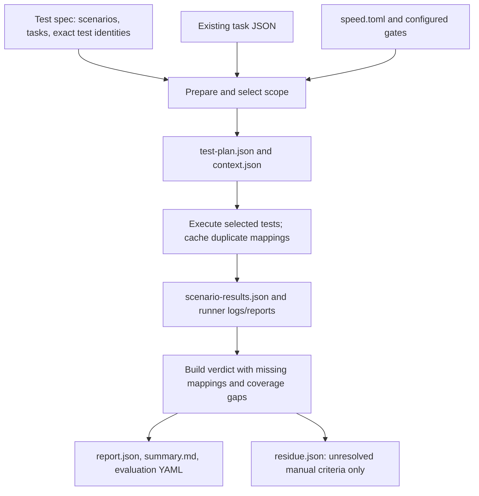

# Task-scoped evaluation without changing task JSON

Implemented on `feat/eval-test-spec-template`. The implementation checkout is `.claude/worktrees/task-scoped-eval`; the shared checkout is left on its original branch.

## Behavior

`speed eval -f payments` evaluates all declared feature scenarios. `speed eval -f payments --task task-1` evaluates only task-1's mapped tests, even when other tasks share the same test file. `--task-id` is equivalent to `--task`. The selected task must be `done`; feature evaluation requires every feature task to be `done`.

One task can own several scenarios, several tests for one scenario, and tests in several files or languages. An exact mapping can be shared by several scenarios and executes once per attempt. A failed test affects its mapped scenarios; it does not fail every scenario using that file.

Parsing, scope selection and test-plan generation are deterministic; no LLM chooses the tests.

Existing task JSON remains unchanged. Task IDs, `files_touched`, acceptance criteria and any existing scenario references are read as inputs. The mapping lives in the **Execution and Evidence** table of the test spec, or an explicit `--test-plan` JSON override.

## Example: two service tests and one other test for task-1

The Scenario Catalog must contain these IDs. Task IDs must match existing task files.

```markdown
| Scenario | Task | Selector | Test name | Runner | Command | Criterion |
|---|---|---|---|---|---|---|
| AC-01 | task-1 | test/service.test.ts | authorise records the amount and posts a balanced pair | node | | 1 |
| AC-02 | task-1 | test/service.test.ts | authorise never stores a full PAN | node | | 2 |
| VAL-01 | task-1 | test/money.test.ts | money rejects fractional minor units | node | | |
| AC-03 | task-2 | test/service.test.ts | idempotent authorise returns the original payment | node | | |
| AC-12 | task-2 | | | | | |
```

`--task task-1` selects the first three tests. It does not run AC-03's test or report task-2's missing AC-12 as task-1's failure. Task-2 and full-feature evaluation both report AC-12 as missing. Retain the Task cell on missing-test rows so their intended owner remains known.

Criterion is optional: `1` means the first existing acceptance criterion in that task, `2` the second. For criteria with `verify_by: "test"`, it associates existing criteria with the scenario evidence without adding fields to task JSON. Several rows may contribute to one criterion. Reordering criteria requires updating these indexes. Existing `scenario_ids` associations remain supported.

A generated plan entry looks like:

```json
{
  "scenario_id": "AC-01",
  "task_id": "task-1",
  "selector": "test/service.test.ts",
  "test_name": "authorise records the amount and posts a balanced pair",
  "runner": "node",
  "command": "",
  "criterion": "1",
  "depends_on_scenarios": []
}
```

Do not edit generated latest-run plans to change the source mapping; edit the spec or supply a separate override. `selection` records the mode, selected scenario IDs, candidate files, criterion associations and mapping gaps.

## How ownership is resolved

1. An explicit Task cell determines ownership of that mapping.
2. Existing task scenario references can determine ownership when Task is absent.
3. Otherwise, the selector's file can establish ownership only when it occurs in exactly one task's candidate test files.
4. When multiple tasks share that candidate file, add Task explicitly. Eval reports ambiguity and does not guess which test belongs to which task.

`files_touched` alone cannot establish individual test ownership. It supplies candidate files, filtered through `[eval] test_file_patterns`. A touched candidate file without a mapping is reported as a selection gap, except when all assigned scenarios for its task are explicitly manual. Patterns use Python `fnmatch` against repository-relative paths and basenames; `*` can match slashes. Explicit mappings can still name tests outside these discovery patterns.

```toml
[eval]
test_commands = [
  "python3 -m pytest -q",
  "node --experimental-strip-types --test",
  "cd frontend && npm test --"
]
test_file_patterns = ["test_*.py", "*_test.py", "*.test.*", "*.spec.*"]
```

When commands are ambiguous, put the exact configured command in the Command cell. Set Runner for wrappers, such as `vitest` when `npm test --` invokes Vitest. Selector paths are relative to the command's working directory (`cd frontend && ...` makes `service.test.ts` relative to `frontend`). Task `files_touched` paths stay relative to the project root. Use explicit Task/Command when working-directory inference is ambiguous.

## Individual tests and runners

| Runner | Selector | Test name | Evidence |
|---|---|---|---|
| pytest | `tests/test_payment.py::test_authorise` | empty | Automatically written JUnit |
| pytest class method | `tests/test_payment.py::TestPayments::test_authorise` | empty | JUnit |
| pytest parameter | `tests/test_payment.py::test_amount[2500]` | empty | JUnit; omit parameter suffix to run all parameters of that function |
| Node test runner | `test/service.test.ts` | Literal full title | JUnit; nested suite names are joined by spaces |
| Vitest | `service.test.tsx` | Literal full title including describe blocks | JSON assertion results |
| Jest | `test/service.test.js` | Literal full title including describe blocks | JSON assertion results, exact file selection |

JavaScript titles are escaped and anchored, so punctuation is literal rather than a regex supplied by the spec. A missing or renamed title, skipped selected test, duplicate/ambiguous full title, invalid report or empty discovery cannot pass. Filtered-out tests in a report do not count as selected skips. Extra executed tests make exact-selection evidence unverified; recorded selected failures remain failures.

Use runner commands that accept selector/filter arguments and terminate after one run (`vitest run`, for example). A wrapper must forward those arguments. Custom runners can retain the existing structured-report contract for exact selectors; they are responsible for honoring the selection. No runner-specific individual-name adapter is implemented here for Go, Playwright, Cypress, Java or other frameworks.

## Flow and files



| Source file | Responsibility |
|---|---|
| `lib/test_spec.py` | Parse mapping columns; retain task ownership and empty mapping rows |
| `lib/eval_selection.py` | Resolve ownership, filter task scope, classify candidate files and record gaps |
| `lib/eval_runtime.py` | Validate done tasks, snapshot inputs, generate plan/context, execute and reuse evidence, publish completed attempts |
| `lib/eval_execution.py` | Resolve allowed commands, apply exact runner filters, collect structured individual test evidence |
| `lib/eval_report.py` | Combine scenario results, reuse criterion evidence, report gaps, preserve provenance, write JSON/YAML/Markdown |
| `lib/cmd/eval.sh` | CLI arguments, locks, optional evaluator/defects and exit codes |
| `templates/test-spec.md` | Authoring format for new specs |
| `templates/speed-toml.toml` | Example runner and candidate-file configuration |

`test-plan.json` describes intended execution. Runner reports and `scenario-results.json` describe what ran. `report.json` combines that evidence with missing requirements, manual results and build checks. `evaluation.yaml` carries the verdict, selection and per-test records to downstream tooling. `summary.md` is the human-readable view. `residue.json` contains only unresolved manual criteria for optional judgment; missing automated tests never become an LLM pass. This flow does not generate `gaps.json`; gaps are recorded in selection metadata and report rows.

Feature attempts live under `.speed/features/<feature>/eval/runs/<run-id>/` and update `eval/report.json` and the feature's `evaluation.yaml`. Task attempts use `eval/task-<id>/runs/<run-id>/`, update that task's latest report and write `evaluation-task-<id>.yaml`. They do not update feature state or overwrite the full feature verdict.

## Missing coverage and limits

- Every declared feature scenario remains visible in feature mode, including scenarios with no mapping.
- Task mode includes scenarios assigned to that task even when their Selector is empty. A passing row cannot hide another empty required row for the same scenario.
- Missing files/tests, unmatched titles, selected skips, malformed evidence, absent task associations and unmapped touched test candidates block acceptance.
- An automated criterion without scenario associations is unverified. Use Criterion in the spec or existing task scenario references; eval does not infer semantic coverage from a green test file.
- Legacy task selector lists are usable only for one otherwise unmapped scenario and only with individual test selectors. They never add another whole-file run after mapped tests have executed.
- Older file-only mappings remain usable in **feature mode**, with file-level attribution explicitly labeled. They cannot distinguish which test proves which scenario. Add individual identities to obtain precise attribution. Task mode rejects these broad mappings without executing them.
- Test imports, setup, teardown and suite hooks still execute as the framework requires. Selection controls test bodies; it is not process isolation from shared setup.
- Runtime cannot detect a business requirement that was never declared in the catalog, traceability or task criteria. A reviewer must still check that the declared test asserts the intended behavior and that the spec is complete. This is not automatic change-impact analysis.

## Validation and handoff

[The checklist](task-scope-checklist.md) maps each requested scenario to observed tests. [The next-session prompt](next-session-prompt.md) identifies the checkout, completed work, reproduction commands and follow-ups. The original payments fixture is not modified; opt-in integration tests copy it into temporary projects.
