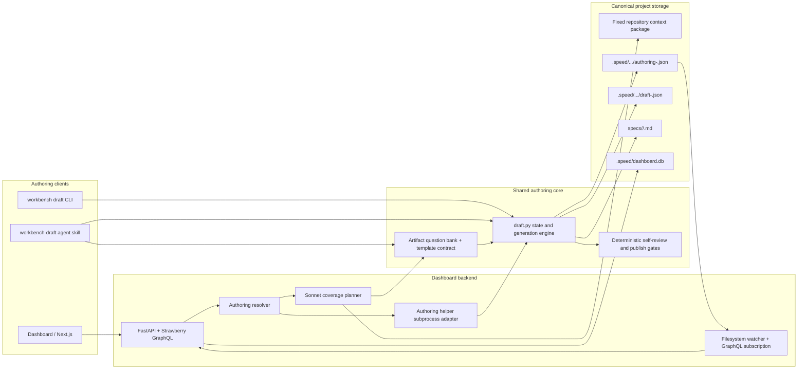
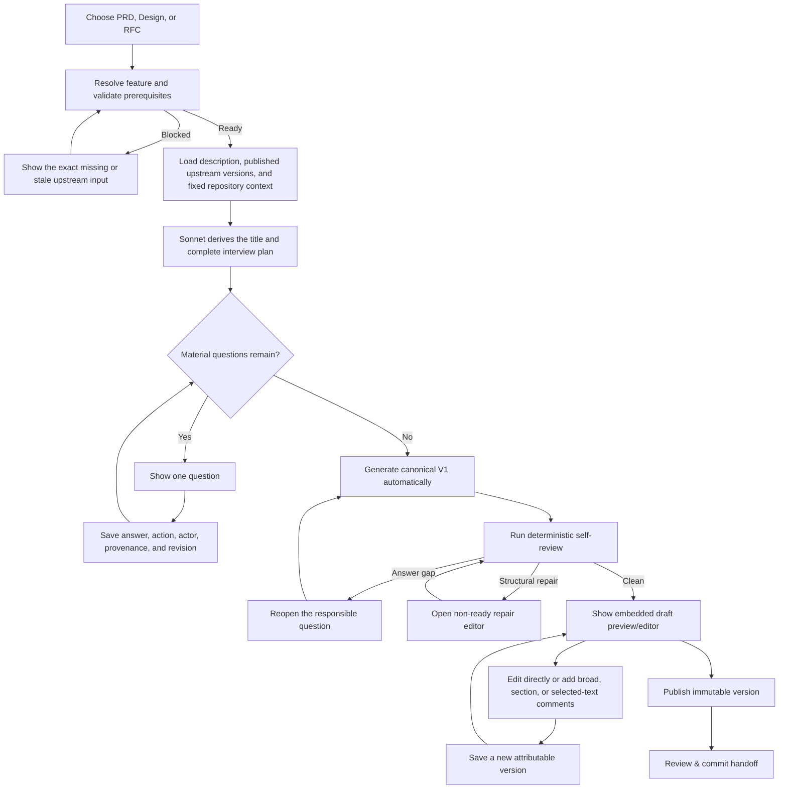

# Guided Authoring: Current Implementation Guide

**Status:** PRD, Design, and Technical RFC guided authoring are implemented across the dashboard and `workbench` CLI/agent surfaces.  
**Audience:** Product, Design, Engineering, and reviewers who need to create or continue a Define package.  
**Last updated:** September 8, 2026

> In this document, **RFC** is the implemented technical specification artifact. References to “RSC” in conversation mean RFC.

## What is implemented

The current implementation provides one guided-authoring system with three artifact-specific branches:

- **PRD:** starts from a short feature/problem brief and uses the Product interview contract.
- **Design:** starts from an immutable, published PRD version and uses the Design interview contract.
- **Technical RFC:** starts from immutable, published PRD and Design versions and uses the Engineering interview contract.

All three branches share the same interaction model:

- AI-derived title and canonical feature slug;
- evidence-aware interview planning using Sonnet;
- one question at a time, with every answer durably saved;
- no draft preview until the required interview is complete;
- automatic V1 generation after the final required answer;
- an embedded Markdown editor with Edit/View modes, formatting controls, and word/character counts;
- direct edits, document-wide feedback, section comments, and selected-text comments;
- immutable published versions and a version dropdown;
- ownership, revision-conflict protection, provenance, and self-review;
- the same canonical files and checkpoints whether the work is performed in the dashboard, CLI, or an agent.

Publishing freezes an editorial version. It does **not** mean that the artifact has been approved or ratified.

## Architecture



### Responsibility boundaries

| Layer | Responsibility |
|---|---|
| Dashboard | Presents intake, interview, editor, comments, publishing, and version selection. It does not invent questions or readiness rules. |
| GraphQL resolver | Converts UI operations into calls to the shared authoring engine and projects its result back to the browser. |
| Sonnet planner | Derives the title, compares available evidence with the selected artifact contract, resolves covered areas, and returns all material questions still needed. |
| `draft.py` | Owns interview state, answer persistence, generation, direct edits, comments, self-review, versions, publishing, locks, and conflicts. |
| Question banks/templates | Define stable coverage areas, completion evidence, section mappings, and the expected document shape for Product, Design, and RFC. |
| Filesystem checkpoint | Is the authoring source of truth. Chat history and browser state are not treated as durable workflow state. |

## End-to-end flow



Important flow rules:

1. The browser navigates immediately under an opaque temporary feature identity.
2. It shows **Deriving title…** until Sonnet returns a concise capability name; it never displays a sentence copied from the brief as the title.
3. The planner runs once for the initial interview. It does not discover extra questions during final synthesis.
4. Every answer is written before the next question appears. Reloading or switching between dashboard and CLI resumes from the same checkpoint.
5. The draft is hidden while material information is missing.
6. The final answer automatically generates V1; there is no separate **Create PRD** or **Generate Spec** button.
7. Direct edits and comment-driven regeneration produce new versions instead of overwriting published history.

## Creating a new PRD

### From the dashboard

1. Start the dashboard from the repository:

   ```bash
   workbench dashboard start
   ```

   The temporary `speed dashboard ...` alias reaches the same implementation.

2. Open `http://localhost:3000/define/new` and choose **PRD**.
3. Enter a plain-language description of what should ship. A title is not requested, and the description has no 500-character limit or counter.
4. Submit the brief. The app creates a durable temporary checkpoint, navigates immediately, and displays **Deriving title…** while planning runs.
5. Review the derived title and answer each material Product question. Depending on the completeness of the original brief, the planner may ask several questions or none.
6. When the last required answer is saved, V1 is generated automatically and appears in the right-side editor.
7. Refine the PRD in any of these ways:
   - edit the Markdown directly;
   - select text and attach a precise comment;
   - comment on a whole section;
   - enter broad feedback in chat and regenerate the affected sections.
8. Use **View** to render the Markdown, or **Edit** to continue changing it. Use the version dropdown to inspect earlier versions; historical versions are read-only.
9. Choose **Publish** to freeze the current version.
10. Choose **Review & commit** to enter the existing validation and commitment workspace.

The canonical PRD is written to:

```text
specs/<feature>/prd.md
```

### From the CLI or an agent

Start the Product intake conversationally:

```bash
workbench draft prd
```

For an existing canonical feature, resume it with:

```bash
workbench draft prd <feature-name>
```

The helper returns the exact next question or terminal action. A supported agent uses the `workbench-draft` skill to render the returned controls and submit answers. The CLI/agent and dashboard operate on the same checkpoint; they do not create parallel drafts.

To see where the entire core package stands:

```bash
workbench define <feature-name>
```

## Creating a Design specification

Design cannot begin from an unrelated freeform prompt. It must be linked to a published PRD snapshot.

### Dashboard

1. Publish the feature's PRD.
2. Open **New Spec** and choose **Design**.
3. Select an eligible feature. The picker includes only packages with a hash-verified published PRD.
4. The Design planner reads the exact published PRD content—not a newer working PRD draft—and resolves what is already known.
5. Answer the remaining Design questions.
6. V1 is generated automatically after the interview, using the same editor, comment, publish, and version workflow as the PRD.

### CLI or agent

```bash
workbench draft design <feature-name>
```

If no published PRD exists, the command returns a prerequisite blocker and routes the author back to the PRD. The Design output is:

```text
specs/<feature>/design.md
```

## Creating a Technical RFC

The RFC requires both a published PRD and a published Design specification. A later unpublished edit does not mutate either frozen upstream input.

### Dashboard

1. Publish the PRD and Design specification.
2. Open **New Spec** and choose **Technical RFC**.
3. Select an eligible feature with both required published snapshots.
4. The Engineering planner reads the pinned upstream content plus the fixed repository context package.
5. Answer the material interface, data/state, validation, testing, security, decision, migration, and dependency questions.
6. V1 is generated automatically and uses the shared editor, comments, publishing, and versioning workflow.

### CLI or agent

```bash
workbench draft rfc <feature-name>
```

The RFC output is:

```text
specs/<feature>/rfc.md
```

If the Design or PRD prerequisite is absent, stale, or fails its hash check, authoring is blocked without creating a misleading RFC preview.

## How the backend runs

The local dashboard consists of two processes:

| Process | Default endpoint | Purpose |
|---|---|---|
| Next.js frontend | `http://localhost:3000` | Dashboard and embedded authoring/editor UI |
| FastAPI + Strawberry GraphQL | `http://127.0.0.1:4440/graphql` | Queries, mutations, subscriptions, filesystem adapters, and model-planning orchestration |

Useful commands:

```bash
# Start frontend and backend
workbench dashboard start

# Use a different frontend port when 3000 is occupied
workbench dashboard start --frontend-port 3001

# Start only GraphQL/API
workbench dashboard start --api-only

# Show process state
workbench dashboard status

# Stop only the processes tracked for this project
workbench dashboard stop
```

Each frontend launch receives its GraphQL and WebSocket endpoints through environment variables. Its Next.js build directory is isolated by API/frontend port, preventing two project dashboards from overwriting each other's compiled client endpoint.

The authoring resolver runs blocking helper/model work outside the async request loop. The helper is invoked as a subprocess so the dashboard, CLI, and projected agent skill all execute the same packaged authoring implementation. The planner currently prefers the configured support model, defaulting to Sonnet, and has a 45-second bound with a deterministic fallback.

Repository context is deliberately bounded. Until a dedicated context module replaces it, the planner reads only the first available project authoring context file, the feature context package, and the product overview:

```text
.speed/context/authoring-project-context.md
.speed/context/authoring-project-context.json
.speed/.../features/<feature>/context-package.json
specs/product/overview.md
```

Authoring writes are protected by a feature lock and expected-revision checks. A stale browser receives a conflict state instead of silently overwriting a newer answer. Claims identify the current artifact owner, while filesystem watcher events push checkpoint changes back to open dashboard tabs through a GraphQL subscription.

### Persisted files

For single-player projects, operational state is under `.speed/features/<feature>/`; multiplayer projects use `.speed/shared/features/<feature>/`.

| File | Meaning |
|---|---|
| `authoring-prd.json`, `authoring-design.json`, `authoring-rfc.json` | Authoritative intake, interview, coverage, provenance, comments, artifact versions, and publish history |
| `draft-prd.json`, `draft-design.json`, `draft-rfc.json` | Dashboard-facing artifact projection |
| `claim-<artifact>.json` | Current ownership/claim state |
| `commit-<artifact>.json` | Existing Review & commit evidence |
| `context-package.json` | Feature-scoped repository evidence supplied to planning |
| `specs/<feature>/<artifact>.md` | Current human-readable artifact |

## How PARI/readiness covers the artifact

There is no separate `PARI` boolean or service in the current code. **PARI** is a useful team-facing way to explain the four implemented gate families:

| PARI dimension | What the implementation checks |
|---|---|
| **P — Prerequisites** | The correct feature exists; Design has a published PRD; RFC has published PRD and Design snapshots; upstream paths, revisions, and hashes are usable. |
| **A — Answer coverage** | Every required artifact coverage area is either resolved by evidence, confirmed by the author, legitimately not material, or still represented by a blocking question. |
| **R — Review readiness** | Required sections exist, answer quality is sufficient, IDs/tables are valid, no unsupported claim or unresolved marker is presented as fact, and self-review has no blocking finding. |
| **I — Integrity** | Answers and edits have provenance; writes use expected revisions; comments keep section/text anchors; published versions are immutable; downstream artifacts pin exact upstream hashes. |

PARI is therefore not a manually maintained progress percentage. It is derived from evidence and persisted state.

### Coverage contracts

The model does not decide completeness from intuition alone. Each branch has a versioned question bank that maps stable coverage IDs to document sections and completion evidence.

| Artifact | Stable coverage | What it protects |
|---|---|---|
| PRD | `P-Q1` Problem/evidence; `P-Q2` user boundary; `P-Q3` hypothesis; `P-Q4` product behavior; `P-Q5` acceptance; `P-Q6` success; `P-Q7` scope/dependencies; `P-Q8` delivery/controls | Outcome, user, requirements, observable acceptance, measurement, scope, non-regression, risk, and rollout completeness |
| Design | `D-Q1` intent; `D-Q2` journeys/routes; `D-Q3` layout/responsiveness; `D-Q4` components/data; `D-Q5` states; `D-Q6` interaction/accessibility/content; `D-Q7` visual tokens; `D-Q8` adaptation/verification | Every applicable Product journey, state, recovery path, responsive behavior, accessibility need, and component contract |
| RFC | `R-Q1` example/interface; `R-Q2` data/state; `R-Q3` API/validation; `R-Q4` testing; `R-Q5` security/controls; `R-Q6` decisions/tradeoffs; `R-Q7` migration/file impact; `R-Q8` dependencies/open questions | Implementable interfaces, data lifecycle, failures, verification, security, decisions, delivery impact, and remaining blockers |

The completeness loop is:

1. Compare the evidence set with every stable coverage area.
2. Reuse evidence-backed decisions instead of asking the user to repeat them.
3. Ask every remaining material question; there is no fixed question count.
4. Block V1 while a required question is unanswered or deferred.
5. Map confirmed answers to their declared sections and preserve the source IDs.
6. Run deterministic self-review against the artifact template.
7. Reopen the responsible question for answer-level gaps, or expose repair mode for structural gaps.
8. Freeze a hash-addressed version at publication and use that exact version downstream.

This design prevents silent omissions and invented certainty. It does not guarantee that a human answer is factually correct; reviewers still own approval and business/technical judgment.

## Package status and connected audit

Run this at any time to reconcile the three core artifacts and receive the next safe action:

```bash
workbench define <feature-name>
```

After PRD, Design, and RFC are published, run the connected core-package audit:

```bash
workbench audit <feature-name>
```

The audit checks current artifact hashes, prerequisite pins, self-review state, open comments, and cross-artifact relationships. It writes an immutable timestamped report plus a latest-report pointer. If an input changes, the older report becomes stale instead of being silently reused.

## Current limitations

The following stages are intentionally not reported as complete:

- formal reviewed Discover handoff;
- ADR candidate capture and ADR finalization;
- evaluation specification/readiness;
- final package ratification;
- an honest `plan_ready` result across the complete future Define journey.

`workbench define` reports these as blockers. Published PRD, Design, and RFC files alone are not presented as a fully ratified, Plan-ready package.

## Key implementation references

- [Guided authoring product contract](../specs/product/define-module/03-guided-authoring.md)
- [Dashboard/backend RFC](../specs/tech/workbench-guided-authoring-dashboard.md)
- [Shared authoring skill](../skills/workbench-draft/SKILL.md)
- [Shared authoring engine](../skills/workbench-draft/scripts/draft.py)
- [Model-backed planner](../dashboard/backend/authoring_planner.py)
- [GraphQL resolver](../dashboard/backend/resolvers/authoring.py)
- [Dashboard authoring page](../dashboard/frontend/app/define/%5Bfeature%5D/authoring/%5Bartifact%5D/page.tsx)
- [Embedded editor](../dashboard/frontend/components/ceremony/guided/DraftPreview.tsx)
- [Define reconciliation/audit skill](../skills/workbench-define/SKILL.md)
