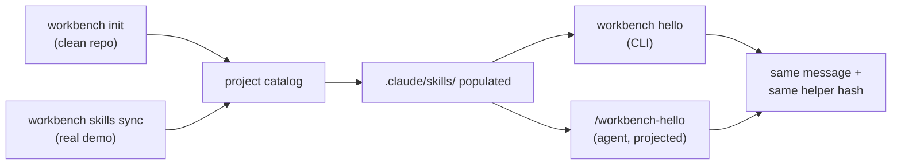

# Workbench Skill System: End-to-End Verification

**Date:** 2026-08-26
**Branch:** `worktree-skill-system-rfc`
**Spec:** [RFC](../specs/tech/speed-skill-system.md) · [feature note](../specs/product/define-module/01-skill-system.md)

This report records a live end-to-end test of the skill system against a real project. It covers what was tested, how it was run, the results, one bug the test caught and fixed, and the known limitations. Read the results table first; the transcripts below back each row.

The single question under test: **when a user initializes a project, do the built-in skills land in that project, become usable by the agent, and produce the same result whether invoked through the CLI command or the agent-side skill?**

## What was tested

| # | Claim | Result |
|---|---|---|
| A | `workbench init` on a fresh project projects the catalog into the agent surface | Pass |
| B | The same projection lands in the real demo project via `workbench skills sync` | Pass |
| C | CLI command and agent-side skill produce the same result from one implementation | Pass |
| D | Safety holds: idempotent re-sync, conflict preservation, force-repair | Pass |

## Environment

| Item | Value |
|---|---|
| Code under test | `worktree-skill-system-rfc` (this branch) |
| Interpreter | main checkout `.venv` (Python 3.11), via `SPEED_PYTHON` |
| Real project | `/Users/mohitpatel/Desktop/inrhythm/speed-todo-demo` |
| Clean project | throwaway `git init` repo for the full-init path |
| Canonical entry | `./workbench <cmd>`; `./speed <cmd>` exercised as the temporary alias |

One environment fixup was required: a fresh git worktree lacks the compiled tree-sitter grammar `.dylib` files (gitignored build artifacts), so `speed`'s startup dependency gate refuses to run. The four built grammars were copied from the main checkout to let the real binary launch. This gate is unrelated to the skill system and blocks every `speed` command equally.

## How it was run

The demo project is already initialized and carries uncommitted work, so `workbench init` (which ends in `git add -A && git commit`) was **not** run against it. Instead:

- The full `workbench init` path was verified in a clean throwaway repo.
- The projection step that `init` performs (`workbench skills sync`, init step 8) was run against the real demo.



## Results

### A. Full init on a clean project

`workbench init` scaffolded the project and its final step projected the catalog:

```text
✓ Skills projected into detected agent surfaces
[master ...] speed init: project scaffold
 create mode 100644 .claude/skills/workbench-draft/SKILL.md
 create mode 100644 .claude/skills/workbench-hello/SKILL.md
 create mode 100644 .claude/skills/workbench-hello/scripts/hello.py
```

Provenance keys were injected into the projected `SKILL.md` (`x-speed-managed: true`, `x-speed-source`, `x-speed-catalog-version`), and install events were recorded.

### B. Projection into the real demo project

`workbench skills sync` against the demo produced:

```text
$ workbench skills status
catalog dev · 2 skills
  claude_code   workbench-draft   current
  claude_code   workbench-hello   current
```

Projected tree in the demo (no bytecode, no OS junk):

```text
.claude/skills/workbench-draft/SKILL.md
.claude/skills/workbench-hello/SKILL.md
.claude/skills/workbench-hello/scripts/hello.py
```

Install events (`.speed/skills/events.jsonl`), both under one transaction id:

```json
{"action":"installed","skill":"workbench-draft","surface":"claude_code","new_version":null,...}
{"action":"installed","skill":"workbench-hello","surface":"claude_code","new_version":"0.1.0",...}
```

### C. Same result: CLI command vs agent-side skill

The CLI adapter and the agent-side projected skill both execute the one canonical `scripts/hello.py`.

| Route | Command | message | surface |
|---|---|---|---|
| CLI | `workbench hello Mohit` | `Hello, Mohit! Workbench skills are available.` | `workbench-cli` |
| Agent | run the projected `scripts/hello.py` | `Hello, Mohit! Workbench skills are available.` | `claude-code` |

The `message` invariant is identical; only `surface` differs, by design. Two structural proofs that this is one implementation rather than two look-alikes:

- **Helper hash equality:** the canonical and the demo-projected `hello.py` share the SHA-256 `8b53f4de…6a135`.
- **Alias equality:** `speed hello Mohit` prints stdout identical to `workbench hello Mohit`, plus a stderr notice that `speed` is a temporary alias.

### D. Safety guarantees on the real demo

| Check | Action | Result |
|---|---|---|
| Idempotency | second `sync` with no catalog change | manifest untouched, no writes |
| Conflict | hand-edit a projected `SKILL.md`, then `sync` | edit preserved, state `conflicted`, `conflict` event logged |
| Repair | `sync --force` | managed content restored, state `current` |

## Bug found and fixed

The clean-init run projected a stray `scripts/__pycache__/hello.cpython-311.pyc` into `.claude/skills/`. Importing the helper compiled bytecode next to the canonical file, and the catalog loader's recursive glob swept it in. Fixed by excluding `__pycache__`, `*.pyc`/`*.pyo`, and `.DS_Store` from package loading and projection, and by disabling bytecode writes when the engine imports the helper. A regression test (`test_load_package_excludes_junk_files`) locks it. After the fix, no projection contains bytecode, confirmed on both the clean repo and the demo.

## What the test added to the demo

The projection wrote generated files into the demo that were not there before:

- `.claude/skills/workbench-draft/`, `.claude/skills/workbench-hello/`
- `.speed/skills/manifest.json`, `.speed/skills/events.jsonl`
- an empty `.claude/` was created first, to mark the project as a Claude Code surface

The demo's `.gitignore` does not currently ignore these, so they appear as untracked. They are safe to keep (they are the installed skills), to commit, or to gitignore. A real `workbench init` adds `.speed/skills/` to `.gitignore` automatically; a project that only runs `skills sync` does not.

## Known limitations

- **Grammar gate:** the real binary needs the compiled grammars present. This is a general SPEED build requirement, not specific to skills. In a normal install they are already built.
- **Catalog version shows `dev`:** the version is read from the SPEED install receipt and falls back to `dev` when it is not resolvable in a sandboxed run. In a released install it reflects the release version.
- **Surfaces:** only Claude Code (`.claude/skills/`) is projected in this phase; Codex (`.agents/skills/`) is a later phase and reports `unsupported` until then.

## Conclusion

The skill system works end to end: initialization projects the built-in catalog into a project's agent surface, the skills are discoverable and usable there, and the CLI command and the agent-side skill return the same result from a single shared implementation. Idempotency, conflict preservation, and repair all behaved correctly against a real project. The one defect surfaced by live testing was fixed and covered by a regression test.
