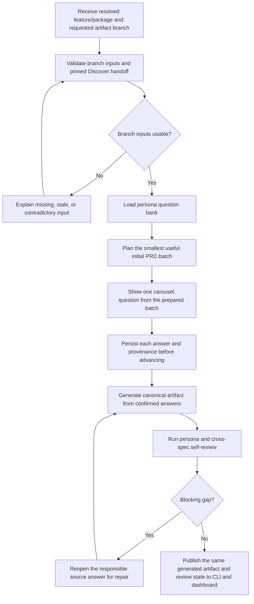

# Feature Note: Guided Authoring

**Status:** Core PRD, Design, and Technical RFC authoring implemented; Discover handoff, ADR capture/finalization, and evaluation readiness remain outside the current slice
**Owns:** One shared cross-surface interview mechanic with product, design, and technical branches; branch-input validation; human answer decisions; question-level resume and staleness; canonical artifact generation; provenance-aware editing; self-review; and CLI/dashboard parity inside an authoring session.

## Dashboard authoring refinement (2026-09-07)

The dashboard uses one shell for PRD, Design, and Technical RFC. PRD starts as
one chat-style description input with no character counter or hard cap. The
server creates an opaque temporary identity, the model derives a concise display
title, and the workflow atomically canonicalizes the feature slug from that
title. Design requires the exact published PRD; Technical RFC requires the exact
published PRD and Design. Each uses its own interview agent and question bank.
Once the smallest necessary clarification set is answered, the first draft opens
in a simple editor beside the chat instead of linking to a separate editor route.
Authors can save formatting/content changes as a new version, inspect older
versions, see live word and character counts, leave broad change requests in
chat, or select exact text and attach a section-and-line-scoped comment. All
anchors and earlier artifact versions survive the next revision. Publishing
creates an immutable labelled snapshot; subsequent edits create a new draft
without replacing the published version. The editor header owns the single
`Review & commit` action and an Edit/View toggle. View renders the complete
Markdown file, while Edit keeps the metadata in the document scroll region so
it scrolls away with the body instead of remaining sticky.

The initial interview questions are planned once. Every answer is persisted to
the shared checkpoint before the next question appears. Answering the final
question generates the first draft immediately; there is no separate Create PRD
confirmation or second planning pass.

## Why This Is Needed

Broad prompt-to-document generation produces fast drafts but does not reliably expose missing evidence, force decisions, or preserve why content entered an artifact. A guided interview makes the thought process explicit without making authors memorize every template section.

One shared mechanic keeps entry, evidence handling, answer controls, persistence, and review consistent. Persona-specific question banks retain the distinct judgment required for product, design, and engineering.

## Boundary with Flow and Orchestration

[Flow and orchestration](02-flow-and-orchestration.md) decides where the user goes; this note governs what happens while authoring a PRD, design specification, or RFC.

- Orchestration owns canonical feature/package resolution, journey-stage selection, and the journey-level next action.
- A direct `workbench draft` or dashboard **New Spec** entry invokes that same resolver before guided authoring begins. Guided authoring does not maintain a second feature registry or package bootstrap.
- Guided authoring owns whether the selected PRD, design, or RFC branch has usable input revisions and evidence. It returns its prerequisite result to orchestration rather than relying on a separately implemented orchestration check.
- Orchestration resumes the appropriate activity; guided authoring resumes the exact unanswered or stale question inside that activity.
- Guided authoring reports its artifact revision, blockers, stale-answer impact, self-review result, and next internal or handoff action. Orchestration incorporates that result into the complete journey.

## Interview Flow

The CLI/active agent and dashboard can both start, conduct, resume, and complete the interview in v1. The dashboard's **New Spec** action does not invoke a separate broad-generation path: after shared feature/package resolution, it selects the PRD, design, or RFC branch, runs the same branch prerequisite gate, loads the same versioned question bank, and writes to the same persisted interview session used by `workbench draft`.

The two surfaces are clients of one guided-authoring workflow, not independent interview engines. An author may answer in the dashboard, continue through the CLI/active agent, and return to the dashboard without duplicating a session, replaying confirmed questions, changing question order, or generating a second artifact. Both surfaces show the same current question, confirmed/deferred answers, evidence, self-review findings, artifact revision, and next action. ADR candidates are not yet projected by this implementation.

## Dashboard Authoring Contract

From the dashboard, an eligible author can select **New Spec**, choose PRD, design, or RFC, and select an existing target package or request creation through the shared package resolver. A new package is created only when the orchestration-owned identity and Discover-handoff rules permit it. Before showing the first question, the dashboard applies the same guided-authoring branch prerequisite and ownership checks as the CLI/agent.

During the interview, the dashboard must provide:

- for a new PRD, one question at a time from the complete initial plan of all
  material contextual questions, with every submitted answer durably resumable;
- the same question ID, wording, evidence, and question-bank version as the CLI/agent;
- a single-select response control for accept suggestion, edit suggestion,
  reject suggestion, and defer, followed by a prefilled edit field when Edit is
  selected, with the same blocking behavior on every surface; unavailable
  actions are omitted rather than displayed as selectable choices;
- visible save/checkpoint state after each durable transition;
- progress, unresolved requirements, stale answers, and the exact resume point;
- generation and self-review actions only when the same branch gates would permit them through the CLI/agent.

Submitting the last required answer immediately creates or updates the one canonical artifact from confirmed answers. There is no separate **Create PRD** or **Generate Spec** confirmation. Generation must not create an unrelated dashboard-only draft, bypass unanswered material questions, or use a different prompt/template pipeline. The generated path, content, revision/hash, source-answer mapping, unresolved items, and self-review result are identical regardless of which surface initiated generation.

Each generated section shows its source question IDs and offers **Edit draft**
and **Comment**. Edit draft makes an explicit manual section override; Comment
collects requested changes so several sections can be regenerated in one pass.
On submission, the model reconsiders each affected section against the complete
existing PRD and its source context and returns a structured replacement body;
the comment itself is never appended as PRD prose. Model failure leaves the
current artifact unchanged and the comments available to retry.
The preview does not expose an **Edit answer** action. A blocking self-review
finding may still reopen its responsible question so the author can repair the
underlying decision before regeneration.

If both surfaces are open, persisted session revision controls prevent silent last-write-wins behavior. A stale client must reload or deliberately reconcile before changing an answer. The dashboard never represents locally cached answers as saved until the shared checkpoint succeeds.

### Missing-input intake

The artifact choice determines the next input; the UI does not offer one generic
repository feature picker for every branch.

- **New PRD:** collect only a short problem/outcome description. Do not ask for
  or display a guessed title or slug. Persist it under an opaque temporary
  identity, navigate immediately, show **Deriving title…**, and canonicalize the
  feature identity only from the model title. Treat the description as direct
  evidence and let the planner resolve P-Q1 when it is sufficient.
- **Design and Technical RFC:** enter through an existing canonical feature.
  Design is blocked until its PRD has an immutable, hash-verified published
  version. Technical RFC is blocked until both PRD and Design have published
  versions. A newer working draft does not invalidate the last published snapshot.

CLI/agent and dashboard clients consume this same branch-aware intake result.

## Shared Interview Behavior

1. Invoke the shared feature/package resolver and receive the canonical feature reference, requested artifact type, actor, and current journey inputs.
2. Validate the selected branch's exact prerequisite revisions and show missing, stale, contradictory, or unratified inputs with their impact.
3. Load the question bank for the selected persona.
4. Plan every contextual question needed to complete the applicable template,
   without a fixed question-count limit. Present one question at a time and
   persist each answer immediately before advancing. Do not append a newly
   discovered question during final synthesis.
5. Return a shared selectable action control. Persist the selected action before
   collecting any second-step edit text, then persist the resulting answer or
   deferral state.
6. Checkpoint after each durable transition—including intake evidence and an
   edit selection—and resume at the exact saved control with the same confirmed
   answers and Discover outputs.
7. Generate the canonical template only from confirmed information.
8. Self-review and return answer-level gaps to the responsible question on either surface; expose structural repair in the embedded editor without marking V1 ready.
9. Preserve direct section/document edits and anchored review comments as attributable, revisioned provenance.
10. Publish the same generated revision, provenance, findings, and authoring next action to CLI/agent and dashboard, then return the branch result to orchestration for journey routing.

## Persona Branches

### Product

Establish users, jobs, problem, outcomes, primary/alternate/failure flows, functional requirements, measurable success, scope, controls, risks, assumptions, and unresolved product decisions. Stable requirement IDs and observable acceptance criteria are mandatory. Code may constrain the contract but does not decide the product outcome.

#### Product questions

| ID | Core question | Evidence used | PRD template destination | Completion evidence |
|---|---|---|---|---|
| P-Q1 | Who experiences the problem, in what situation, what happens today, and why does it matter now? | Reviewed Discover handoff, research, defects, learnings, and current behavior | `Problem` | Supported problem statement with source references |
| P-Q2 | Which users and roles are affected, what jobs are they trying to complete, and what permissions or constraints differ between them? | Discover personas, existing roles and permissions, current journeys | `Users` | Named user/role set with relevant differences |
| P-Q3 | What user and business outcomes should change, and which guardrails must not regress? | Discover outcome, product vision, baselines, analytics, policy | `Success Criteria` | Outcome and guardrail IDs with baseline/measurement status |
| P-Q4 | What are the primary, alternate, failure, cancellation, and recovery flows from entry to completion? | Current product behavior, related requirements, defects, support evidence | `User Stories`; `User Flows` | Stable story/flow IDs covering material paths |
| P-Q5 | What must the product do, and what observable Given/When/Then behavior proves each stable requirement? | Confirmed flows, business rules, policies, existing contracts | `User Stories`; linked flow acceptance behavior | Stable requirement/story IDs with observable acceptance criteria |
| P-Q6 | How will success be measured, what threshold or baseline is required, where does the measurement come from, and who owns it? | Existing instrumentation, historical baselines, desired outcomes | `Success Criteria` | Metric, threshold or baseline plan, source, and owner |
| P-Q7 | What is in scope, explicitly out of scope, dependent on other work, or constrained by sequencing? | Related features, organizational constraints, release dependencies | `Scope`; `RFC Decomposition`; `Dependencies` | Explicit inclusions, exclusions with reasons, dependency IDs, and decomposition decision |
| P-Q8 | Which authorization, privacy, compliance, abuse, rollout, assumption, risk, or unresolved decision needs explicit ownership or ADR-candidate capture? | Security policy, regulatory requirements, historical failures, existing ADRs | `Security & Controls`; `Risks`; `Open Questions` | Owned controls/risks/questions and any `ADRC-###` candidates |

Product questions challenge solution-first statements. Missing customer or measurement evidence is recorded as a research or baseline gap; the interview must not invent certainty to complete the PRD.

### Design

Translate every applicable product journey into routes/surfaces, hierarchy, components, content, interaction, responsive behavior, accessibility, and default/loading/empty/partial/error/permission/offline/overflow states. Reused tokens and components must resolve to evidence; new primitives are labeled new.

#### Design questions

| ID | Core question | Evidence used | Design template destination | Completion evidence |
|---|---|---|---|---|
| D-Q1 | What experience, hierarchy, tone, and explicit negative constraints should guide the design? | PRD outcomes, product patterns, approved references | `Design Intent` | Intent and negative constraints linked to PRD outcomes |
| D-Q2 | Where does each journey begin and end, and which routes, surfaces, and navigation transitions cover every PRD flow? | PRD flows, existing routes, navigation model | `Pages / Routes` | Every applicable PRD flow maps to a route/surface path or justified non-visual decision |
| D-Q3 | What layout regions, containment, information priority, scrolling, and responsive structure are required? | Existing shells, grids, breakpoints, platform conventions | `Layout Structure`; `Responsive Behavior` | Layout regions and breakpoint behavior for each relevant surface |
| D-Q4 | Which components are reused, modified, or new, and what inputs, states, and ownership does each require? | Component library, current implementation, design system | `Component Inventory`; `Component Props`; `Data Binding`; `Implementation Notes` | Resolvable reused components, explicitly labeled new components, and owned implementation implications |
| D-Q5 | What happens in default, loading, empty, partial, error, permission, disabled, success, offline, and overflow states? | PRD failure paths, existing patterns, defects | `States` | State IDs covering every material happy, boundary, and recovery path |
| D-Q6 | How do actions, validation feedback, recovery, focus, keyboard behavior, motion, and user-facing copy work? | Content standards, accessibility rules, interaction patterns | `Interactions & Motion`; `Accessibility`; `Content Constraints` | Observable interaction, recovery, focus, motion, and content rules |
| D-Q7 | Which existing spacing, typography, color, depth, icon, and imagery tokens apply, and which primitives are genuinely new? | Closed token set and design-system documentation | `Spacing`; `Typography`; `Color Application`; `Elevation & Depth` | Every reused token resolves; every new primitive is identified as new |
| D-Q8 | How does the experience adapt across viewport, platform, localization, reduced motion, assistive technology, and accessibility targets? | Breakpoints, supported platforms, localization rules, WCAG target | `Responsive Behavior`; `Accessibility`; `Verification Criteria`; `Figma / Visual Reference` when applicable | Testable adaptation/accessibility criteria and linked visual evidence or reason it is not applicable |

Every applicable product requirement must map to design behavior or an evidence-backed non-visual/not-applicable decision. The branch cannot complete while a material unhappy or boundary state is omitted.

### Technical

Translate approved product and design obligations into architecture, data/state, interfaces, errors, validation, file/symbol impact, delivery, security, reliability, observability, performance, verification, and decomposition. Existing files and symbols must resolve or be labeled new. Significant choices become ADR candidates.

#### Technical questions

| ID | Core question | Evidence used | RFC template destination | Completion evidence |
|---|---|---|---|---|
| T-Q1 | Which architecture boundaries and owners are involved, what alternatives are credible, and why is the proposed integration shape appropriate? | Semantic graph, current architecture, related RFCs, conventions | `Basic Example`; `Key Decisions`; `Drawbacks`; `Dependencies` | Chosen boundary, credible alternatives, rationale, owner, and dependency links |
| T-Q2 | Which entities, fields, relationships, constraints, lifecycles, and state transitions are created or changed? | Models, schemas, migrations, existing state logic | `Data Model`; `State Machine` | Complete data/state contract grounded in existing or explicitly new entities |
| T-Q3 | Which APIs, events, commands, types, inputs, outputs, errors, consumers, and compatibility guarantees form the interface contract? | Existing routes, symbols, schemas, clients, sibling specs | `Interface Contract`; `API Surface`; `Search / Query Strategy` when retrieval behavior applies | Stable interface IDs with consumers, producers, errors, compatibility, and applicable query behavior |
| T-Q4 | Which inputs are rejected, what exact failure semantics apply, and how does the caller or system recover? | PRD rules, validators, error conventions, defect history | `Validation Rules`; `Testing > Edge Cases` | Rejected inputs and observable failure/recovery semantics |
| T-Q5 | Which existing files and symbols change, which files are new, and where are ownership overlap or dependency-order risks? | Repository graph, file ownership, related-spec analysis | `File Impact`; `Dependencies` | Resolvable existing paths/symbols, labeled new paths, owners, and collision risks |
| T-Q6 | What migration, rollout, feature-flag, backward-compatibility, rollback, and operational ownership behavior is required? | Deployment, migration, release, and operational conventions | `Migration Strategy`; `Dependencies`; `Unresolved Questions` | Executable migration/rollback contract and owned unresolved delivery decisions |
| T-Q7 | What security, privacy, observability, performance, reliability, cost, and failure-isolation obligations must the implementation satisfy? | Policies, platform patterns, incidents, service objectives | `Security & Controls`; `Testing > Risks and Coverage`; `Drawbacks` | Testable quality obligations, thresholds, risks, and controls |
| T-Q8 | Which observable acceptance criteria, high risks, rejected inputs, edge cases, fixtures, and evidence hooks make the RFC test-derivable? | PRD criteria, design states, testing conventions, evaluation-readiness contract | `Testing > Acceptance Criteria`; `Risks and Coverage`; `Test Plan`; `Edge Cases`; `Out of Scope` | Every upstream obligation maps to observable verification behavior |
| T-Q9 | Which significant choices, rejected alternatives, consequences, or deviations must be captured as ADR candidates? | Interview decisions, existing ADRs, repository constraints | `Key Decisions`; `Drawbacks` | Linked candidate IDs with alternatives and consequences |
| T-Q10 | Does the work need parent/child RFCs, and what interfaces, file ownership, dependency order, and independently testable output belong to each child? | Scope, sizing, subsystem boundaries, ownership analysis | `Interface Contract > Consumes/Produces`; `File Impact`; `Dependencies` across the RFC set | Credible topology with non-overlapping ownership and testable child outputs |

Technical answers must resolve existing files, symbols, and contracts or label them as new. The branch cannot complete while an upstream obligation lacks an implementable technical contract or a required verification behavior.

### Question activation and answer contract

- The question bank marks questions as required or conditional and records the condition that activates each one.
- Questions are asked one at a time; confirmed earlier answers and evidence are carried forward without asking the author to repeat them.
- The author can answer, edit, or defer. Deferring a required question records its owner and impact and blocks generation or approval when the missing answer is material.
- Each persisted answer records question ID, artifact branch, answer state, final answer, evidence references, actor, timestamp, and any ADR candidate.
- Self-review findings return to the responsible question ID so repair updates the source answer rather than patching unexplained prose into the document.

## User Stories

| ID | User story | Surfaces | Acceptance criteria | Output or gate | Priority |
|---|---|---|---|---|---|
| AUTH-S1 | As an artifact author, I want one guided-authoring entry that selects the correct persona branch so I receive a consistent interview without losing the judgment specific to my role. | CLI/agent + dashboard authoring | Starting through `workbench draft` or dashboard **New Spec** first obtains the same canonical feature/package reference from the shared resolver, then loads the same PRD, design, or RFC branch, interview session, question bank, and template mapping. Neither entry creates a parallel feature identity, session, or artifact. | Correct branch and versioned interview session for the resolved feature | Must |
| AUTH-S2 | As an artifact author, I want branch-input problems explained before questioning so I do not produce a draft from stale or unusable evidence. | CLI/agent + dashboard authoring | For the selected PRD, design, or RFC branch, missing, stale, contradictory, or unapproved input revisions are named with their impact, owner, and repair action. Material failures block questioning on both surfaces; the same gate result is returned to orchestration for routing, and a repair reflected in either surface updates that gate. | Passed authoring prerequisite gate or actionable blocker | Must |
| AUTH-P1 | As a product owner, I want the interview to turn reviewed Discover evidence into a PRD so the team receives an outcome-led, measurable product contract rather than an implementation proposal. | CLI/agent + dashboard authoring/review | P-Q1–P-Q8 populate their mapped PRD sections; primary and failure flows, stable requirements, measurable success, scope, controls, risks, and open questions are covered. Unsupported certainty is not invented, and unresolved material product decisions block generation or approval on either surface. | Reviewable PRD mapped to confirmed Product answers | Must |
| AUTH-D1 | As a design owner, I want the interview to turn approved product obligations into a complete experience contract so every relevant journey, state, interaction, and accessibility need is implementable. | CLI/agent + dashboard authoring/review | D-Q1–D-Q8 populate their mapped design sections; every applicable PRD flow has grounded routes/components/states or a justified non-visual decision. Missing boundary, recovery, responsive, or accessibility behavior blocks generation or approval on either surface. | Reviewable design spec mapped to confirmed Design answers | Must |
| AUTH-T1 | As an engineering owner, I want the interview to turn approved product/design obligations and repository evidence into an RFC set so implementation can proceed from real contracts and credible decomposition. | CLI/agent + dashboard authoring/review | T-Q1–T-Q10 populate their mapped RFC sections; upstream obligations map to interfaces, data/state, validation, delivery, quality, testing, decisions, and file/symbol impact. Existing references resolve or are labeled new; material gaps block generation or approval on either surface. | Reviewable RFC set mapped to confirmed Technical answers | Must |
| AUTH-S3 | As an author, I want control over every answer used in my artifact so generated prose cannot silently replace my judgment. | CLI/agent + dashboard authoring | For each question the author can answer, edit, or defer through either surface. The shared state records the final answer, evidence, actor, time, and impact; only confirmed information enters generated sections, and deferred material content remains visibly blocking. | Auditable answer record | Must |
| AUTH-S4 | As an interrupted author, I want to resume at the next unanswered or stale question so I do not repeat confirmed decisions. | CLI/agent + dashboard authoring | Answers, provenance, question-bank version, current question, prerequisite revisions, and candidates survive interruption. Switching surfaces resumes the same checkpoint; an incompatible question-bank or prerequisite change identifies targeted stale answers. | Deterministic cross-surface resume point | Must |
| AUTH-S5 | As an author, I want significant choices captured while their reasoning is fresh so required ADR work is not lost during drafting. | CLI/agent + dashboard authoring/decision queue | A significant choice confirmed on either surface receives one durable candidate ID, source answer, alternatives, significance reason, actor, and time. The author can correct or defer it, but the system cannot silently graduate, discard, or duplicate it across surfaces. | Traceable ADR candidate | Must |
| AUTH-S6 | As an author, I want self-review findings tied back to their source questions so I can repair reasoning instead of patching unexplained prose. | CLI/agent + dashboard authoring/review | Self-review checks required sections, unsupported claims, contradictions, scope drift, unresolved material answers, and upstream coverage. Every blocking finding names and reopens the responsible question/answer on either surface; regeneration updates affected managed sections and records the artifact revision checked. | Self-reviewed draft or question-level repair loop | Must |
| AUTH-S7 | As a reviewer, I want to inspect how a draft was produced so I can distinguish repository evidence, system assistance, human decisions, and unresolved gaps before approval. | CLI/agent + dashboard detail | Both surfaces expose the same artifact/input revisions, section-to-question mappings, answer evidence, ADR candidates, unresolved items, and self-review findings. Neither surface shows evidence from a different artifact revision. | Reviewable provenance for the exact draft | Must |
| AUTH-S8 | As an author, I want dashboard **New Spec** and `workbench draft` to generate the same canonical artifact so my choice of surface cannot change or duplicate the specification. | CLI/agent + dashboard authoring | Both entries use the feature/package identity returned by the shared resolver and resolve one artifact identity and persisted interview session. **Generate Spec** applies the same completion gate, confirmed answers, template version, generation rules, and self-review; it produces one matching path, content revision/hash, provenance record, and authoring next action. Concurrent stale writes require reload or explicit reconciliation. | One cross-surface canonical artifact | Must |
| AUTH-S9 | As an author, I want clear ways to refine generated content without returning to old interview answers. | CLI/agent + dashboard authoring | Every generated section retains source provenance and offers **Edit draft** plus **Comment**, but no **Edit answer** action. Direct edits are recorded as manual overrides. Multiple comments can be submitted together; the model rewrites exactly those section bodies using the comments, existing PRD, source inputs, and template structure. It never appends instruction text verbatim, and model failure changes no artifact state. A blocking self-review finding may still reopen its responsible source question. | Direct refinement, model-reconsidered review comments, and traceable provenance | Must |

## Skill Delivery Dependency

Guided authoring is delivered through `workbench-draft`, whose packaging, global catalog installation, cross-agent projection, invocation, runtime inheritance, sync, repair, and provenance are owned by the [Workbench Skill System](01-skill-system.md). This note owns what the Define interview does after the skill starts.

## Current Evidence and Gap

**Existing:** [`ceremony_generator.py`](../../../dashboard/backend/ceremony_generator.py) generates PRD, design, and RFC drafts from canonical templates, includes earlier specs, checks required headings, retries, and persists drafts. [`ceremony_editor.py`](../../../dashboard/backend/resolvers/ceremony_editor.py) supports draft updates, validation, decomposition, and child RFC generation. The dashboard has feature authoring and review surfaces.

**Implemented in this slice:** one persisted question-at-a-time workflow serves
PRD, Design, and Technical RFC across CLI and dashboard. It includes model title
derivation, artifact-specific question banks, strict published-upstream gates,
answer and edit provenance, ownership checks, optimistic revision control,
embedded editing, anchored comments, deterministic self-review, publication,
and selectable immutable versions. `workbench-define` reconciles the three core
artifacts and `workbench audit <feature>` writes a frozen connected core-package
audit with stable finding IDs and staleness detection.

**Still unsupported:** a reviewed Discover handoff contract, ADR candidate
capture/finalization, evaluation specifications, final package ratification, and
an honest Plan-ready result. The package index reports these as blockers rather
than treating published core artifacts as a completed Define journey.

## Completion Signals

- All three branches share invariant interview behavior while enforcing their own evidence and completion gates.
- Every required PRD, design, and RFC template section has a declared source question and completion-evidence rule.
- No required answer is invented to make a template look complete.
- Product requirements, design coverage, and RFC contracts use stable cross-artifact links.
- Interrupted sessions resume without losing confirmed answers or referenced Discover outputs.
- CLI/active-agent and dashboard entry differences do not change required questions, gates, answers, generation, self-review, or outputs.
- Dashboard **New Spec** and `workbench draft` resolve one session and one canonical artifact rather than creating independent drafts.
- An author can switch surfaces and resume the same planned batch or repair question without losing or duplicating confirmed work.
- Generated sections expose their source-question provenance and can be refined
  through a direct draft edit or batched review comments; the preview does not
  offer source-answer editing.

## Suggested Responses — Product v1 Decision

The Product slice may show a suggested response for a material P-Q question. It
derives the suggestion from the persisted feature context, intent, source
statuses, and earlier confirmed interview answers. The response exposes its
supporting source IDs and paths, confidence, and missing, stale, empty, or
contradictory evidence. With no usable evidence, the interface says that no
grounded suggestion is available instead of presenting a generic model answer.
Raw evidence can be shown as a partial starter, but it must be edited before
confirmation. Only a complete response prepared in the context package and
backed by available sources is eligible for unchanged acceptance.

The author must choose one explicit action:

- **Accept** a grounded suggestion unchanged. Partial or missing suggestions
  cannot be accepted unchanged.
- **Edit or replace** the suggestion with the author's answer.
- **Reject** the suggestion while keeping the question open.
- **Defer** the question with its required-content impact preserved.

The checkpoint stores the suggestion separately from the confirmed answer and
records suggestion ID, sources, decision, actor, time, and revision. Only
accepted or edited answers enter the generated PRD. This v1 decision does not
settle Discover's final evidence schema; that remains a later compatibility decision.

## Suggested Responses — Design v1 Decision

Design uses the same accept, edit, reject, and defer controls, but it cannot
start from an independent design prompt. The exact generated PRD revision is a
required, pinned input. Each D-Q suggestion exposes the routed PRD sections as
separate sources, supplemented by repository context and earlier confirmed
Design answers. This keeps the response proportional to actual product flows,
scope, controls, and risks instead of relying on a generic feature summary.

A prepared Design response may be accepted unchanged only when the PRD and its
other declared sources remain usable and no evidence gap makes the suggestion
partial. Raw PRD or repository evidence is an editable starter, not an inferred
design decision. If the PRD hash or Product interview revision changes, Design
preserves its checkpoint and blocks until its answers can be revalidated.

## Answer Quality and Self-Review — v1 Decision

Each question-bank entry declares its purpose, completion evidence, minimum
answer-quality threshold, and one targeted follow-up prompt. An incomplete
answer does not silently advance the interview. The helper persists the initial
response, asks the declared follow-up once, and combines the response while
recording any remaining quality gap. No surface invents additional probes.

After all required answers are confirmed, the helper generates the artifact and
runs deterministic self-review for required sections, placeholders, unresolved
markers, malformed tables, stable requirement IDs, scope boundaries, stale
manual overrides, and persisted answer-quality gaps. Answer-level findings carry
their P-Q, D-Q, or T-Q source and reopen it for repair. Structural findings enter
`review_repair` and expose the editor without reporting V1 ready. A clean result
is `drafted`; the implementation no longer exposes a misleading
`drafted_with_open_questions` terminal state.
