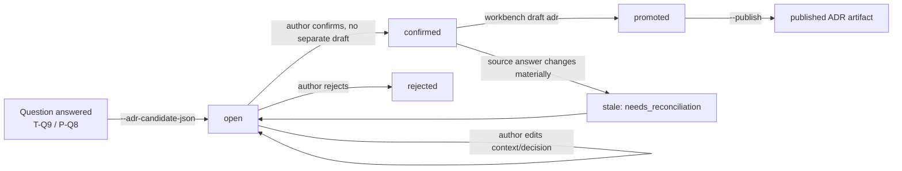

# Technical RFC: ADR candidate capture

**Status:** Draft — proposal, not yet run through `workbench draft`. No PRD or Design
has been published for this feature, so nothing here is pinned to an upstream
artifact yet.
**Owns:** Capturing architecture decisions as durable, ID-tagged candidates during
PRD and RFC interviews, and closing the `adr` entry in Define's
`unsupported_gates`. Does not touch the sibling `evaluation` gate, which stays
out of scope.

## Basic Example

Today, `T-Q9` in the RFC question bank already asks *"Which significant
choices, rejected alternatives, consequences, or deviations must be captured
as ADR candidates?"*, and `P-Q8` asks the equivalent for product decisions.
Both questions get answered like any other question: the text goes into a
`Key Decisions` or `Security & Controls` paragraph and nothing durable comes
out of it. This RFC gives that answer a second, structured output.

```
$ python3 scripts/draft.py rfc adr-capture --project-root . \
    --adr-candidate-json '{
      "source_question_id": "T-Q9",
      "title": "Persist candidates as sibling authoring checkpoints, not RFC prose",
      "context": "T-Q9 answers currently bury decisions inside RFC Markdown with no stable ID.",
      "decision": "Add a dedicated adr artifact type reusing the existing draft.py state machine.",
      "alternatives_considered": [
        "Parse ADR candidates out of RFC Markdown after generation",
        "Store candidates only as a field on the RFC answer record"
      ],
      "consequences": "RFC answers gain an ADRC- cross-reference column; ADR gets its own publish/version history."
    }' --expected-revision 4 --json
```

The call returns the same shape every other mutation returns: the assigned
`ADRC-adr-capture-001` id, the updated interview `revision`, and the current
`response_control` for whatever question is still open. Capture is a side
effect of answering a question, not a separate interview a person has to
remember to run.

## Interface Contract

One new CLI action, added to the existing mutually-exclusive action group in
`_parser()` ([draft.py:4436](../../skills/workbench-draft/scripts/draft.py#L4436)):

- `--adr-candidate-json <json>` — persist one candidate against the question
  currently in focus (`--question-id`, same as `--answer`). Consumes
  `--expected-revision` for optimistic concurrency, exactly like every other
  mutation in `run_once`.

No existing flag changes shape. `--publish`, `--answer`, `--defer`, and the
rest keep their current contracts untouched.

Two read paths change: `peek_once` and `_result()` gain an
`adr_candidates: [...]` array on PRD and RFC results (id, title, status,
source question, linked artifact), and a new `list_once --artifact-type adr`
path lists every ADR checkpoint for a feature, the same way it already lists
PRD/Design/RFC checkpoints today.

## Data Model

Each interview checkpoint (`authoring-<type>.json`) gains one new top-level
list:

| Field | Type | Notes |
| --- | --- | --- |
| `adr_candidates` | list of objects | Default `[]`; added by `_migrate_state` for every checkpoint written before this change. |
| `.id` | string | `ADRC-<feature>-<seq3>`, assigned once, never reused — same allocation pattern as `US-`/`REQ-`/`GR-`. |
| `.source_question_id` | string | The `P-Qn`/`T-Qn` that produced it. |
| `.status` | enum | `open`, `confirmed`, `promoted`, `superseded`, `rejected`. |
| `.title`, `.context`, `.decision`, `.alternatives_considered`, `.consequences` | strings / string list | The ADR body fields, captured at candidate time so reasoning isn't lost even if the ADR itself isn't drafted immediately. |
| `.promoted_to` | string or null | Set once a candidate becomes a real `adr` artifact (see State Machine). |
| `.actor`, `.actor_email`, `.created_at`, `.updated_at` | existing actor/timestamp shape | Matches `decision_history` entries elsewhere in the file. |

`ARTIFACTS` gains a fourth entry:

```python
"adr": {
    "label": "ADR",
    "persona": "Engineering",
    "question_bank": "adr-questions.json",
    "sections": ["Context", "Decision", "Alternatives Considered", "Consequences", "Status", "Related Requirements"],
},
```

The one real structural wrinkle: PRD, Design, and RFC are singular per
feature (`authoring-<type>.json`). ADRs are not — a feature can produce many.
State paths become `.speed/features/<feature>/adr/<ADRC-id>/authoring-adr.json`,
and the rendered document becomes `specs/<feature>/adr/<ADRC-id>.md` rather
than the flat `specs/<feature>/<type>.md` every other artifact type uses.
`_feature_dir` and `_render_artifact`'s path construction both need an
optional `candidate_id` parameter; nothing about locking, atomic write, or
revisioning changes underneath that.

## State Machine



`confirmed` is enough to satisfy the Define gate for a feature that wants a
recorded rationale without the ceremony of a full standalone document.
`promoted` is for the candidates that warrant their own versioned,
self-reviewed, publishable ADR page — reusing every existing publish/version
mechanic in `draft.py` unchanged, since `adr` is just another entry in
`ARTIFACTS`.

## API Surface

No new HTTP surface in this RFC's scope. The dashboard backend
(`dashboard/backend`) already proxies `workbench draft` calls generically;
`--adr-candidate-json` and `list_once --artifact-type adr` ride that same
proxy without a new endpoint. If the dashboard wants a dedicated "ADR
candidates" panel rather than surfacing them inline on the PRD/RFC page, that
panel is a frontend-only addition against the existing `_result()` payload —
out of scope here, flagged as a follow-up in Unresolved Questions.

## Validation Rules

- `ADRC-` ids follow the same `FEATURE_RE`-derived character set already
  enforced on feature and skill names — no free-form id input from the
  caller; the id is always assigned by `draft.py`, never supplied.
- `--adr-candidate-json` is validated against a fixed schema (required:
  `title`, `context`, `decision`; optional: `alternatives_considered`,
  `consequences`) before it's accepted, the same way `_apply_compact_planning_plan`
  validates the compact plan today. A malformed payload raises `DraftError`,
  not a partial write.
- Promoting a candidate to a full `adr` artifact requires `status ==
  "confirmed"` — an `open` or `rejected` candidate cannot be promoted, which
  keeps the promotion action from silently overriding an author's rejection.

## Testing

| Risk | Test level | Assertion |
| --- | --- | --- |
| Candidate id collides or gets reused after a rejected candidate | Unit | Two sequential `--adr-candidate-json` calls against the same feature always get distinct, monotonic ids, including after one is rejected. |
| `_migrate_state` breaks old checkpoints that predate `adr_candidates` | Unit | Load a fixture checkpoint at the current `SCHEMA_VERSION` without the field; migration adds `[]` and every other field round-trips unchanged. |
| Define gate reports `adr` as satisfied only when every referenced candidate has a matching published artifact | Unit (mirrors `tests/skills/test_define.py`) | A PRD citing `ADRC-x-001` with no published ADR keeps `plan_readiness.status == "blocked"`; publishing the matching ADR clears it. |
| Self-review catches a T-Q9 answer that names an ADRC id with no candidate record | Unit | `_self_review` returns a blocking finding pointing at `T-Q9`. |
| Concurrent capture from two processes | Integration | Same `_feature_lock` fixture pattern already used for `sync.py`'s manifest race — two `--adr-candidate-json` calls under the existing file lock never assign the same id. |

## Security & Controls

No new trust boundary. Candidate payloads come from the same harness/CLI
caller that already supplies answers and compact plans, so they get the same
implicit trust level — this RFC doesn't add a new external input surface.
The one control worth naming explicitly: candidate ids must never be taken
from caller input when constructing `specs/<feature>/adr/<id>.md` or its
state path, for the same path-escape reason `targets.py`'s `dest_dir()`
refuses to trust a caller-supplied skill name. Assigning ids internally
(never accepting them as input) closes that off by construction rather than
by validation.

## Key Decisions

Reuse `ARTIFACTS`/the existing state machine for `adr` instead of building a
parallel capture system. The alternative — bolting a `decisions.json` sidecar
onto PRD/RFC state with its own ad hoc persistence — would duplicate locking,
atomic-write, revisioning, and self-review logic that `draft.py` already has
working and tested. Making `adr` a fourth `ARTIFACTS` entry costs one new
question bank and one new template; it inherits publish, versioning, and
CLI/dashboard parity for free.

Capture a lightweight record at confirmation time rather than requiring a
full interview before a candidate exists. `AUTH-S5` in the product spec asks
for capture "while [the] reasoning is fresh" — forcing a second multi-question
interview before anything is recorded would reintroduce exactly the loss this
feature exists to prevent. The full `adr` interview (question bank, sections)
is only needed for candidates an author chooses to promote into a standalone
document; most candidates can stay at `confirmed` and still close the Define
gate.

## Drawbacks

A feature can now own an unbounded number of small checkpoint files
(`.speed/features/<feature>/adr/<id>/...`), where every other artifact type
has exactly one. That's a real deviation from the current one-checkpoint-per-
type assumption baked into `_feature_dir`, and it's the part of this RFC most
likely to surface edge cases in code that currently assumes a flat
`authoring-<type>.json` layout (list/peek formatting, the dashboard's feature
summary view). It's judged worth it because the alternative — one shared
`adr` checkpoint holding every candidate as a list — would make each
candidate's revision, self-review, and publish state a field inside someone
else's optimistic-concurrency envelope instead of its own.

## Search / Query Strategy

Not material. This feature doesn't introduce ranking, full-text search, or a
query surface — `list_once` already returns every checkpoint for a feature by
directory walk, and a handful of ADR candidates per feature doesn't warrant
anything beyond that.

## Migration Strategy

Bump `SCHEMA_VERSION` from 2 to 3. `_migrate_state` gets one new branch: any
checkpoint below version 3 gets `adr_candidates: []` added and nothing else
touched, following the same additive pattern the file already uses for prior
schema bumps. No backfill runs against existing published PRDs/RFCs — their
`Key Decisions` prose stays exactly as published; only new confirmations
after this ships get an `ADRC-` id.

## File Impact

| File | Change |
| --- | --- |
| `skills/workbench-draft/scripts/draft.py` | `ARTIFACTS["adr"]`, `SCHEMA_VERSION` bump, `_migrate_state`, new `--adr-candidate-json` flag and its `_apply_*` handler, `adr_candidates` in `_result`/`peek_once`, candidate-id-aware `_feature_dir`/render path. |
| `skills/workbench-draft/references/adr-questions.json` | New — question bank for the promoted-ADR interview. |
| `skills/workbench-draft/references/adr-template.md` | New — mirrors `prd-template.md`'s role as the composition contract. |
| `skills/workbench-draft/scripts/planner_contract.py` | Extend `normalize_compact_plan` to accept `adr` as a fourth artifact type. |
| `skills/workbench-define/scripts/define.py` | `_snapshot`/`_next_action`/`_audit_findings` — `adr` leaves `unsupported_gates` and becomes a real, computed gate keyed on candidate-to-published-artifact linkage. |
| `tests/skills/test_define.py` | New cases for the computed `adr` gate. |
| `tests/skills/test_draft_adr.py` | New — candidate capture, promotion, migration, concurrency. |

## Dependencies

None new. Everything above is stdlib Python plus code already vendored in
this repo (`fcntl`-based locking, the existing atomic-write helper, the
existing `_migrate_state` pattern).

## Unresolved Questions

- Should Design interviews also get `--adr-candidate-json`, or is capture
  scoped to PRD and RFC only for v1? Design decisions (a chosen component
  pattern, a rejected layout) can be just as significant, but `Design`
  doesn't currently have a T-Q9-equivalent question in its bank.
- Who or what judges "significance"? Today it's implicit in whether the
  harness proposes a candidate alongside an answer. A future version might
  want an explicit author-initiated "flag as ADR candidate" action independent
  of any specific question.
- Does closing the `adr` gate in `define.py` require *every* cited `ADRC-`
  id to reach `promoted`/published, or is `confirmed` sufficient? This RFC
  assumes `confirmed` is sufficient (see Key Decisions) but that's a product
  call, not a technical one, and belongs in the PRD this RFC is standing in
  for.
