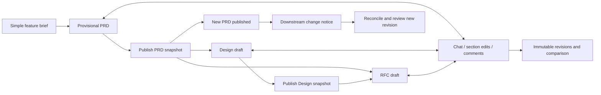
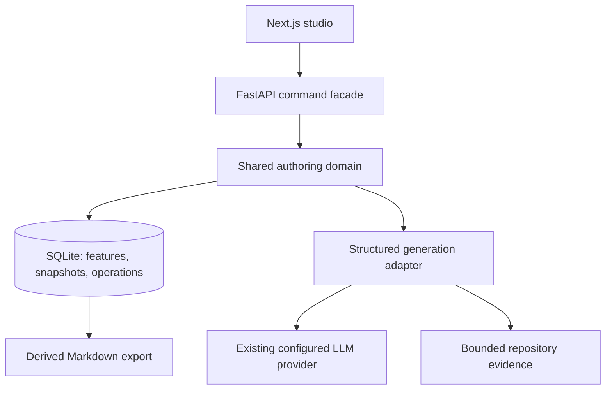

# Guided authoring studio: architecture experiment

Start with a feature brief, get a provisional PRD, and refine it in the same workspace. Publishing a PRD makes it an explicit input to Design and RFC. The experiment tests that experience and the persistence rules beneath it. This document covers the branch agenda, document contracts, architecture, and adoption boundaries.

## Branch agenda

`codex/guided-authoring-studio` starts from a committed snapshot of the current `guided-prd-ui` worktree, including its uncommitted implementation. The original worktree stays available. The prototype lives at `/define/studio` alongside the existing flow.

| Deliverable | Acceptance |
| --- | --- |
| Brief to PRD | One brief produces a visible, useful draft; missing evidence is explicit. No questionnaire gates the preview. |
| Conversation and direct editing | A request can change the whole document or one stable section. Every applied change creates an immutable version. |
| Review comments | Comments retain their section, source version and optional quotation. Addressing a comment links the resulting revision; resolution remains a human action. |
| Connected documents | Design and RFC reference exact published upstream snapshots. Later upstream changes produce a visible stale state and an explicit reconciliation action. |
| Honest recovery | User inputs survive model failures. Pending work is recoverable after restart; retry is explicit. Concurrent writes cannot silently overwrite each other. |
| Playable handoff | A local launcher, regression tests, browser verification and seeded example make the branch independently testable. |

## The user journey

The left side is the conversation and open decisions. The main canvas contains the actual document, with a section outline and version comparison. PRD, Design and RFC stay in one feature workspace. History is available without leaving the document. Only the first unresolved question is foregrounded; the initial generation can ask at most three.

Saving a revision, publishing a snapshot and approving a package are distinct concepts. This experiment implements the first two. Publishing means “use these exact bytes as a shared input,” subject to structural checks and unresolved blocking decisions. It does not claim organizational approval, valid ADR/evaluation coverage, or readiness for Plan.

## Document contracts

### PRD

Use the supplied PRD Proposal's eleven sections: Metadata; Summary; Problem and evidence; Hypothesis; User stories; Requirements and acceptance; Scope; Guardrails; Delivery risks and open questions; Success; References. Requirements pair a changed behavior with a verifiable acceptance criterion. User outcomes, product acceptance, regression guardrails and post-launch success have different purposes. Stable `US`, `REQ`, `GR` and `SM` identifiers are assigned by the application, never by sentence position.

Depth follows uncertainty and scope. Avoid asking the author to choose an internal size class. Conditional target-user/release details belong only when the feature needs them. No invented customer evidence, metrics, owners or delivery dates. Any suggested target or unverified behavior is marked as a proposal or open decision.

### Design

Capture experience intent, users and entry points, end-to-end journeys, interaction/state behavior, accessibility and content, requirement coverage, validation, and unresolved decisions. Tie journeys to PRD requirement identifiers. Include empty, loading, failure, permissions and recovery states when relevant. Keep engineering task decomposition in Plan.

### RFC

Follow `RFC Proposal 2.docx`: Metadata; Decision summary and approval ask; Context and constraints; Proposed design; Contracts and impact; Alternatives and tradeoffs; Delivery and verification; Open decisions and ownership. The RFC makes an engineering decision and shows its consequences.

Assess API/events/CLI, persistence, compatibility, migration, security, privacy, reliability, rollout/rollback/observability, performance/cost, and AI/evaluation. Record each as material, not material (with a reason), or unresolved. Include detail in the relevant core section instead of filling every conditional module with boilerplate. An unresolved material decision blocks publication but never hides the preview. ADR extraction and a separate evaluation artifact remain policy work after the experiment.

## Architecture and authority

`lib/authoring_studio` owns state transitions, version creation, identifier allocation, publication and source validity. FastAPI translates requests into commands; the UI renders their results. The existing GraphQL guided engine is deliberately not a second writer to the experiment's state. A future GraphQL or CLI adapter must call the same domain commands rather than reimplement them.

SQLite transactions provide a small, testable canonical store for the local experiment. Each feature has a monotonically increasing revision; every command supplies the expected revision. Snapshots are append-only, include exact source pins, and are never pruned. Hashes verify snapshot bytes. Markdown is an export, not a mutable authority that can drift after review. A publish command selects an already stored snapshot and never rereads editable filesystem bytes.

Operations persist the user request before contacting the model. A background worker uses the captured feature revision and upstream pins. Applying the candidate snapshot and completing the operation happen in one transaction. Model failure leaves the request and current document intact. Restarted operations become interrupted and can be retried; the prototype runs one API process. Cancellation invalidates the operation so late provider output cannot commit. Repeated delivery of the same request ID returns its existing operation.

Each comment stores its source snapshot, stable section ID, quotation when supplied, state, and any addressing revision. Applying a suggested change does not silently resolve a reviewer's objection. A quote that no longer occurs in the current section is visibly outdated.

Section edits replace only the targeted section. Direct edits mark that section protected from whole-document AI rewrites. A deliberately scoped revision can change it. Reconciliation preserves protected text and requires human review of those sections before publication. Historical revisions retain their original content and sources.

## Generation and evidence

The generator uses the existing provider settings in `speed.toml`. Its structured response contains section patches, typed requirement rows, assumptions and open questions. Validation rejects unknown section IDs, duplicate entity IDs and missing required first-draft sections. Unsupported evidence references remain visible on a provisional draft and block publication; they never appear in the verified source list. The server allocates new entity IDs and never recycles retired IDs.

Repository context is bounded, recorded with path and content hash, and passed as evidence rather than instructions. User-provided context and upstream documents are separately identified. Truncation is visible in source metadata. The model has no write tools. A failed generation produces a clear retry state, never a success-shaped placeholder.

Publishing checks the exact stored candidate for required content, unanswered blocking questions, unresolved RFC coverage, unresolved blocking comments, protected sections awaiting reconciliation review, and stale source pins. Those checks provide a structural guard; semantic quality still needs review. Multi-reviewer permissions and approval identity are not implemented in this local experiment.

## Adoption boundaries and later work

### What the experiment changes from the reviewed flow

| Reviewed gap | Experiment behavior | Remaining work |
| --- | --- | --- |
| Preview hidden behind the interview | A provisional draft appears after generation; questions improve it in place. | Measure first-draft usefulness with feature authors. |
| Artifact content separated from manual overrides | Section edits become canonical content for all three artifacts. | Migrate old override/checkpoint formats. |
| Published history pruned after 20 versions | Append-only snapshots have no rolling retention window. | Add archive/backup policy without breaking pins. |
| Answers lost when generation fails | Requests commit before provider calls; failure and interruption are retryable. | Distributed worker leases for multiple API processes. |
| Stale upstream sessions become a dead end | A notice leads to reconciliation and a reviewable revision. | Semantic impact analysis beyond source version changes. |
| Comment application conflated with resolution | Addressing and resolving are separate recorded actions. | Authenticated reviewer identity and collaboration permissions. |
| Requirements identified by sentence position | Application-assigned IDs persist across reorder and revision. | Semantic review still checks whether an edit repurposed a requirement. |
| Quality checks confused with approval | Structural blockers are visible; publication is separate from approval. | Define ADR/evaluation policy and enforce Plan handoff. |

The [preview guide](../../docs/authoring-studio-preview.md) contains launcher commands and a hands-on review path.

The new database is isolated under `.speed/studio/`; it does not rewrite existing feature packages or authoring checkpoints. Import/migration, Git-backed package export, streaming responses, background queue leases for multiple server processes, authenticated collaboration, ADR extraction, evaluation generation, and Plan enforcement need separate implementation before rollout. The design has explicit places for them without presenting unfinished capabilities as available.

An adoption review should measure time to first useful draft, manual corrections to requirements, unintended section changes, successful recovery after failures, and whether users understand downstream changes. Verify the new flow with a small feature, a multi-role feature and an architecture-heavy feature before replacing the original guided engine.

## Reference decisions

The supplied implementation guide, initial Define PRD, PRD Proposal and RFC Proposal 2 are the primary product references. The internal review in `working-docs/guided-authoring-review-2026-09-08/` contains the earlier reproducers and evidence.

[Atlassian's PRD guidance](https://www.atlassian.com/agile/product-management/requirements/) supports keeping shared product intent concise and customer-oriented. [Rust's RFC template](https://github.com/rust-lang/rfcs/blob/master/0000-template.md) makes motivation, alternatives and unresolved questions explicit. [Kubernetes' KEP template](https://github.com/kubernetes/enhancements/blob/master/keps/NNNN-kep-template/README.md) separates production readiness concerns so an RFC can expose operational risk. The conditional coverage model here is our application of those ideas to the supplied proposal, not a claim that every feature needs a Kubernetes-sized process.
