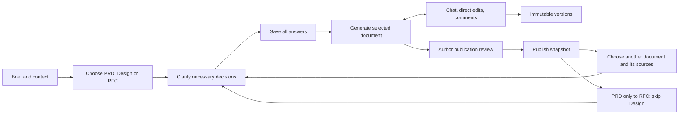
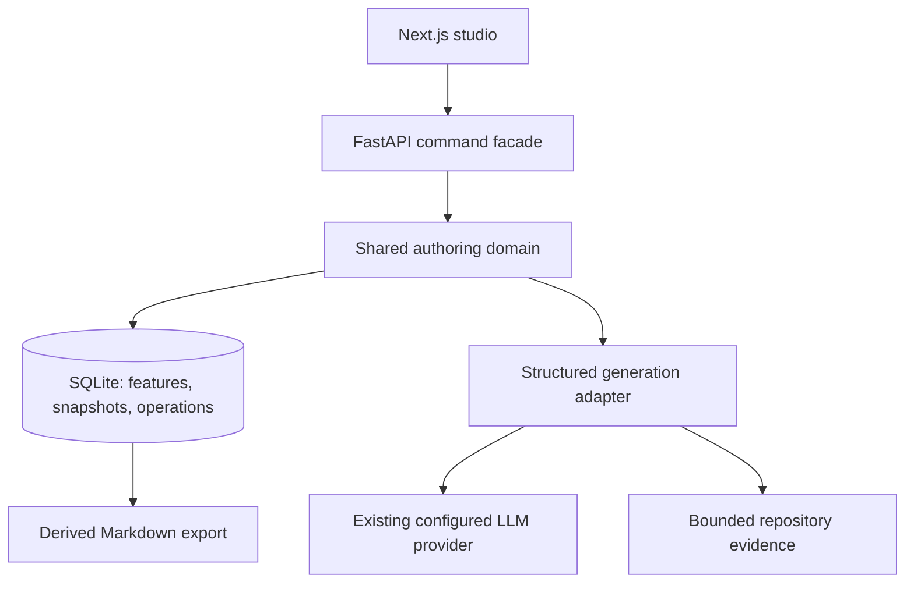

# Guided authoring studio: architecture experiment

Choose PRD, Design spec or RFC, clarify the decisions the supplied context leaves open, then generate and refine that document in the same workspace. Published documents become optional inputs to other documents. The experiment tests that experience and the persistence rules beneath it. This document covers the branch agenda, document contracts, architecture, and adoption boundaries.

## Branch agenda

`codex/guided-authoring-studio` starts from a committed snapshot of the current `guided-prd-ui` worktree, including its uncommitted implementation. The original worktree stays available. The prototype lives at `/define/studio` alongside the existing flow.

| Deliverable | Acceptance |
| --- | --- |
| Brief to any document | Start directly with PRD, Design or RFC. Check the selected context first. If clarification is needed, save every answer before generation; otherwise generate directly. Each question has three suggestions and a custom-answer option. |
| Conversation and direct editing | A request can change the whole document or one stable section. Every applied change creates an immutable version. |
| Review comments | Comments retain their section, source version and optional quotation. Addressing a comment links the resulting revision; resolution remains a human action. |
| Publication review | Authors confirm Success and Open questions or acknowledge unresolved details with a note. Reviews apply to one exact version and cannot bypass structural blockers. |
| Connected documents | Authors select the published documents to use. PRD can lead directly to RFC with Design skipped; standalone Design and RFC are also supported. Selected sources reference exact published upstream snapshots. Later upstream changes produce a visible stale state and an explicit reconciliation action. |
| Honest recovery | User inputs survive model failures. Pending work is recoverable after restart; retry is explicit. Concurrent writes cannot silently overwrite each other. |
| Playable handoff | A local launcher, regression tests, browser verification and seeded example make the branch independently testable. |

## The user journey

The entry form asks for a description, with optional supporting context and a choice of document. It accepts problems and investigations as well as feature requests. New workspaces initially use a short description excerpt; the existing clarification response derives and saves a concise title before any document is generated. That title stays stable across later documents and revisions. Explicit titles from older API clients and existing workspaces are preserved; no migration or extra model call is required.

Before drafting, the workspace shows the clarification step beside the saved brief. Each question offers three concrete suggestions plus **Write my own**, with no preselected answer. **Next** persists the answer and advances; **Back** lets the author revisit saved answers. The last submission starts generation. The brief check asks only necessary product decisions (up to six), and skips questions when the supplied information is sufficient.

Once the selected document exists, the left side becomes the conversation and later open decisions. The main canvas contains the document, with a section outline and version comparison. PRD, Design and RFC stay in one workspace and are optional until the author chooses to create them. History is available without leaving the document.

Saving a revision, publishing a snapshot and approving a package are distinct concepts. This experiment implements the first two. Publishing means “use these exact bytes as a shared input,” subject to structural checks and explicit author review. Unresolved questions can be acknowledged with a recorded reason while remaining open. Publication does not claim organizational approval, valid ADR/evaluation coverage, or readiness for Plan.

## Document contracts

### PRD

Use the supplied PRD Proposal's eleven sections: Metadata; Summary; Problem and evidence; Hypothesis; User stories; Requirements and acceptance; Scope; Guardrails; Delivery risks and open questions; Success; References. Requirements pair a changed behavior with a verifiable acceptance criterion. User outcomes, product acceptance, regression guardrails and post-launch success have different purposes. Stable `US`, `REQ`, `GR` and `SM` identifiers are assigned by the application, never by sentence position.

Depth follows uncertainty and scope. Avoid asking the author to choose an internal size class. Conditional target-user/release details belong only when the feature needs them. No invented customer evidence, metrics, owners or delivery dates. Any suggested target or unverified behavior is marked as a proposal or open decision.

### Design

Capture experience intent, users and entry points, end-to-end journeys, interaction/state behavior, accessibility and content, requirement coverage, validation, and unresolved decisions. Tie journeys to real PRD requirement identifiers when a PRD is selected. Otherwise describe coverage against the brief and saved decisions without inventing a PRD or its IDs. Include empty, loading, failure, permissions and recovery states when relevant. Keep engineering task decomposition in Plan.

### RFC

Follow `RFC Proposal 1.docx`: Metadata and status; Decision summary and approval ask; Context and constraints; Proposed design; Contracts and impact; Alternatives and tradeoffs; Delivery and verification; Open decisions and ownership. The RFC makes an engineering decision and shows its consequences. PRD and Design are optional sources; when omitted, the RFC derives its product context from the brief and saved answers.

The updated proposal adds driver-based comparisons of viable alternatives, a connected compatibility/migration/rollout/rollback/observability argument, artifact boundaries and conditional AI evaluation guidance. The generation contract carries these instructions, a stable RFC ID and operation date. Unknown owners and unvalidated thresholds remain explicit. RFC clarification asks at most three material questions. The author's requested clarification-before-generation interaction takes precedence over the document's suggested draft-first workflow.

Assess API/events/CLI, persistence, compatibility, migration, security, privacy, reliability, rollout/rollback/observability, performance/cost, and AI/evaluation. Record each as material, not material (with a reason), or unresolved. Include detail in the relevant core section instead of filling every conditional module with boilerplate. Unresolved material coverage blocks publication even with an author acknowledgement and never hides the preview. ADR extraction and a separate evaluation artifact remain policy work after the experiment.

## Architecture and authority

`lib/authoring_studio` owns state transitions, version creation, identifier allocation, publication and source validity. FastAPI translates requests into commands; the UI renders their results. The existing GraphQL guided engine is deliberately not a second writer to the experiment's state. A future GraphQL or CLI adapter must call the same domain commands rather than reimplement them.

SQLite transactions provide a small, testable canonical store for the local experiment. Each feature has a monotonically increasing revision; every command supplies the expected revision. Snapshots are append-only, include exact source pins, and are retained for the lifetime of the workspace. Hashes verify snapshot bytes. Markdown is an export, not a mutable authority that can drift after review. A publish command selects an already stored snapshot and never rereads editable filesystem bytes.

`DELETE /studio/features/{id}` requires the reviewed workspace revision and an explicit UI confirmation. One transaction removes the feature state (including conversation, reviews and operations) and cascades to all of its snapshots. The database still rejects individual snapshot deletion while the owning feature exists. Only opaque feature/create-request IDs remain as tombstones, making deletion retries idempotent and rejecting delayed create retries. Read, command and export routes no longer expose the deleted workspace. Workers check for its existence before claiming work and before applying either a result or an error, so a late response cannot recreate it. In-flight provider processes may finish; their results are discarded.

Operations persist the user request before contacting the model. A background worker uses the captured feature revision and upstream pins. Applying the candidate snapshot and completing the operation happen in one transaction. Model failure leaves the request and current document intact. Restarted operations become interrupted and can be retried; the prototype runs one API process. Cancellation invalidates the operation so late provider output cannot commit. Repeated delivery of the same request ID returns its existing operation.

New features record `initial_kind` and begin with a `clarify` operation for that document whose structured response contains questions and suggested answers, never document sections. Each document's durable intake state moves from `checking` to `awaiting_answers` or `ready`. An `answer_clarification` command saves the canonical answer with optimistic revision checking. The final answer and queued generation commit together; duplicate submissions cannot enqueue a second draft. With zero questions, the completed brief check queues generation atomically and the worker continues directly. Generation checks intake readiness again before calling the provider. The first-document response contract permits no unanswered questions for all three document kinds and fixes the template length (eleven PRD sections; eight Design or RFC sections). Initial-generation prompts explicitly distinguish preceding clarification from a draft revision. The existing PRD intake remains readable; `intakes` exposes separate saved state for each kind, preventing answers from leaking across document flows. Saved answers become a named, hashed source in the generated document.

Source selection is explicit (`brief`, `prd`, `design`, or `prd_design` as applicable). `source_mode` and immutable `pins` travel with each operation and generated snapshot. Clarification uses the selected source versions, and its final submission keeps those same pins. Retry never picks up a newly available document implicitly. Reconciliation advances the versions of the selected sources. Staleness follows pinned documents and their existing upstream dependencies; a new Design publication cannot invalidate an RFC that skipped Design. Selected sources must be published and current. The allowed direction (PRD to Design/RFC, Design to RFC) prevents cycles.

Each comment stores its source snapshot, stable section ID, quotation when supplied, state, and any addressing revision. Applying a suggested change does not silently resolve a reviewer's objection. A quote that no longer occurs in the current section is visibly outdated.

Section edits replace only the targeted section. Direct edits mark that section protected from whole-document AI rewrites. A deliberately scoped revision can change it. Reconciliation preserves protected text and requires human review of those sections before publication. Historical revisions retain their original content and sources.

`reviews.py` derives the Success and Open questions reviews from canonical snapshot content. PRDs require both; Design and RFC require Open questions. The latter covers both the risks/decisions section and structured questions, including an explicit confirmation when no questions remain. Case-insensitive text checks locate unfinished values by section, row and field. These checks help navigation; they cannot determine whether every natural-language decision is settled.

`acknowledge_publication` records a confirmed or deferred assessment, exact snapshot ID, timestamp and author note in the document's review history under the same transaction/CAS rules as other commands. Detected unresolved details cannot be confirmed as settled; deferral requires a nonempty note. Revocation appends a new event. Reviews do not create document versions, and new snapshot IDs invalidate prior acknowledgements even when a restore reproduces earlier content. Publication freezes a copy of its review records. Markdown exports and published upstream evidence include those notes. The model cannot create acknowledgements or treat deferred questions as answered. Existing published versions are grandfathered; no review is invented for them.

## Generation and evidence

The generator uses the existing provider settings in `speed.toml`. Its structured response contains section patches, typed requirement rows, assumptions and open questions. Revision response schemas constrain entity IDs to the current document's IDs (or the selected section's IDs for a scoped revision) and unique `new-*` placeholders. Validation rejects unknown section IDs, duplicate entity IDs and missing required first-draft sections. Unsupported evidence references remain visible on a provisional draft and block publication; they never appear in the verified source list. The server allocates new entity IDs and never recycles retired IDs.

Repository context is bounded, recorded with path and content hash, and passed as evidence rather than instructions. User-provided context and upstream documents are separately identified. Truncation is visible in source metadata. The model has no write tools. A failed generation produces a clear retry state, never a success-shaped placeholder.

Publishing checks the exact stored candidate for current author acknowledgements, required content, unfinished placeholders outside reviewed Success/open-question sections, unresolved RFC coverage, unresolved blocking comments, protected sections awaiting reconciliation review, unavailable source references, and stale source pins. Review notes preserve accepted uncertainty without altering source text or clearing question flags. Multi-reviewer permissions and authenticated approval identity are not implemented in this local experiment.

## Adoption boundaries and later work

### What the experiment changes from the reviewed flow

| Reviewed gap | Experiment behavior | Remaining work |
| --- | --- | --- |
| Initial draft written before required clarification | Following prototype feedback, necessary decisions are collected before drafting through a short choice-based flow. | Measure completion and first-draft usefulness; avoid unnecessary questions. |
| Artifact content separated from manual overrides | Section edits become canonical content for all three artifacts. | Migrate old override/checkpoint formats. |
| Published history pruned after 20 versions | Append-only snapshots have no rolling retention window. | Add archive/backup policy without breaking pins. |
| Answers lost when generation fails | Requests commit before provider calls; failure and interruption are retryable. | Distributed worker leases for multiple API processes. |
| Stale upstream sessions become a dead end | A notice leads to reconciliation and a reviewable revision. | Semantic impact analysis beyond source version changes. |
| Comment application conflated with resolution | Addressing and resolving are separate recorded actions. | Authenticated reviewer identity and collaboration permissions. |
| Requirements identified by sentence position | Application-assigned IDs persist across reorder and revision. | Semantic review still checks whether an edit repurposed a requirement. |
| Quality checks confused with approval | Structural blockers are visible; publication is separate from approval. | Define ADR/evaluation policy and enforce Plan handoff. |

The [preview guide](../../docs/authoring-studio-preview.md) contains launcher commands and a hands-on review path.

The new database is isolated under `.speed/studio/`; it does not rewrite existing feature packages or authoring checkpoints. Import/migration, Git-backed package export, streaming responses, background queue leases for multiple server processes, authenticated collaboration, ADR extraction, evaluation generation, and Plan enforcement need separate implementation before rollout. The design has explicit places for them without presenting unfinished capabilities as available.

An adoption review should measure time to first useful draft, manual corrections to requirements, unintended section changes, successful recovery after failures, and whether users understand downstream changes. Verify the new flow with a small feature, a multi-role feature and an architecture-heavy feature before replacing the original guided engine.

## Reference decisions

The supplied implementation guide, initial Define PRD, PRD Proposal and RFC Proposal 1 are the primary product references. RFC Proposal 1 supersedes Proposal 2 for this experiment. The internal review in `working-docs/guided-authoring-review-2026-09-08/` contains the earlier reproducers and evidence.

[Atlassian's PRD guidance](https://www.atlassian.com/agile/product-management/requirements/) supports keeping shared product intent concise and customer-oriented. [Rust's RFC template](https://github.com/rust-lang/rfcs/blob/master/0000-template.md) makes motivation, alternatives and unresolved questions explicit. [Kubernetes' KEP template](https://github.com/kubernetes/enhancements/blob/master/keps/NNNN-kep-template/README.md) separates production readiness concerns so an RFC can expose operational risk. The conditional coverage model here is our application of those ideas to the supplied proposal, not a claim that every feature needs a Kubernetes-sized process.
