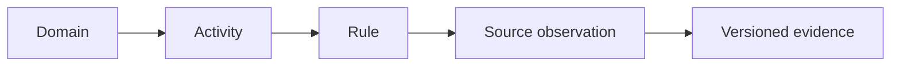
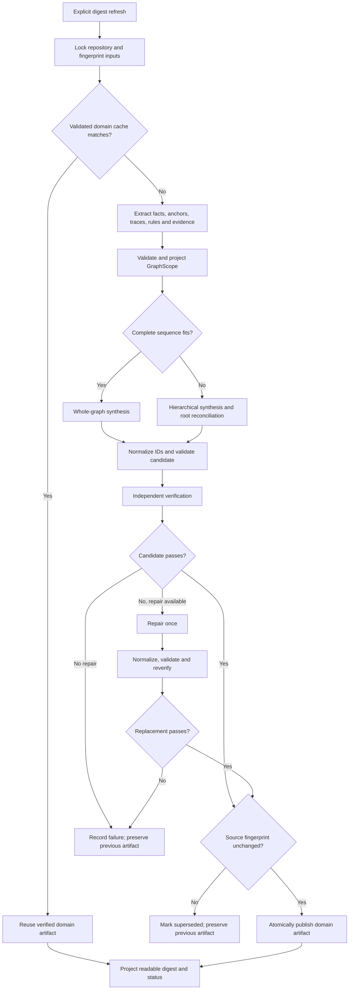

# RFC: Business Domain Discovery

> See [Business Domain Discovery PRD](../product/speed-business-domain-discovery.md) for the user problem, product outcomes and success criteria.
> Replaces the business-domain interpretation of the existing [CSG clustering product spec](../product/speed-csg-clustering.md).
> Depends on: [Repository Digest](speed-repository-digest-dashboard.md) and existing [CSG discovery infrastructure](speed-csg-clustering.md).
> Format: [RFC template](../../templates/rfc.md).

Status: Proposed; undergoing section-by-section review. This rewrite does not imply approval of unreviewed sections.
Date: 2026-09-06

Identity remediation and hierarchical orchestration are pending. Release requires the complete hermetic business-domain suite to collect and pass.

## Basic Example

Existing command, proposed replacement behavior:

```sh
speed digest --refresh  # Existing command; this RFC upgrades what its domain stage produces
speed digest --json     # Existing command; reads the stored digest without building
```

Both commands exist today. Currently refresh turns structural clusters into digest domains. This RFC replaces that stage with business-domain discovery inside the same refresh operation; it does not add another flag. A refresh checks evidence freshness, reuses valid domain results, and runs activity/rule extraction plus bounded synthesis when their inputs have changed or no valid result exists. A read never runs synthesis. See [Refresh behavior and existing pattern](#refresh-behavior-and-existing-pattern) for exact stages, side effects and failures.

The four examples below describe proposed output, not functionality already implemented. They are independent examples, not one combined application.

Before: `repository/pet — 37 files — 3 sources`, where sources are central symbols in a structural group.

After: the four examples below illustrate the required output across UI, API, SQL and DAG sources. They are hypothetical acceptance examples, not claims about PetClinic or an approved domain taxonomy. Each starts from behavior and explains the rule, evidence, proposed responsibility and limits.

### Example 1 — UI: request a refund

Populated contract example: [ui.domain.json](contracts/examples/ui.domain.json). This manually authored partial model illustrates the schema; it is not extractor output or an execution record.

**Customer goal:** Request a refund for a purchase and find out whether the request was received.

This is a hypothetical acceptance fixture, not an existing refund implementation. Screen layouts, messages, identifiers and paths below illustrate the expected explanation; they are not screenshots or extracted findings. All screen states belong to the same view unless navigation is explicitly evidenced.

#### Identify the view

| Field | Example |
| --- | --- |
| Route / URL pattern | `/purchases/:purchaseId/refund` |
| View ID | `view:refund-request` |
| Component / source | `RefundForm` in `src/refunds/RefundForm.tsx` |
| Parent view | `view:purchase-details` |
| Route input | `:purchaseId` → parent purchase lookup → purchase details passed to the form |

Route patterns require router evidence; component and parent identities require source/composition evidence. A view can have several routes or none, and multiple views can share a route. Preserve known absence versus unresolved routing. A route change alone does not change a stable view ID. The purchase date comes from the loaded purchase, not the URL. Neither route nor component name establishes business-domain ownership.

#### What the screen receives

| Information | Where it comes from | How the form uses it |
| --- | --- | --- |
| Purchase ID and purchase date | Parent purchase page | Identify the purchase and check its age |
| Refund window: 30 days | Configuration | Supply the limit for the client age check |
| Current time | Client clock | Calculate elapsed purchase age |
| Reason | Customer types into the field | Include it in the refund request |

The parent page's loading call must be traced separately to establish purchase-data origin. Missing or invalid purchase/configuration values produce an unavailable-context message and prevent the request.

#### What the customer sees and does

**1. Empty reason → validation message**

```text
+-----------------------------+
| Request a refund            |
| Purchase: #123               |
| Reason: [                 ] |
| [Submit request]            |
+-----------------------------+
               |
        Submit with no reason
               v
+-----------------------------+
| Request a refund            |
| Purchase: #123               |
| Reason: [                 ] |
| ! Enter a reason            |
| [Submit request]            |
+-----------------------------+
```

**On this transition:** The required-field constraint fails. The browser displays validation feedback, the form stays open, and no API request is sent. The message above is illustrative; native browser wording varies.

**2. Reason entered → client eligibility check**

```text
+-----------------------------+
| Request a refund            |
| Purchase: #123               |
| Reason: [Item damaged      ] |
| [Submit request]            |
+-----------------------------+
               |
        Submit with a reason
               v
      Check purchase age
         /           \
  Outside window   Within window
        |                |
        v                v
 Show window error    Send request
 Keep reason          Show pending
 No API request       (step 3)
```

**On this transition:** After native validation passes, the form's submit handler prevents default navigation and checks the current purchase age against configuration. The failure message is “This purchase is outside the refund window.” The code must establish both the guard and the displayed message; message text alone does not prove enforcement.

**3. Checks pass → request pending → visible result**

```text
+-----------------------------+
| Request a refund            |
| Purchase: #123               |
| Reason: [Item damaged      ] |
| [Submitting... — disabled]  |
+-----------------------------+
               |
     Wait for request outcome
               v
     One of the states below
```

| Outcome | What the customer sees | Form behavior |
| --- | --- | --- |
| API records the request | “Request received” and request reference | Replace the form with the receipt; clear pending state |
| API rejects the request | Returned field/form error explanation | Keep the entered reason; clear pending state and enable submission |
| Connection fails or times out | “We couldn't confirm submission” | Keep the reason; clear pending state; do not automatically resend |

A receipt confirms request recording, not refund approval or payment. A timeout leaves recording uncertain. This fixture specifies no automatic retry; manual retry, status lookup and idempotency require their own evidence before discovery can describe their behavior. A disabled button and a handler guard against repeated pending submissions are separate facts.

#### The API call behind step 3

```text
Refund form
    |
    | POST /refund-requests
    | {purchaseId, reason}
    v
Refund API
    |
    +-- 201 {requestId, status: "received"} --> Receipt
    +-- Structured rejection ----------------> Form errors

Transport failure / timeout -----------------> Outcome unknown
```

The form sends purchase ID and reason. It does not send the purchase date or client threshold as authoritative policy. Server validation and data ownership must be traced from the API implementation; a client check or displayed server error does not establish how the server enforces a rule.

#### What discovery records and why it matters

Discovery must preserve enough information to reconstruct the interaction, explain its rules and assess its proposed business responsibility. A list of rule names and an API URL is insufficient. The records below describe the hypothetical fixture; actual discovery must populate them from evidence or identify what it cannot resolve.

**Screen, inputs and events**

| Record | What is captured in this example | Why it matters |
| --- | --- | --- |
| View identity and location | View ID, route pattern, component/source and parent view | Locate the behavior and distinguish this screen from other uses of the same component |
| Controls and displayed content | Reason field, submit control, purchase summary and their source identities | Connect customer actions and messages to specific interface elements |
| Input origins and transformations | Route purchase ID → parent lookup → form input; purchase date from loaded data; reason from customer input | Explain where each value comes from; distinguish editable values from supplied context |
| Configuration and clock dependencies | Window key/default, lookup/override source, client clock and units | Explain which limit the client uses and what can change the decision |
| Events and execution order | Field input updates reason; native validation precedes submit handler; handler checks pending state and age | Establish when checks run and which code paths reach the API |

**Checks, calls and outcomes**

| Record | What is captured in this example | Why it matters |
| --- | --- | --- |
| Field validation | Required reason, triggering submit attempt, failing field and feedback | Explain why an empty submission stays on the screen without a request |
| Context validation | Missing/invalid purchase or configuration data blocks this request | Distinguish unavailable inputs from a customer failing an eligibility rule |
| Business-rule observation | Exact age predicate, its inputs, client enforcement site and branch preventing the call | Explain the refund-window restriction and its client-only scope |
| Repeat-submission behavior | Pending-state handler guard and separate disabled-button condition | Establish which repeat actions are blocked without claiming server idempotency |
| API request | Event → handler → client wrapper → HTTP method/path; purchase ID/reason mapped to payload fields | Trace the customer action to a particular operation and show which data crosses the boundary |
| API response handling | Receipt fields, structured rejection mapping and transport-failure branch | Distinguish request recording, rejection and unknown outcome |
| Screen states and transitions | Editing, field/policy error, pending, receipt and outcome unknown; event/guard for each transition | Reconstruct what changes on screen and why |
| Outputs and destinations | Field/form messages, receipt reference, retained reason and pending-state changes | Explain exactly what is displayed or updated; capture navigation or emitted events only if implemented |

**Business interpretation and limits**

| Record | What is captured in this example | Why it matters |
| --- | --- | --- |
| Activity | “Request a refund,” linked to its view, events, checks, call and outcomes | Describe the business task across implementation parts |
| Business terminology | Refund request, purchase, reason and request receipt, with source occurrences | Support meaningful names without treating a frequent word as a domain |
| Information use and ownership | UI reads purchase context and submits a refund request; authoritative storage/ownership remains unresolved until backend evidence is traced | A UI consuming purchase data does not establish that Refund management owns purchases |
| Proposed domain membership | Request-refund activity proposed under Refund management, with supporting rule/purpose evidence and references to related activities when found | Explain the proposed grouping; one screen does not establish a complete domain boundary |
| Boundary and shared implementation | Purchase-context dependency; shared form/client helpers if evidenced; supporting versus primary activity participation | Avoid absorbing a parent page, shared helper or whole API service into the domain |
| Cross-source rule relationships | Link to separately evidenced server/configuration observations; record potential conflicts and applicable scope | Avoid treating client checks as universal policy or silently merging different thresholds |
| Gaps and coverage | Unresolved parent lookup, endpoint target, server policy, deployment overrides or retry behavior, where applicable | Show what discovery cannot establish; “not found” is not proof that behavior does not exist |
| Review and identity | Stable activity/domain IDs, proposal or review state, and user decisions | Keep inferred business boundaries distinguishable from reviewed decisions across refreshes |

**How the records connect** — references connect records; these are not extra stages of form execution:

```text
View → control → event → validation → call → response → screen output
                  |          |
                  |          +→ rule observation → parameter sources
                  |
                  +→ activity → proposed domain membership

Each recorded fact or claim → versioned source evidence
Unresolved connections     → diagnostic and coverage gap
```

The displayed view, controls, inputs, events, validations, calls, states, transitions and outputs map to the existing [UI interaction extraction contract](#ui-interaction-extraction-and-presentation). Activities, concepts, rule observations, memberships and review state use the canonical business-domain records. These tables do not introduce a second model.

**Evidence must establish the connection, not merely mention its participants.** A route requires router-to-view wiring; an input requires its source and assignment; a validation requires an invoked predicate and its consequence; a request requires a call and payload mapping; an output requires the response/event branch and render or navigation expression. Record exact source locators, content versions, extractor provenance and resolution status through the existing evidence contract. Tests are separate evidence of expected behavior; recorded test execution is required before claiming the test ran.

For example, the statement “This form prevents an out-of-window refund request” requires the linked evidence below:

```text
Purchase-date binding + threshold lookup + clock source
                         |
                         v
             Invoked age predicate
                         |
                         v
       Failing branch exits before API call
                         |
                         v
             Visible window message
```

A message string or disabled-button style alone does not establish that claim. If the branch-to-call connection is unresolved, retain the observed message/predicate and mark enforcement unresolved. Server enforcement, final refund approval and payment completion require their own traces.

For this fixture, the exact age predicate is `0 <= now - purchasedAt <= refundWindowDays * 86_400_000`, using valid timestamps in milliseconds. Exactly 30 elapsed days passes this guard. This is an elapsed-time rule; extraction must retain actual units, timezone handling, clock source and boundary operators rather than paraphrasing calendar days into the rule.

#### Representation basis

This presentation adapts Figma's trigger/action/destination approach to connect visible screen states, and Google's Android event/state approach to explain their behavior. Google’s guidance is Android-specific; the adaptation here does not prescribe an Android architecture for React. See [Figma prototype interactions](https://help.figma.com/hc/en-us/articles/360040315773-Connect-your-prototype) and [Google UI-layer guidance](https://developer.android.com/topic/architecture/ui-layer). IFML's view, event and parameter-binding concepts inform the underlying extraction records; these sketches are not formal IFML diagrams. See [OMG IFML 1.0](https://www.omg.org/spec/IFML/1.0/PDF).

Native validation can prevent the submit event from reaching the handler. `novalidate`, direct `form.submit()` and custom click/fetch paths can change that ordering; follow the actual implementation. See the [HTML form submission algorithm](https://html.spec.whatwg.org/multipage/form-control-infrastructure.html#form-submission-algorithm). Capture field-associated feedback where implemented, and keep client and server validation distinct. See [W3C form notifications](https://www.w3.org/WAI/tutorials/forms/notifications/) and [form validation](https://www.w3.org/WAI/tutorials/forms/validation/).

### Example 2 — API: cancel an order

Populated contract example: [api.domain.json](contracts/examples/api.domain.json). This manually authored partial model illustrates the schema; it is not extractor output or an execution record.

**Business goal:** Cancel an order when the application permits it and return an explicit result to the caller.

This language- and framework-independent hypothetical fixture uses the identifiers and response contract below. Labels such as `cancel_request`, `cancel_order` and `order_store` describe roles; they do not require classes, controllers, dependency injection or any particular runtime. They are not findings about PetClinic or a claim that every cancellation API follows this design.

#### Identify the operation and its inputs

| Field | Example / source |
| --- | --- |
| Operation | `cancelOrder`; `POST /orders/{orderId}/cancellation` |
| Implementation | `cancel_request` → `cancel_order` → `order_store`; resolve to the actual functions, methods, generated handlers or workflow steps and their source locators |
| Caller input | `orderId` path parameter and `reason` request-body field |
| Request context | Concrete fixtures use fixed tenant A, with no authentication; a real caller/security context requires its own provenance |
| Stored input | Current order status read through the repository |
| Policy input | `SHIPPED` enum value used by the service guard |

An endpoint definition identifies an entry point. Resolving it to the service, actual authorization checks and data access requires additional evidence. Protocol/framework adapters preserve actual registration and validation behavior. HTTP method/path is the identity in this example; RPC services/methods or GraphQL operations require their corresponding identities and response semantics. No controller class is required.

#### Service boundaries and the full call path

The `cancel_order` operation is local application logic in this fixture. A function, class or module name does not establish a separately deployed service or a business-domain boundary. Record three distinctions: code/module boundary, process/deployment boundary, and proposed business responsibility. Each needs its own evidence.

```text
Caller
  |
  | HTTP request crosses into Orders application
  v
+------------- Orders application --------------+
| Routing / request filters / access checks     |
|                  |                            |
| cancel_request   |                            |
|                  | local call                 |
| cancel_order     |                            |
|                  | storage-adapter call       |
| order_store      |                            |
+------------------+----------------------------+
                   | SQL / database connection
                   v
             Orders database
```

This map identifies locations and connection types; the request workflow below establishes order and branches. Router/filter interception, tenant context, transactions and error mapping must be resolved where relevant, not hidden behind a handler-to-operation arrow.

| Boundary / call | What discovery captures | What it must not assume |
| --- | --- | --- |
| Incoming request | Logical application/service identity, protocol, route/base path, request filters and handler | One handler equals one deployed service |
| Local function/method/module call | Qualified caller/callee, module/artifact, argument/return mappings and conditional reachability | A function, module or class named Service is a network service |
| Runtime implementation selection | Registered handler/callback, dispatch target, implementation candidates and relevant configuration, plugins, dependency injection or interceptors where present | A declared symbol proves the runtime target in every environment |
| Remote service call, when present | Client/wrapper, protocol, logical destination, operation, request/response mapping, credential-context source, timeout/retry/error handling | A client name proves a destination, or the downstream implementation exists in this repository |
| SQL/ORM call | Connection/schema scope, query or ORM operation, parameter bindings, tables/columns, read/write kind, returned data and transaction handling | A repository method name proves exact SQL or database ownership |
| Message/event call, when present | Destination, payload, publish condition, delivery acknowledgement and consumer link if resolvable | Publishing an event proves that a consumer processed it |

**Downstream-call variant:** If cancellation calls a Fulfillment API before writing the order, show a separate outbound request and its return:

```text
Orders application                 Fulfillment application
       |                                      |
       | check cancellation {orderId}         |
       +------------------------------------->|
       |<-------------------------------------+
       | allowed / denied / request failure   |
       v
Map response → continue, reject or handle failure
```

This is a variant to test, not a remote call asserted by the base fixture. Extract its exact destination, response predicate and placement relative to the local commit. If only the client is available, the trace ends at an external contract with an unresolved implementation. Local transaction rollback does not establish rollback of an external effect. Deployed service boundaries provide context for domain proposals; they neither force separation nor justify merging responsibilities.

**Runtime-dependent implementation selection:** Capture how the application selects the executed code when that affects this activity. Examples include route/callback registration, module/plugin loading, dynamic dispatch, reflection, dependency injection, generated handlers and deployment entry-point configuration. These are optional source-specific mechanisms, not mandatory steps in every API. A Java class loader is one such mechanism, not the universal model. Record selection conditions, artifact/version, candidate targets and resolution gaps without executing target code. Do not infer a business boundary from module or loader isolation.

A cross-service edge can connect implementations in different languages and frameworks. Match the protocol contract, operation and logical service scope; do not require matching language symbols or a shared repository. Missing downstream source ends the resolved trace at the external contract. Optional supplied traces can support a particular execution across services and database calls, but do not prove all possible branches or expose every function automatically. See [OpenTelemetry traces](https://opentelemetry.io/docs/concepts/signals/traces/).

#### Concrete source fixtures: two implementations of cancellation

The authored fixtures below make the example reviewable against actual code. They are examples for the proposed extractor, not extracted application code and not proof that these language adapters are implemented. Python/FastAPI and JavaScript/Node share [orders.sql](fixtures/business-domains/orders.sql) and [seven response cases](fixtures/business-domains/api_cases.json), each in its own in-memory SQLite database.

**Fixture scope:** Tenant `A` is fixed test context, not authentication. The query filters by tenant, but these files do not establish caller identity, order-level authorization, production connection management or remote-service behavior. They add an explicit already-cancelled rejection. SQLite is embedded in each process, so the database connection in this concrete fixture is not a network boundary. The earlier service map remains a logical map with a separate database as a possible deployment. These implementations are intentionally small and single-process; no listeners start merely by importing them.

**Python / FastAPI** — complete [cancel_api.py](fixtures/business-domains/cancel_api.py). Tested with Python 3.12, FastAPI 0.141.1, Starlette 1.6.0 and HTTPX 0.28.1. The route function calls local business logic, which reads and updates real SQLite rows. The handler explicitly serializes the operation's result with an HTTP status; see [FastAPI response handling](https://fastapi.tiangolo.com/advanced/response-directly/).

```python
"""Authored example: Python 3.12+ / FastAPI; not a production service."""
from pathlib import Path
import sqlite3
from fastapi import FastAPI, Request
from fastapi.responses import JSONResponse


def create_app():
    app = FastAPI()
    db = sqlite3.connect(':memory:', isolation_level=None, check_same_thread=False)
    db.executescript(Path(__file__).with_name('orders.sql').read_text())
    app.state.db = db

    def cancel_order(tenant_id, order_id, reason):
        db.execute('BEGIN IMMEDIATE')  # PY-TX: read and write in one transaction
        try:
            row = db.execute(  # PY-READ: stored status, scoped by tenant
                'SELECT status FROM orders WHERE tenant_id = ? AND order_id = ?',
                (tenant_id, order_id),
            ).fetchone()
            if row is None:
                db.execute('ROLLBACK')
                return 404, {'code': 'ORDER_NOT_FOUND'}
            if row[0] == 'SHIPPED':  # PY-GUARD: exits before UPDATE
                db.execute('ROLLBACK')
                return 409, {'code': 'ORDER_SHIPPED'}
            if row[0] == 'CANCELLED':
                db.execute('ROLLBACK')
                return 409, {'code': 'ALREADY_CANCELLED'}
            db.execute(  # PY-WRITE: reason and state persisted together
                "UPDATE orders SET status = 'CANCELLED', cancellation_reason = ? "
                'WHERE tenant_id = ? AND order_id = ?',
                (reason, tenant_id, order_id),
            )
            db.execute('COMMIT')  # PY-OUTPUT: success only after commit
            return 200, {'orderId': order_id, 'status': 'CANCELLED'}
        except Exception:
            if db.in_transaction:
                db.execute('ROLLBACK')
            raise

    @app.post('/orders/{order_id}/cancellation')  # PY-ROUTE
    async def cancel_request(order_id: str, request: Request):
        try:
            body = await request.json()
        except ValueError:
            return JSONResponse({'code': 'INVALID_JSON'}, status_code=400)
        reason = body.get('reason') if isinstance(body, dict) else None
        if not isinstance(reason, str) or not reason.strip():  # PY-INPUT
            return JSONResponse({'code': 'REASON_REQUIRED'}, status_code=400)
        # PY-CONTEXT: fixed test context; does NOT implement authentication.
        tenant_id = 'A'
        try:
            status, payload = cancel_order(tenant_id, order_id, reason.strip())
        except sqlite3.Error:
            status, payload = 500, {'code': 'PERSISTENCE_ERROR'}
        return JSONResponse(payload, status_code=status)  # PY-RESPONSE

    return app
```

**JavaScript / Node.js** — complete [cancel_api.mjs](fixtures/business-domains/cancel_api.mjs). Tested on Node.js 26.5.0 using built-in HTTP and SQLite modules, without a web framework. `createFixture()` returns an unbound server plus its handler; the checks invoke the handler directly. See [Node SQLite API](https://nodejs.org/api/sqlite.html).

```javascript
// Authored example: Node.js 26 / built-in HTTP and SQLite; no web framework.
import { createServer } from 'node:http';
import { DatabaseSync } from 'node:sqlite';
import { readFileSync } from 'node:fs';

export function createFixture() {
  const db = new DatabaseSync(':memory:');
  db.exec(readFileSync(new URL('./orders.sql', import.meta.url), 'utf8'));

  function cancelOrder(tenantId, orderId, reason) {
    db.exec('BEGIN IMMEDIATE'); // JS-TX
    try {
      const row = db.prepare( // JS-READ
        'SELECT status FROM orders WHERE tenant_id = ? AND order_id = ?'
      ).get(tenantId, orderId);
      if (!row) {
        db.exec('ROLLBACK');
        return [404, {code: 'ORDER_NOT_FOUND'}];
      }
      if (row.status === 'SHIPPED') { // JS-GUARD: no UPDATE on this path
        db.exec('ROLLBACK');
        return [409, {code: 'ORDER_SHIPPED'}];
      }
      if (row.status === 'CANCELLED') {
        db.exec('ROLLBACK');
        return [409, {code: 'ALREADY_CANCELLED'}];
      }
      db.prepare( // JS-WRITE
        "UPDATE orders SET status = 'CANCELLED', cancellation_reason = ? " +
        'WHERE tenant_id = ? AND order_id = ?'
      ).run(reason, tenantId, orderId);
      db.exec('COMMIT'); // JS-OUTPUT
      return [200, {orderId, status: 'CANCELLED'}];
    } catch (error) {
      if (db.isTransaction) db.exec('ROLLBACK');
      throw error;
    }
  }

  async function handler(req, res) {
    function reply(status, payload) { // JS-RESPONSE
      res.writeHead(status, {'Content-Type': 'application/json'});
      res.end(JSON.stringify(payload));
    }
    const path = new URL(req.url, 'http://fixture.invalid').pathname;
    const match = /^\/orders\/([^/]+)\/cancellation$/.exec(path); // JS-ROUTE
    if (req.method !== 'POST' || !match) return reply(404, {code: 'ROUTE_NOT_FOUND'});
    let body;
    try {
      const chunks = [];
      for await (const chunk of req) chunks.push(Buffer.from(chunk));
      body = JSON.parse(Buffer.concat(chunks).toString('utf8'));
    } catch {
      return reply(400, {code: 'INVALID_JSON'});
    }
    if (typeof body?.reason !== 'string' || !body.reason.trim()) { // JS-INPUT
      return reply(400, {code: 'REASON_REQUIRED'});
    }
    // JS-CONTEXT: fixed test context; not authentication or authorization.
    const tenantId = 'A';
    try {
      const [status, payload] = cancelOrder(tenantId, decodeURIComponent(match[1]), body.reason.trim());
      return reply(status, payload);
    } catch {
      return reply(500, {code: 'PERSISTENCE_ERROR'});
    }
  }
  // No listener starts on import; tests can invoke the real HTTP handler directly.
  return {db, handler, server: createServer(handler)};
}
```

**Expected discovery, tied to source statements:** Marker comments below identify locations for review; extractors must derive behavior from code, not trust those comments as semantic evidence.

| Expected finding | Python source marker | JavaScript source marker |
| --- | --- | --- |
| POST cancellation route reaches the operation | `PY-ROUTE` and call to `cancel_order` | `JS-ROUTE` and call to `cancelOrder` |
| Reason must be a nonblank string; input is trimmed | `PY-INPUT` and `reason.strip()` | `JS-INPUT` and `body.reason.trim()` |
| Tenant comes from fixed fixture context; authentication is absent | `PY-CONTEXT` | `JS-CONTEXT` |
| Stored status is read using tenant and order ID | `PY-READ` | `JS-READ` |
| Shipped order returns rejection before any cancellation UPDATE | `PY-GUARD` → rollback/return | `JS-GUARD` → rollback/return |
| State and reason are written in the same transaction | `PY-TX`, `PY-WRITE` | `JS-TX`, `JS-WRITE` |
| Success result follows commit and becomes HTTP JSON | `PY-OUTPUT`, `PY-RESPONSE` | `JS-OUTPUT`, `JS-RESPONSE` |
| Persistence failure rolls back and produces an error | operation exception block and handler SQLite error mapping | operation catch and handler catch |

For the shared test inputs, both fixtures produce the same response statuses/bodies and persisted fields. They need equivalent business findings, not identical syntax trees or claims of universal behavioral equivalence. Framework-level unmatched routes, parsing edge cases and untested failure classes can differ. Function registration, runtime wiring and database-driver details remain source-specific evidence. No fixture contains a downstream service call or a dynamic loader, so neither may appear as a discovered fact.

[Fixture checks and limitations](fixtures/business-domains/README.md) record what was actually run. Expected domain membership remains a proposal; successful handler tests do not validate the domain synthesis algorithm.

#### Request, checks and outcomes

```text
Caller sends cancellation request
                 |
                 v
Parse inputs; resolve context; load order
                 |
                 v
Service checks stored status
        /                  \
     SHIPPED             Not SHIPPED
        |                    |
        v                    v
Reject cancellation    Continue remaining checks
No cancellation write        |
        |              If all checks pass:
        |              write cancellation and commit
        v                    v
Error response          Success response
```

| Trigger / condition | Processing | Output to caller |
| --- | --- | --- |
| Invalid request, unauthorized access or missing order | Follow the corresponding validation/security/not-found branch | Error mapped by that branch; extract status/body rather than inventing defaults |
| Stored status is `SHIPPED` | Guard returns a rejection before cancellation mutation; handler maps it to HTTP | Fixture response: `409 {code: "ORDER_SHIPPED"}` |
| Not shipped, remaining checks pass and transaction commits | Record cancellation; serialize committed result | Fixture response: `200 {orderId, status: "CANCELLED"}` |
| Another check or persistence operation fails | Follow its rejection/exception and transaction handling | Its evidenced error response; success cannot be inferred from passing the shipped check |

The guard proves rejection of shipped orders on this path. It does not prove that every non-shipped order can be cancelled. Concurrent shipment, repeated requests and alternate cancellation paths require examination of locking, conditional writes, transaction boundaries and idempotency behavior.

#### Outputs: caller response, internal returns and effects

The API output includes the caller-visible response and the effects produced while processing it. Record them separately so a returned object is not mistaken for a committed database change or completed downstream operation.

| Output | Base fixture / evidence required | Meaning |
| --- | --- | --- |
| Successful HTTP response | `200`, `Content-Type: application/json`, body `{orderId, status: "CANCELLED"}`; handler/serializer mapping from committed result | Reports cancellation under the fixture contract |
| Shipped-order HTTP response | `409`, `Content-Type: application/json`, body `{code: "ORDER_SHIPPED"}`; guard → rejection result/error → response mapper | Reports a business rejection with no cancellation write on this branch |
| Other HTTP responses | Status, headers, media type and body schema/nullability from each validation, authorization, missing-record or failure mapper | Preserve actual contracts; unknown mappings remain unknown |
| Internal method return | Application result/error → handler return → serialized fields | Explain where response values originate, including enum/DTO transformations |
| Database read result | Selected order/status fields → repository mapping → service predicate | Connect the stored facts to the decision |
| Database write result | Changed order fields, affected-row/result checks and commit/rollback outcome | Establish what persisted; a successful method return alone is insufficient |
| Downstream response or external effect | If a variant has one: response payload, business acceptance versus transport acknowledgement, and handling | Separate remote outcomes from local success; a timeout can leave the external effect unknown |
| Event, audit or cache output | Only when evidenced: payload/changed entry, destination, timing relative to commit and acknowledgement semantics | Describe additional observable changes without inventing them |

For every return/response, capture field types, required/optional fields, status/error discriminators, relevant headers and transformations. For every effect, capture target, condition, payload/changed fields, ordering and transaction scope. Illustrative fixture headers above are not defaults to impose on discovered endpoints. Sensitive runtime values are not copied into the artifact.

A concrete response provenance chain is:

```text
Committed cancellation result
           |
           v
Application result: order ID + cancellation status
           |
           v
Handler response mapping → serializer
           |
           v
HTTP 200 + JSON headers + {orderId, status}
```

If source only constructs a success DTO but the commit or response mapping cannot be resolved, retain those gaps instead of claiming the full output chain. A gateway or response filter can also alter the external response; state which boundary the discovered contract describes.

#### What discovery records and why it matters

**Entry point, data and execution**

| Record | What is captured | Why it matters |
| --- | --- | --- |
| Operation identity | HTTP method, route pattern, operation ID, application/base-path scope, handler and application-operation symbols | Distinguish similarly named endpoints and locate the actual implementation |
| Input contract and bindings | Parameter/body types, required fields, conversions and operation argument mapping | Explain what the caller supplies and which values reach the guard/write |
| Identity and authorization | Identity/tenant origin, invoked access predicate, failure branch | Establish whose order may be changed; an authentication annotation alone does not prove record-level authorization |
| Service and runtime boundaries | Application/process/module identities, local versus remote calls, implementation selection and relevant runtime-selection configuration | Distinguish deployment topology from code naming and explain unresolved execution targets |
| Downstream calls | Destination/operation, request and response bindings, failure/retry policy and relation to commit | Trace dependencies across services without fabricating unavailable implementations |
| SQL/ORM operations | Query/mapping evidence, connection/schema, input parameters, result fields and mutation outcome | Explain exactly which information is read or changed; generated SQL stays unresolved when source cannot establish it |
| Stored-data reads | Order lookup, key/tenant filters and status field lineage | Establish that the guard checks stored status rather than caller-supplied status |
| Validation and business rules | Input constraints separately from `status == SHIPPED`, rejection effect and enforcement scope | Distinguish malformed requests from business ineligibility |
| Call order | Endpoint → application operation → lookup → guard → remaining checks → write | Establish reachability and whether the rejected path can reach a mutation |
| Writes and transaction | Changed records/fields, transaction boundary, conditional updates/locks when evidenced | Explain what cancellation changes and whether the checked state can race with shipment |
| Response and side effects | Status/headers/media type/body schemas, internal return provenance, committed writes and separately evidenced messages/audits/external effects | Explain outputs at each boundary without equating a return value, acknowledgement and completed business effect |

**Business interpretation, evidence and uncertainty**

| Record | What is captured | Why it matters |
| --- | --- | --- |
| Activity and terminology | Cancel order, cancellation, shipped status and source wording | Name the business task independently of controller/repository folder names |
| Information responsibility | Cancellation writes and order-state usage; shipment dependency | Support Order management as a proposal without absorbing Shipping solely because its status is read |
| Membership and boundary | Purpose/rule/write evidence, related activities, shared implementation and exclusions | Explain grouping and retain alternative boundaries when responsibility is ambiguous |
| Scope and cross-source variants | Other endpoints, UI checks, configuration and policy observations | Avoid promoting this one path into universal cancellation policy |
| Evidence and gaps | Versioned locators, resolution, missing handlers/authorization/transaction paths, test versus execution evidence | Make each claim inspectable and avoid filling unresolved links with convention |
| Review | Stable activity/domain IDs and proposal/reviewer state | Preserve reviewed boundaries separately from mechanically resolved calls |

**Evidence chain for the rejection claim:**

```text
Route → handler → operation → stored order status
                                  |
                                  v
                          SHIPPED predicate
                                  |
                                  v
                   Rejection before cancellation write
                                  |
                                  v
                     Handler mapping → 409 response
```

Each arrow requires its own call/data/control-flow or mapping evidence. If the mapper is missing, discovery can report a service rejection while leaving the HTTP response unresolved. Tests of a service alone do not establish the endpoint's response contract. All records use canonical anchors, traces, bindings, rule observations, evidence and domain memberships; the example adds no separate API domain model.

### Example 3 — SQL: prevent duplicate invoice numbers

Populated contract example: [sql.domain.json](contracts/examples/sql.domain.json). This manually authored partial model illustrates the schema; it is not extractor output or an execution record.

**Business goal:** Create an invoice whose number is unique within its tenant.

This example includes authored PostgreSQL 17 and Oracle Database 19c source fixtures. Each uses a declared table constraint and a plain insert inside a procedure. Source code establishes the declared behavior, not that a deployed database has applied it.

#### Identify the schema and write operation

| Field | Example / source |
| --- | --- |
| Database object | `billing.invoice` in the identified database/schema scope |
| Constraint | `invoice_tenant_number_key`: `UNIQUE (tenant_id, invoice_number)` |
| Column semantics | `tenant_id` and `invoice_number` both `NOT NULL`; preserve actual types and equality/collation semantics |
| Definition source | [PostgreSQL fixture](fixtures/business-domains/invoice_postgresql.sql) or [Oracle fixture](fixtures/business-domains/invoice_oracle.sql); separate versioned sources |
| Business entry point | `create_invoice` procedure → INSERT; any upstream application caller remains outside these fixtures |
| Write inputs | Caller-supplied tenant ID and invoice number; procedure-parameter-to-column mappings; upstream identity provenance unresolved |
| Enforcement timing | Fixture constraint is `NOT DEFERRABLE`; extract timing explicitly for other definitions |

This is a full-table composite constraint, not uniqueness of each column independently. Other dialects, nullable columns, partial indexes and expression indexes need their own interpretation. See [PostgreSQL 17 constraints](https://www.postgresql.org/docs/17/ddl-constraints.html).

#### Concrete source fixtures: PostgreSQL and Oracle procedures

These are alternative database implementations of the invoice-number example, not scripts to run in the same database. Each defines the table and a procedure with explicit input/output parameters. The procedural entry point establishes the create-invoice write activity directly; an upstream application service and its tenant authorization are not included and remain unresolved.

**PostgreSQL 17 / PL/pgSQL** — [invoice_postgresql.sql](fixtures/business-domains/invoice_postgresql.sql). `CALL billing.create_invoice(1, 123, NULL)` returns the OUT result. Duplicate handling checks the violated constraint's name before translating the error; other errors propagate. See [PL/pgSQL exception handling and diagnostics](https://www.postgresql.org/docs/17/plpgsql-control-structures.html#PLPGSQL-ERROR-TRAPPING).

```sql
-- Authored PostgreSQL 17 / PL/pgSQL fixture; use an empty disposable database.
CREATE SCHEMA billing;
CREATE TABLE billing.invoice (
    tenant_id bigint NOT NULL,
    invoice_number bigint NOT NULL,
    CONSTRAINT invoice_tenant_number_key
        UNIQUE (tenant_id, invoice_number) NOT DEFERRABLE -- PG-CONSTRAINT
);

CREATE PROCEDURE billing.create_invoice(
    IN p_tenant_id bigint, IN p_invoice_number bigint, OUT p_result text
)
LANGUAGE plpgsql AS $$
DECLARE
    violated_constraint text;
BEGIN
    INSERT INTO billing.invoice (tenant_id, invoice_number) -- PG-WRITE
    VALUES (p_tenant_id, p_invoice_number);
    p_result := 'CREATED'; -- PG-OUTPUT: caller still owns commit
EXCEPTION
    WHEN unique_violation THEN
        GET STACKED DIAGNOSTICS violated_constraint = CONSTRAINT_NAME;
        IF violated_constraint <> 'invoice_tenant_number_key' THEN
            RAISE;
        END IF;
        p_result := 'DUPLICATE_INVOICE_NUMBER'; -- PG-ERROR-MAP
END;
$$;
-- Example call within a caller-controlled transaction:
-- BEGIN; CALL billing.create_invoice(1, 123, NULL); ROLLBACK;
```

**Oracle Database 19c / PL/SQL** — [invoice_oracle.sql](fixtures/business-domains/invoice_oracle.sql). Run in a disposable `BILLING` schema; object names are schema-relative. An OUT bind receives the result. Oracle's predefined `DUP_VAL_ON_INDEX` catches duplicate-key errors; see [Oracle predefined exceptions](https://docs.oracle.com/en/database/oracle/oracle-database/19/lnpls/predefined-exceptions.html).

```sql
-- Authored Oracle Database 19c / PL/SQL fixture.
-- Run as a disposable BILLING schema owner; DDL has Oracle commit semantics.
CREATE TABLE invoice (
    tenant_id NUMBER(18, 0) NOT NULL,
    invoice_number NUMBER(18, 0) NOT NULL,
    CONSTRAINT invoice_tenant_number_key
        UNIQUE (tenant_id, invoice_number) NOT DEFERRABLE -- ORA-CONSTRAINT
);

CREATE OR REPLACE PROCEDURE create_invoice(
    p_tenant_id IN invoice.tenant_id%TYPE,
    p_invoice_number IN invoice.invoice_number%TYPE,
    p_result OUT VARCHAR2
) AS
BEGIN
    INSERT INTO invoice (tenant_id, invoice_number) -- ORA-WRITE
    VALUES (p_tenant_id, p_invoice_number);
    p_result := 'CREATED'; -- ORA-OUTPUT: no COMMIT here
EXCEPTION
    WHEN DUP_VAL_ON_INDEX THEN
        p_result := 'DUPLICATE_INVOICE_NUMBER'; -- ORA-ERROR-MAP
END;
/
-- This exact fixture has one unique constraint and no triggers.
-- Adding another unique constraint or trigger requires revisiting error attribution.
-- Example in SQL*Plus/SQLcl after setup:
-- VARIABLE result VARCHAR2(30)
-- EXEC create_invoice(1, 123, :result);
-- PRINT result
-- ROLLBACK;
```

The Oracle handler does not inspect a constraint name. Its mapping is supported only by this exact table having one unique constraint and no triggers. Adding another uniqueness rule or a trigger requires revisiting that attribution. PostgreSQL's diagnostic guard is a distinct implementation fact, not something to assume in the Oracle variant. Numeric type ranges and database semantics also differ; these fixtures illustrate the same numbering invariant, not complete dialect equivalence.

#### Calls and visible outputs

The procedure has two outputs to explain: **the result returned to its caller** and **the change to invoice rows**. The following is expected output from the authored fixtures, not a captured database session. Start after setup with an empty invoice table. Client formatting may differ.

**PostgreSQL — the OUT parameter is returned as a result row.**

```sql
BEGIN;
CALL billing.create_invoice(1, 123, NULL);
```

Expected returned row:

```text
p_result
-------
CREATED
```

The insert is visible within this transaction but has not been committed. Call again with the same tenant and number:

```sql
CALL billing.create_invoice(1, 123, NULL);
```

Expected returned row:

```text
p_result
------------------------
DUPLICATE_INVOICE_NUMBER
```

The procedure catches the duplicate error and returns this value normally. The original row remains; no second row is inserted. A different tenant can reuse the number:

```sql
CALL billing.create_invoice(2, 123, NULL);
```

Expected returned row:

```text
p_result
-------
CREATED
```

**Oracle — the caller supplies an OUT bind variable, then prints it.** In SQL*Plus or SQLcl, with autocommit off and connected as the disposable BILLING owner:

```sql
SET AUTOCOMMIT OFF
VARIABLE p_result VARCHAR2(30)
EXEC create_invoice(1, 123, :p_result);
PRINT p_result
```

Expected printed bind value (generic client completion messages omitted):

```text
P_RESULT
--------
CREATED
```

Repeat the same pair:

```sql
EXEC create_invoice(1, 123, :p_result);
PRINT p_result
```

Expected printed bind value:

```text
P_RESULT
------------------------
DUPLICATE_INVOICE_NUMBER
```

Use the same invoice number for another tenant:

```sql
EXEC create_invoice(2, 123, :p_result);
PRINT p_result
```

Expected printed bind value:

```text
P_RESULT
--------
CREATED
```

**Database output — the rows after these three calls**, before commit or rollback. Run this query in the same session/transaction for either fixture:

```sql
SELECT tenant_id, invoice_number
FROM billing.invoice
ORDER BY tenant_id, invoice_number;
```

Expected rows:

```text
tenant_id | invoice_number
----------+---------------
1         | 123
2         | 123
```

There are two rows, not three. `CREATED` means the insert succeeded inside the caller's transaction; it does not mean the transaction committed. To demonstrate rollback:

```sql
ROLLBACK;
SELECT COUNT(*) AS invoice_count FROM billing.invoice;
```

Expected result, given the initially empty table:

```text
invoice_count
-------------
0
```

**Uncaught-error output:** A call with a null tenant or invoice number raises a database NOT NULL error. The duplicate handler does not translate it into `DUPLICATE_INVOICE_NUMBER`, and no successful procedure result is promised. Test that case separately and handle/reset the transaction according to the dialect. Do not print a previous OUT value and label it as the failed call's result.

**Expected discovery and procedure outputs:**

| Finding / case | Exact source connection | Expected result and limit |
| --- | --- | --- |
| Input parameters reach constrained columns | `PG-WRITE` / `ORA-WRITE`: procedure parameters → INSERT column list | Tenant and number originate with the procedure caller; caller authorization remains unknown |
| Tenant-scoped numbering invariant | `PG-CONSTRAINT` / `ORA-CONSTRAINT` plus both NOT NULL declarations | No duplicate pair under this declared schema |
| First call `(1, 123)` | INSERT succeeds → `PG-OUTPUT` / `ORA-OUTPUT` | OUT result `CREATED`; caller must still commit |
| Second call `(1, 123)` in that transaction | Unique rejection → `PG-ERROR-MAP` / `ORA-ERROR-MAP` | OUT result `DUPLICATE_INVOICE_NUMBER`; the second row is not inserted |
| Call `(2, 123)` | Composite key differs in tenant | OUT result `CREATED`, assuming other conditions succeed |
| Null tenant or invoice number | NOT NULL failure is outside the handled duplicate category | Database error propagates; no successful OUT result is promised |
| Caller rolls back successful calls | Neither procedure contains COMMIT | Inserted rows are not durable after rollback |

```text
Caller parameters → procedure → INSERT → table constraint
                                  |              |
                              succeeds        duplicate
                                  |              |
                                  v              v
                           CREATED output    caught error
                                                 |
                                                 v
                                  DUPLICATE_INVOICE_NUMBER output

Caller controls transaction commit / rollback
```

This changes the earlier coarse “database error → caller” description: the database rejects the insert, but the procedure translates that particular error into a normal output. Preserve both the database rule and the procedure's error mapping. SQL procedure outputs are not HTTP responses; an API wrapper would need its own mapping evidence.

**Validation status:** Both SQL fixtures were reviewed against the dialect documentation but were not executed: PostgreSQL and Oracle clients/engines are unavailable in this workspace. Their compile/runtime checks remain pending; do not count them as adapter conformance passes. DDL setup is separate from the transaction around procedure calls, especially because Oracle DDL has commit effects. Use empty disposable schemas for eventual checks; do not apply these example definitions to an application database.

#### Write and outcomes

```text
Create invoice for tenant A, number 123
                    |
                    v
Map values to invoice INSERT
                    |
                    v
Database enforces declared constraints
          /                       \
Another A / 123 exists       No A / 123 exists
          |                       |
          v                       v
Unique constraint error     This constraint passes
          |                       |
          v                       v
Procedure maps error       Other checks; caller commit
```

| Input / condition | Database consequence under this schema | What remains to establish |
| --- | --- | --- |
| Another row has tenant A / number 123 | Composite uniqueness rejects the plain insert | The fixture procedure returns a duplicate result; upstream caller handling remains unresolved |
| Only tenant B / number 123 exists | This uniqueness constraint permits A / 123 | Other constraints and transaction commit may still fail |
| Tenant or number is null | A not-null constraint rejects the write | Which application validation/error mapping handles it |
| Concurrent writes attempt the same pair | Database uniqueness enforcement governs the collision | Winner/timing, retries and caller outcome require transaction/execution evidence |

The same uniqueness restriction applies to updates that would collide with another row. Discovery must inspect `ON CONFLICT`, exception handlers and transaction boundaries before describing an application's outcome; this fixture assumes a plain insert, not an upsert. Passing one constraint is not proof that an invoice was committed.

#### What discovery records and why it matters

**Schema, inputs and enforcement**

| Record | What is captured | Why it matters |
| --- | --- | --- |
| Object identity | Database/schema/table identity, constraint name and source locator | Avoid conflating equal table or constraint names across databases/schemas |
| Schema provenance | Migration order/revision or supplied schema snapshot identity and capture time | Distinguish declared design from evidence of an applied schema |
| Column and comparison semantics | Types, nullability, composite columns, collation/equality details | State exactly which values count as duplicates |
| Constraint scope and timing | Full-table uniqueness, enforcement timing and applicability to insert/update | Avoid generalizing a partial or deferred constraint into an immediate universal rule |
| Input lineage | Tenant/number origins, transformations and SQL parameter-to-column bindings | Connect business inputs to the constrained values; tenant uniqueness does not prove tenant access isolation |
| Write path | Service/repository call and resolved SQL target; dynamic SQL remains a gap | Attribute the schema rule to an actual invoice-creation activity |
| Enforcement and error | Named constraint, database error identity and caller handling | Distinguish database rejection from ignored conflict, retry or user-visible error |
| Transaction and side effects | Commit/rollback, retry/upsert behavior and other writes in scope when evidenced | Avoid claiming a durable invoice or complete rollback from one statement alone |

**Business interpretation, evidence and uncertainty**

| Record | What is captured | Why it matters |
| --- | --- | --- |
| Business-rule observation | Invoice numbers cannot duplicate within a tenant under this identified schema | Preserve the exact information invariant and scope |
| Activity and information responsibility | Invoice creation/write ownership, numbering terms and relevant readers | Support an Invoicing proposal through lifecycle behavior, not the table name alone |
| Boundary and shared data | Tenant identity dependency, other invoice writers and shared database helpers | Avoid absorbing tenant administration or every database consumer into Invoicing |
| Cross-source relationships | Related API/UI uniqueness checks and their scope | Show agreement or differences without assuming a pre-check replaces database enforcement |
| Evidence and coverage | Versioned DDL, SQL mappings, caller branches, dialect support and unresolved deployment state | Keep valid schema findings even when activity attribution or applied state is unknown |
| Review | Activity/domain IDs, proposed membership and user decisions | Keep an inferred responsibility distinct from the mechanically declared constraint |

**Evidence chain for the business attribution:**

```text
Invoice creation activity → procedure INSERT → billing.invoice
                                                   |
                                                   v
                             tenant_id + invoice_number columns
                                                   |
                                                   v
                              NOT NULL + composite UNIQUE
```

The DDL alone supports a declared invariant. The linked write path supports attribution to invoice creation. An applied-schema snapshot supports a claim about that captured environment; a recorded insert/error supports one execution. None of these automatically establishes present state in every deployment. Retain constraint observations when the writer is unresolved and mark domain attribution incomplete. Use existing data facts, traces, rule observations and versioned schema evidence.

### Example 4 — DAG: release a supplier payment

Populated contract example: [dag.domain.json](contracts/examples/dag.domain.json). This manually authored partial model illustrates the schema; it is not extractor output or an execution record.

**Business goal:** Request release of a supplier payment only after its recorded approval has been checked.

This hypothetical Airflow fixture has two tasks, one direct dependency, explicit `all_success`, and no configured task retries. It is a definition-level example; scheduler/version compatibility must be verified by the adapter fixtures before release. Identifiers and paths below are illustrative.

#### Identify the workflow and its inputs

| Field | Example / source |
| --- | --- |
| Workflow ID / definition | `supplier_payment_release`; `dags/supplier_payment_release.py` |
| Start event | Manual run with `paymentId`; no schedule in this fixture |
| Approval task | `check_approval`: load the decision for that payment ID; raise an error unless approved |
| Payment task | `release_payment`: invoke the payment client for the same payment ID |
| Dependency / trigger rule | `check_approval` → `release_payment`; payment task explicitly uses `all_success` |
| Run context | Definition version, run ID and task attempt only when supplied execution evidence exists |

A task label does not establish its behavior. Task-to-callable/operator resolution and payment-ID bindings must prove that the approval checked belongs to the payment being released.

#### Execution conditions and outcomes

```text
Run receives payment ID
          |
          v
check_approval reads that payment's decision
       /                              \
   Approved                    Rejected / missing / read error
       |                              |
       v                              v
Task succeeds                     Task fails
       |                              |
       v                              v
all_success prerequisite met     Prerequisite not met
       |                              |
       v                              v
Payment task may run             Payment task blocked
       |
       v
Invoke payment client
```

`all_success` requires successful direct upstream tasks; meeting it does not guarantee immediate scheduling or a successful payment. Other scheduler conditions still apply. Branch skips and different trigger rules change behavior, and task states distinguish failed, skipped, retrying and upstream-failed cases. See Airflow's [DAG trigger rules](https://airflow.apache.org/docs/apache-airflow/stable/core-concepts/dags.html#trigger-rules) and [task lifecycle](https://airflow.apache.org/docs/apache-airflow/stable/core-concepts/tasks.html). Record the target Airflow/operator versions rather than relying on moving documentation as a compatibility guarantee.

| Condition | Workflow consequence in this fixture | Business conclusion allowed |
| --- | --- | --- |
| Approval confirmed for the selected payment | Approval task succeeds; payment task becomes eligible under this dependency | Approval prerequisite is satisfied, not that money was transferred |
| Approval denied/missing or lookup raises an error | Approval task fails; payment task cannot pass `all_success` | This workflow path does not invoke the payment task under normal dependency evaluation |
| Payment client returns success and task completes | Payment task records success | The evidenced client result; settlement requires separate evidence |
| Payment call times out or task fails after making the call | Payment task fails; external effect may be uncertain | Failure is not proof that no payment request reached the external system |

No automatic retry is configured in this fixture. Other definitions must preserve effective retry defaults, task overrides, backfills, manual reruns and idempotency handling. An earlier approval read may become stale; approval version/expiry and payment-side revalidation remain separate questions.

#### What discovery records and why it matters

**Definition, data and execution**

| Record | What is captured | Why it matters |
| --- | --- | --- |
| Workflow identity/version | DAG ID, definition source, framework/operator versions | Distinguish revisions and interpret scheduling semantics correctly |
| Start conditions | Manual/scheduled/event trigger, run parameter schema, schedule/catchup settings where present | Explain when work can start without assuming a UI or HTTP entry point |
| Task identities and implementations | Task IDs, operator/callable bindings, task-group scope | Establish executed behavior beyond descriptive task names |
| Input/output lineage | Run payment ID → approval lookup and payment call; task outputs/XCom/templates if used | Prove both tasks refer to the same business record |
| Approval rule | Decision source, exact acceptance predicate, missing/error handling and task outcome | Establish that failed approval produces a blocking state rather than merely logging a warning |
| Dependency semantics | Direct edges, all upstream tasks, trigger rules, branch/skip conditions | Establish whether approval success is required on this path |
| Retries and execution controls | Effective retry policy, timeouts, reruns and relevant scheduler constraints | Separate scheduling/recovery mechanics from business authorization and duplicate-payment guarantees |
| Payment effect and task output | Resolved external operation, request fields, response/failure handling and task-state mapping | Distinguish an external request from completion or settlement |

**Business interpretation, evidence and uncertainty**

| Record | What is captured | Why it matters |
| --- | --- | --- |
| Activity and rule observation | Release supplier payment; approval success required on this workflow path | Name a business activity without requiring an API or screen |
| Information responsibility | Payment lifecycle writes/calls, approval data source and supplier references | Support Supplier payments as a proposal while keeping approval/supplier ownership open to evidence |
| Boundary and shared implementation | Approval dependency, accounting interactions, shared operators and related activities | Avoid grouping every connected DAG task or imported operator into one business domain |
| Scope and alternatives | Other payment entry points, bypass paths, dynamic mapping and custom triggers | Prevent this dependency from becoming a universal claim about every payment |
| Definition versus execution evidence | Source conditions separately from run/task/attempt IDs, outcomes and external receipts when supplied | Distinguish what should happen from what a particular run did |
| Gaps and review | Unresolved dynamic tasks/policies, missing activation versions, coverage, stable IDs and reviewer decisions | Preserve uncertainty and review history instead of executing a DAG to fill gaps |

**Evidence chain for the approval prerequisite:**

```text
Run payment ID → decision lookup → approval predicate
                                       |
                                       v
                         Failure unless approved
                                       |
                                       v
               Dependency + payment all_success rule
                                       |
                                       v
                      Payment call for same ID
```

If `check_approval` only logs rejection and returns normally, its successful task state does not establish an approval guard. If the payment task uses a failure-tolerant trigger rule, the dependency alone does not establish the prerequisite. Definition, callable behavior, trigger semantics and data identity must all support the claim. Record these through existing workflow facts, activity traces, bindings, rule observations and evidence; never import/execute the target DAG during static discovery.

UI, API, SQL and DAG describe where behavior is expressed, not four kinds of business domain. Activities across these sources may belong to the same domain when their purpose and rules support that grouping. The implementation must not hard-code these example names, assume every entity is a separate domain, or force every source into a single exclusive domain.

### Problem and intended behavior

Today, Workbench presents structural file clusters as business domains. `repository_digest._derive_domains()` promotes those clusters and `layer1_domain_clustering._label_cluster()` names them from frequent content/path terms. A label such as `repository/pet` therefore describes a technical grouping without explaining its business responsibility.

This RFC proposes that Workbench explain what a system does for the business, how each activity works, and why its responsibilities belong together. A reader must be able to inspect these outcomes:

| Outcome delivered | What the reader can answer | Artifact records supplying it |
| --- | --- | --- |
| Business responsibility map | What are the proposed domains, what purpose does each serve, and why these boundaries? | Domains, activity memberships, boundary claims, alternatives and exclusions |
| End-to-end activity explanation | What triggers an action, what inputs does it use, what steps/checks occur, and what returns or changes? | Activities, anchors, traces, bindings and effects |
| Information responsibility map | What information is read, created or changed, and what supports proposed ownership? | Concepts, information uses and separately reviewed ownership proposals |
| Rule inventory | What conditions, calculations and ordering requirements govern an activity, and where are they enforced? | Rules, source-specific observations, scope and rule relationships |
| Interaction map | Which services, stores, workflows or business responsibilities participate, and what crosses each boundary? | Resources, typed call/data edges, bindings, effects and domain relationships |
| Inspectable evidence | Which source statement or captured definition supports each explanation? | Claims, versioned evidence and immutable snapshots |
| Visible uncertainty and progress | What is missing, contradictory, stale, unsupported or still being analyzed? | Record resolution, diagnostics, coverage and discovery status |
| Reviewable, persistent decisions | What is proposed versus accepted, and what survives a refresh? | Review decisions, stable IDs, identity lineage and immutable model builds |

The delivered files are [discovery facts, the authoritative business-domain model, evidence snapshots, build status, review decisions and reusable cache entries](#persistent-artifacts-and-authority). Immutable builds preserve model versions; the existing digest is a bounded projection of that model. The [artifact contracts](contracts/business-domain-artifacts.md) define their exact shapes. The four examples show how source-supported findings populate those same records; they are not four independent output models.

For example, the cancellation API should produce an activity with an HTTP entry point, bound order/reason inputs, a tenant-scoped status read, a shipped-order rejection rule, and distinct HTTP-response/database-write effects. An Order management membership is a separate proposed interpretation with evidence and boundary rationale. Discovering a route or a class named Service does not establish that membership or data ownership.

The model works across languages, frameworks and technical layers. A business activity can span a UI, several services, database procedures and a workflow. Implementation/deployment boundaries supply evidence but do not automatically define business domains. Initial adapter coverage is stated separately from the language-independent contract.

Every explanation distinguishes mechanically resolved facts, inferred business meaning, recorded executions and human review. Missing or conflicting evidence remains visible. `complete` means the declared discovery scope was processed under its coverage rules; it does not certify a uniquely correct business taxonomy. Domain reads never start synthesis. Existing digest refresh produces or reuses the artifacts and preserves the last valid model if a new attempt fails.

### Goals

1. Recover business activities from source, contracts, tests and repository documentation.
2. Explain each activity through verified implementation relationships.
3. Extract business rules across UI, API, SQL, configuration, external policy/data sources and workflow/DAG definitions: validations, eligibility and authorization conditions, calculations, state transitions, invariants, cross-record constraints and business ordering requirements. Preserve their conditions, outcomes, enforcement locations, environment/version dependencies and evidence; distinguish implemented rules from documented or tested expectations.
4. Identify and name the application's business areas by grouping related activities and their rules. For each area, state what it does, which activities and rules it covers, which business records it creates or changes, and why those responsibilities belong together. Explain exclusions and shared responsibilities; show alternative groupings when the evidence does not establish a clear boundary.
5. Represent shared code and activities spanning domains without assigning every file exclusively to one domain.
6. Make every membership and naming decision inspectable.
7. Support missing frameworks, partial source and unavailable synthesis providers without inventing complete results.
8. Migrate existing consumers explicitly, preserving valid structural analysis without maintaining a second competing domain model.

### Non-goals

- Automatically asserting bounded contexts, microservice boundaries, team ownership or deployment boundaries.
- Renaming existing clusters and presenting the result as business-domain discovery.
- Using Git co-change, folder proximity, graph centrality or keyword frequency as sufficient evidence of a business domain.
- Rewriting source, moving files or refactoring an application.
- Requiring a running target application, executing its tests or invoking its build during ordinary discovery.
- Producing a whole-repository UML diagram as the main domain view. UML relationships are supporting facts.

### Established findings

The local PetClinic investigation reproduced the stored 18 structural clusters exactly at target revision `77db261c615f30431014f431d5525ddf4ba770df`.

| Finding | Consequence for this design |
| --- | --- |
| `repository/pet` contains models, multiple persistence implementations and clinic services | Structural connectedness does not establish a single business purpose |
| `owner/client` contains nearly the entire frontend | A frequent entity word must not label unrelated activities |
| `service/clinic` contains four test files; production service code is elsewhere | Tests support an activity; their names do not define a production domain |
| `PetType` becomes `pet` after splitting and filtering identifiers | Preserve complete entity names and business distinctions |
| Java backend files are absent from current REST bridge detection | Report framework coverage; add framework-aware endpoint resolution |
| Directed imports are sorted before shared-import calculation | Do not treat legacy similarity edges as resolved calls or dependencies |
| Domain evidence currently consists of up to three highly ranked symbols | Evidence must support a particular activity or boundary claim |

For `JdbcOwnerRepositoryImpl.java`, the measured trace was eight dependency connections with total weight 8, followed by history producing 32 connections with total weight 514.243223. The selected initial partition put the file in a 73-file group; recursive splitting produced the final 37-file group. All 32 connections were internal to that final group. Naming then awarded `repository` 150 points (66 path, 84 content) and `pet` 144 points.

Removing history changed that membership; normalizing history weights to 1 did not. These experiments demonstrate a contribution from history, not a complete account of every optimizer decision. This proposal does not depend on claiming that one edge family is the sole cause.

Implementation references: `lib/context/layer1_domain_clustering.py`, `lib/context/repository_digest.py`, `dashboard/frontend/components/digest/DomainList.tsx`.

## Data Model

### Terminology

| Term | Meaning |
| --- | --- |
| Business activity | An observable business action, expressed as a verb and object, such as recording a visit |
| Business domain | A proposed responsibility grouping activities with related purpose, terminology and rules |
| Business concept | An entity or concept used by activities, preserving distinctions such as Pet and PetType |
| Rule | A supported constraint, validation, state transition or calculation affecting an activity |
| Evidence | A versioned source location supporting one specific claim |
| Trace | A chain of typed relationships plus explicit completion obligations from a canonical activity anchor to supporting implementation |
| Anchor representation | One independently evidenced contract, registration, declaration, implementation or external-boundary view of an entry point |
| Anchor correspondence | The resolved, ambiguous, unresolved or review-required mapping from source representations to a canonical anchor |
| Structural cluster | Existing graph-derived collection of connected files; a different artifact from a domain |
| Shared support | Technical or business implementation used by multiple activities/domains |
| Review state | Whether a person accepted, revised or rejected a proposal; separate from evidence support |

Do not equate a business domain with a bounded context. A bounded-context proposal additionally needs evidence about model meaning and boundaries, and is outside initial scope.

### Persistent artifacts and authority

The following files are proposed repository-scoped interfaces. Their normative field/type definitions are in [business-domain-artifacts.schema.json](contracts/business-domain-artifacts.schema.json); the [readable contract](contracts/business-domain-artifacts.md) lists every definition and validation rule. All fields are required unless their type explicitly includes null; closed objects reject unknown fields. This replaces the earlier scattered field lists.

| Saved artifact | Schema definition | Responsibility |
| --- | --- | --- |
| `.speed/context/business-domain-facts.json` | `FactsArtifact` | Extracted resources, symbols, entry-point representations/correspondence, calls, bindings, traces/obligations, effects, rule observations and diagnostics |
| `.speed/context/business-domains.json` | `DomainArtifact` | Sole authoritative current business model, including all referenced factual records |
| `.speed/context/business-domain-builds/<build_id>.json` | `DomainArtifact` | Immutable versions of the same model; no competing business interpretation |
| `.speed/context/business-domain-snapshots/<sha256>.json` | `SnapshotArtifact` | Captured UTF-8 fragments with source/excerpt hashes and native locators |
| `.speed/context/business-domains-status.json` | `StatusArtifact` | Latest attempt, selected execution mode, published result, freshness, coverage, resumable-work progress, limits and errors |
| `.speed/shared/knowledge/business-domain-overrides.json` | `OverridesArtifact` | Append-only, revisioned human decisions; canonical builds record their applied revision |
| `.speed/context/business-domain-cache/<key>.json` | `CacheArtifact` | Fingerprinted semantic requests and verified synthesis/repair/verification responses for whole-graph, slice and reconciliation scopes; reusable computation support and the durable completion record for large-repository work |
| Existing `.speed/context/repository-digest.json` | Existing digest schema upgraded to 2, with `DigestDomainProjection` fields | Read-only presentation of one canonical domain build; other digest sections retain their contracts |

### Artifact contract

```text
FactsArtifact
  schema_version, generated_at, build_id, fingerprint
  capabilities[], coverage, limits, warnings[]
  resources{}, symbols{}, edges{}, anchors{}
  bindings{}, traces{}, trace_obligations{}
  effects{}, evidence{}, source_snapshots{}, rule_observations{}

DomainArtifact = facts envelope and collections, plus
  facts_build_id, status, override_revision
  activities{}, concepts{}, information_uses{}, ownerships{}
  rules{}, rule_relationships{}, claims{}, domains{}, relationships{}
  unassigned[], identity_changes[]
```

`{}` denotes a map keyed by the enclosed record's ID. `[]` denotes an array; its item schema is explicit in the contract. Facts contain source observations without assigning business domains: `rule_id` is null and `activity_ids` is empty before interpretation. The canonical model copies observations and assigns their semantic references there. The mutable facts file is never required to resolve a published model's IDs.

Each `Anchor` owns its `representations[]` and `correspondences[]`; there are no duplicate top-level maps. An anchor records `identity_key`, `eligibility`, `visibility`, nullable `registration`, and resolution. Each representation preserves its own `identity_key`, `eligibility`, `visibility`, operation, evidence, and source symbol. A trace records `traversal_complete`; it is complete only when every required selection, target, capability, and traversal obligation is satisfied or explicitly terminated at an evidenced external boundary. Registration records the actual kind, event, timing, target, scope, and condition when those fields apply.

Activities now explicitly contain `input_binding_ids`, `output_binding_ids`, `effect_ids` and `information_use_ids` in addition to identity, description, anchors, concepts, rules, traces, evidence, claims, support, review and unresolved questions. These fields apply to UI, API, SQL and DAG equally.

| Record | Explicit meaning |
| --- | --- |
| `Binding` | Typed input/output/internal value; source and target references, expression, scope and evidence. Values are described, not collected from customers |
| `Effect` | A conditional response, write, external action, event, render or other observable change; target, payload bindings, completion and transaction scope |
| `InformationUse` | An activity's read/create/update/delete/reference use of a concept, tied to resources, bindings, effects and traces |
| `Ownership` | A separate proposed information responsibility linking concept and domain, with supporting activities/uses, rationale, uncertainty and review state |
| `Resource` | Identity of a service, database/table, source file, policy, configuration source, clock or other endpoint; no automatic domain ownership |
| `AnchorRepresentation` | One source-preserving contract, registration, declaration, implementation or external-boundary record; it is never deleted merely because correspondence resolves |
| `AnchorCorrespondence` | Evidence-backed mapping of one or more representations to a canonical anchor, or explicit ambiguity/unresolved/review-required candidates |
| `TraceObligation` | A required implementation selection, target resolution, capability, traversal-limit or execution-segment condition whose status determines semantic trace completeness |

An output value and its effect remain distinct. SQL `p_result = CREATED` is an output binding; the inserted row is a data-write effect whose commit may be unknown. An API response has status/media/header/body bindings; a committed order mutation is another effect. A DAG task return is not evidence of external settlement. A UI message is an output of rendering, not proof of server enforcement.

### Serialization and reference rules

All persisted documents use schema version 1 except the existing digest, which moves to 2. UTC timestamps use RFC 3339 date-time strings. Hashes are lowercase SHA-256 hex. Build IDs are UUIDs; record IDs have a kind prefix. Null means unknown/not established unless a field's documented lifecycle explicitly means no attempt/value yet. Empty collections mean known empty or no records captured; coverage and diagnostics distinguish those cases.

The canonical schema defines one source locator union, one binding record, one scope record and one structured diagnostic/error contract. `parameter_binding_ids`, `input_binding_ids` and `output_binding_ids` reference the top-level `bindings` map; do not embed alternate binding shapes. Rule `dependency_ids` also refer to bindings. UI interaction details use `binding_ids` referencing that same map. Every anchor representation occurs in exactly one correspondence record for the build; every canonical anchor is selected by a resolved or explicitly review-required correspondence. Every trace obligation is top-level and referenced by its trace.

Shape validation is followed by reference, source-hash, lifecycle and semantic validation described in the companion contract. References must resolve within the published closure; an external target with unavailable implementation is represented by an identified resource and an unresolved target, never a fabricated method. Evidence IDs support specific claims. Review evidence points to a versioned snapshot of the decision, not a nonexistent source-code line.

Counts are distinct sets derived from symbol membership. Files shared across domains are counted once per participating domain, so totals are non-additive; tests are not production implementation. Ownership is not inferred from file counts or a shared table.

### Immutable source and publication layout

A snapshot filename hashes the canonical serialized snapshot document. `Snapshot.content_hash` and `SnapshotArtifact.source_hash` instead identify the original source object; each fragment has its own excerpt hash. Source objects and excerpts must not be compared as if they were the same bytes. Evidence locators identify a retained snapshot fragment and the original source span/pointer.

Write and fsync a temporary canonical build, validate shape/references/evidence, and atomically rename it to `business-domain-builds/<build_id>.json`. Atomically update `business-domains.json` only after validation. An unreferenced candidate left by a crash is an orphan. A failed digest projection leaves the model valid; the next explicit refresh repairs projection without repeating unchanged synthesis.

The status artifact records repository freshness and external freshness separately and is updated at stage boundaries and at least every ten seconds during provider waits. On the next explicit refresh, an absent heartbeat with no lock holder marks an abandoned attempt failed. Reads never reconcile by writing. Terminal failure/cancellation does not replace the last valid model.

Review revisions are strictly increasing and append-only. Allocate result IDs and persist them with the decision before acknowledging it; replay uses those IDs after a crash. A model's `override_revision` states which committed decisions it includes. Later evidence can create a review conflict but cannot silently discard or retarget a decision.

Only current-source anchors enter a new model. Deleted anchors retire activities/memberships or create review conflicts. Cache entries never accumulate obsolete activities into the current result. Published `status` is complete or partial; unavailable/failed/cancelled are attempt states only.

### Evidence chain



Arrows mean references, not exclusive ownership. One rule can support multiple activities, and one file can implement activities in several domains. Trace relationships additionally connect activities to implementation symbols. Observations preserve differences between UI checks, API enforcement, SQL constraints, external policy and workflow execution.

### Identity, caching and freshness

- Symbol IDs use qualified declarations plus signatures, not line numbers. Evidence IDs include content/location hashes and change when their evidence changes.
- Activity IDs derive from grounded implementation identity: canonical anchors, traces, bindings, effects, concepts, and rules. Equivalent rewritten records coalesce. Same-identity records with unequal bodies are rejected for bounded repair; generated prose never distinguishes identity.
- Candidate domain IDs derive deterministically from normalized primary memberships. At first validated publication they become persistent IDs; rebuild reconciliation may retain those published IDs according to the overlap rule below.
- Rebuild matching uses activity-ID overlap. Preserve an ID only for a unique mutual best match with Jaccard overlap at least 0.7. This threshold is an identity heuristic, not a semantic-quality score. Ambiguous merges/splits allocate new IDs and record lineage; never silently reuse one old ID for two domains.
- Explicit user overrides take precedence in identity matching. Dangling override references become review conflicts; they are not silently retargeted by name similarity.

Fingerprint inputs include inventory paths and source-content hashes, relevant contracts/docs, graph/extractor versions, synthesis prompt/schema versions, provider/model configuration, limits and overrides. Include dirty and untracked indexed files. Git HEAD alone is insufficient.

Reuse a validated whole-graph response only when the complete model-ready graph and synthesis fingerprints match. In hierarchical mode, reuse a validated scope response only when its exact application-boundary, entrypoint-bundle or execution-segment graph, evidence closure, trace/cut-edge obligations and synthesis fingerprints match. Global reconciliation is invalidated when any included child semantics, cross-scope relationship or override changes. Cache hits must not invoke a provider. Fresh builds can vary with model output; deterministic extraction and validated cache reuse are guaranteed, not bit-identical uncached LLM generation.

Publish with a repository-scoped build lock and atomic rename. Recheck input fingerprint before publication. If inputs changed during the build, mark the attempt superseded and retain the previous artifact; do not publish it as current. Readers see the last valid artifact plus independent freshness/build state.

## State Machine

Build-attempt state, artifact completeness, freshness and review state are independent. A failed refresh must not turn the previous valid result into a failed artifact.

| Current attempt state | Trigger | Next state | Effect |
| --- | --- | --- | --- |
| No active attempt | Digest refresh; repository lock acquired | `extracting` | Capture fingerprint and create build ID |
| `extracting` | Valid unchanged domain artifact | `complete` or `partial` | Reuse its recorded completeness; rebuild digest projection without synthesis |
| `extracting` | Valid model-ready graph; full verification sequence fits | `synthesizing` | Run or reuse whole-graph synthesis |
| `extracting` | Valid model-ready graph; complete sequence does not fit | `synthesizing` | Derive or resume application-boundary, canonical-entrypoint-bundle and typed execution-segment scopes as required; do not publish until every required scope and root reconciliation complete |
| `extracting` | Provider unavailable | `unavailable` | Save diagnostic facts; preserve prior domain artifact |
| `synthesizing` | Candidate output ready | `validating` | Run deterministic validation and independent semantic verification |
| `validating` | Verification fails and repair allowance remains | `synthesizing` | Submit one bounded repair using the candidate, deterministic findings and independent verifier report |
| `validating` | Complete verified output; unchanged inputs | `complete` or `partial` | Atomically publish domain artifact; `partial` is permitted only for explicit evidence/capability gaps, never unfinished budget work |
| `synthesizing` or `validating` | Budget/deadline reached with required work incomplete | `failed` | Retain validated reusable work and prior domain artifact; record exact pending work; do not publish candidate |
| Any active state | Cancellation, deadline without publishable result, or unrecoverable failure | `cancelled` or `failed` | Release lock; preserve prior valid result |
| Any active state | Input fingerprint changes before publication | `superseded` | Do not publish the candidate |
| Any terminal state | A later explicit refresh | New `extracting` attempt | New build ID; never mutate the old attempt into a new one |

A `partial` artifact means the declared repository scope was completely processed and the published model honestly retains explicit source, capability or semantic-support gaps. It never means only the prefix that fit the budget was processed. Budget- or deadline-incomplete semantic work ends the attempt without publication and remains resumable through validated fingerprinted cache entries. A rejected duplicate refresh leaves the current attempt unchanged. Publication success followed by digest-projection failure leaves the canonical domain result valid and its digest projection stale, with an explicit error; retry projection without re-synthesizing unchanged domains.

Repository/artifact freshness is `missing`, `current`, or `stale`. External freshness is a separate field: `not_applicable`, `snapshot_only`, `verified_current`, `stale`, or `unknown`. Matching a supplied snapshot does not prove deployed state. Report both fields; do not collapse unknown external state into repository staleness or current deployment.

| Review state | Allowed transition | Condition |
| --- | --- | --- |
| `proposed` | `accepted` or `rejected` | Explicit user review against the expected build ID |
| `accepted` | `needs_review` | Supporting evidence changes materially |
| `needs_review` | `accepted` or `rejected` | Explicit review of changed evidence |
| `rejected` | New `proposed` revision | Explicit reconsideration; preserve original rejection history |

Synthesis cannot set `accepted`, a stale review cannot silently apply to a newer build, and a source edit cannot silently retain an accepted state when its evidence is invalidated.

## API Surface

### Refresh behavior and existing pattern

**No new command or domain-specific flag.** `speed digest --refresh` refreshes the whole digest, including its authoritative business-domain input. The separate artifact is a cacheable build output, not a separate user action.

Verified current behavior:

| Existing interface | What the current code does | Required change |
| --- | --- | --- |
| `speed digest` | Prints stored Markdown; missing digest is an error | Preserve read behavior; project business domains and status |
| `speed digest --json` | Prints the stored digest as JSON | Preserve read behavior and JSON-only stdout |
| `speed digest --refresh` | Synchronously rebuilds the digest using available discovery artifacts | Ensure domain inputs are current, discover/reuse business domains, then project them |
| `speed digest --rebuild-discovery` | Implies refresh; CLI forces Layer 1 rebuild first | Preserve implication; force structural extraction and then refresh domains normally |
| `refreshRepositoryDigest(rebuildDiscovery, narrative)` | Starts a background thread and returns acceptance; optional Layer 1 rebuild | Use the same synchronous core runner inside that thread |
| `narrative` | Existing optional identity-summary path currently returns an unavailable-provider warning | Preserve its meaning; it does not enable/disable domain synthesis |

Sources: `lib/cmd/digest.sh`, `lib/context_bridge.sh::context_build_repository_digest`, `dashboard/backend/resolvers/repository_digest.py`, and `dashboard/backend/schema.py`. Existing CLI rebuild uses `context_build_layer1 true`; the dashboard's `_rebuild_layer1()` uses `fresh=False`, so the two paths are not currently identical. Also, the dashboard owns `.repository-digest.lock` but the CLI bridge does not acquire that lock. These are gaps to fix, not infrastructure assumed already shared.

After this RFC:

| Invocation | Source/domain work | Model calls | Writes |
| --- | --- | --- | --- |
| `speed digest` or `speed digest --json` | Read stored result/freshness only | None | None |
| `speed digest --refresh`, valid unchanged domain input | Validate fingerprints; reuse domain artifact | None for domains | Digest projection and attempt status |
| `speed digest --refresh`, missing/changed domain input | Refresh affected facts, traces and rules; serialize the model-ready graph; synthesize and verify the complete scope | Only uncached synthesis, verification, repair and hierarchical-reconciliation requests | Facts, semantic cache, validated domain artifact, digest, status |
| `speed digest --rebuild-discovery` (with or without `--refresh`) | Force current structural extraction, then the same domain refresh | Only if semantic fingerprints change | Structural artifacts plus outputs listed above |
| Either refresh form with `--json` | Same build as above, synchronously | Same as above | Same as above; stdout contains the resulting readable digest |

Force-rebuilding structural extraction does not force unchanged fingerprinted graph scopes through the model again. Adding `--json` changes output formatting, not freshness or provider behavior. Unknown CLI flags remain usage errors. Model costs are an explicit consequence of refresh on changed inputs; display this in command help and in the dashboard refresh action.

### End-to-end discovery flow



For the cancellation API example, extraction anchors `POST /orders/{orderId}/cancellation`, traces `cancel_request` → `cancel_order` → `order_store`, and records the stored-status check, update and response effects. Synthesis may propose a “Cancel order” activity in an “Order Management” domain. Normalization derives identity from the grounded trace and effects; independent verification checks the proposal and its citations. A failed proposal receives at most one repair and reverification. Only a passing candidate for unchanged source is published; every terminal failure preserves the previous valid artifact.

### Exact refresh sequence

1. Resolve the target repository from existing `PROJECT_ROOT`/selected-project context; reject a nonexistent root. Load and validate configuration and budget values before any provider request.
2. Acquire the shared repository build lock non-blockingly. A busy lock returns a busy outcome; do not queue a second build or start a provider process.
3. Capture current input paths/content hashes and source-snapshot manifest. If required project-map/discovery inputs are missing, create them. If source inputs changed, rebuild affected extraction; if the current Layer 1 cache cannot prove dirty-source freshness, call it with `fresh=True`. The explicit rebuild option forces this step. Never trust unchanged Git HEAD as proof of unchanged source.
4. Compare the domain input fingerprint, which includes source, adapters, prompts, config, overrides and supplied snapshots. If the current valid artifact matches, reuse it, including its recorded partial coverage. Provider availability is irrelevant on this cache-hit path. Changed/missing inputs continue below.
5. Extract and atomically hydrate normalized facts, canonical anchors, traces and rule observations from the current source snapshot. Deterministically validate reference closure, resolution states, complete anchor-representation correspondence accounting and trace obligations. Save valid diagnostic facts even if synthesis is unavailable; do not send an invalid fact graph to a provider.
6. Serialize the complete model-ready graph, create and locally round-trip the lossless provider-wire projection, then estimate the compact request requirements for synthesis, independent verification, one possible repair and final reverification. If that complete compact sequence fits the provider context and build budget, select whole-graph mode. Only then may hierarchical mode partition semantic work: use evidenced application/execution boundaries first, canonical-entry-point bundles when one boundary remains oversized, and typed execution-edge segments when one entry-point closure remains oversized. Preserve every cross-scope edge, cut-edge obligation and entry-point disposition.
7. Resolve the configured SPEED provider and invoke its existing structured-output path with the empty tools argument. In whole-graph mode, send the complete model-ready graph once for candidate synthesis. In hierarchical mode, reuse or produce validated boundary, bundle and execution-segment results, then reconcile all child results and cross-scope relationships to the root. No configured/usable provider means unavailable synthesis, not fallback keyword domains.
8. Run deterministic candidate validation and an independent LLM verifier. If either rejects the candidate, continue a bounded repair chain containing the candidate, deterministic findings and independent verifier report, then run both verifiers again. Persist the chain across refreshes, permit each distinct failure signature only once, and stop on success, an equivalent repeated failure, the configured repair limits, or a hard budget/deadline. A candidate that still fails is not publishable.
9. Apply compatible user decisions, derive counts, and recheck source fingerprints. Convert final excluded/unresolved anchor and correspondence dispositions into published `Unassigned` records; represented dispositions resolve through activities and are not duplicated there. Publish only when every canonical entry point and correspondence gap in the declared scope has a disposition, all required semantic work and global reconciliation completed, both verifiers passed, and inputs remain unchanged. Explicit unresolved evidence can produce an honestly `partial` model; budget/deadline omissions cannot. Invalid, incomplete or superseded results do not replace the prior artifact.
10. Rebuild digest version 2 from the canonical result and its freshness/attempt state. If synthesis failed, a previously valid domain result may remain visible as stale; with none, the digest has an empty domain list and unavailable/failed status. Do not relabel old clusters as business domains.
11. Persist terminal status, release the lock in `finally`, and notify existing digest subscribers. CLI waits and returns the mapped exit code; dashboard returns acceptance immediately and clients read progress through status/subscription.

### Shared build interface

Add `lib/context/repository_digest_build.py` as the synchronous orchestration owner. Move/reuse locking there so CLI and dashboard serialize on the same `.repository-digest.lock`. Keep the raw digest projector free of model calls; normal entry points must use the orchestrator.

```python
from typing import Any

def refresh_digest(
    project_root: str, *, rebuild_discovery: bool = False,
    narrative: bool = False, config: dict[str, object] | None = None,
) -> dict[str, object]:
    # New synchronous orchestration entry point; body implements Exact refresh sequence.
    ...

# Existing projector signature stays valid. It reads the canonical domain artifact.
def build_repository_digest(
    project_root: str, *, config: dict[str, Any] | None = None,
    narrative: bool = False,
) -> dict[str, Any]: ...
```

The new runner returns `{ok: bool, outcome: string, build_id: string|null, domain_build_id: string|null, has_readable_digest: bool, warnings: list[string], error: {code: string, message: string}|null}`. Outcome is `complete`, `partial`, `unavailable`, `failed`, `cancelled`, `superseded` or `busy`. `ok` is true only for complete/partial. Pre-lock validation/busy outcomes have null build IDs; all started attempts have a build ID. `domain_build_id` identifies the readable canonical artifact, possibly from an older successful attempt.

`lib/cmd/digest.sh` owns the digest shell helpers and internal provider entry point. The existing command loader sources this module; no `lib/digest_bridge.sh` is introduced. `digest_build [narrative=false] [rebuild_discovery=false]` calls `refresh_digest`. The dashboard schedules that same Python refresh owner and transfers its existing build lease. Lock ownership occurs once in the shared core. `lib/context_bridge.sh` must contain no digest helpers, imports or provider dispatch.

CLI exit mapping: complete/validated partial = existing `EXIT_OK` (0); failed/superseded/busy = `EXIT_TASK_FAILURE` (1); invalid config/root or unavailable required provider = `EXIT_CONFIG_ERROR` (3); Ctrl+C = `EXIT_USER_ABORT` (130). With `--json`, a readable digest is emitted even for a nonzero build outcome, with embedded latest-attempt metadata; diagnostics go to stderr. If none is readable, stdout is empty and stderr explains the error. Without `--json`, print bounded digest Markdown plus stderr diagnostics. A validated partial model must show its explicit source, capability and semantic-support gaps; it cannot contain unprocessed semantic work.

### GraphQL contract

Keep the existing refresh mutation and result type. `RepositoryDigest.domains(limit: Int = 10)` remains a list of `DigestDomain`; its version-2 fields project the new model. Add detail/review/status operations, not a competing list.

```graphql
extend type Mutation {
  refreshRepositoryDigest(rebuildDiscovery: Boolean = false,
                         narrative: Boolean = false): RepositoryDigestRefreshResult!
  reviewDomain(input: DomainReviewInput!): DomainReviewResult!
  cancelDomainBuild(buildId: ID!): DomainBuildActionResult!
}
extend type Query {
  domain(id: ID!, expectedBuildId: ID!): DomainDetailResult!
  domainDiscoveryStatus: DomainDiscoveryStatus!
  domainUnassigned(expectedBuildId: ID!, first: Int = 20, after: String): DomainUnassignedConnection!
}
```

`RepositoryDigestRefreshResult` retains existing `accepted`, `state`, `message`, `hasReadableDigest`; acceptance is not completion. `DomainDetailResult` has `domain: DigestDomain|null` and `error: DomainError|null`. `DomainError` has `code`, `message`, nullable `field`, `expectedBuildId` and `currentBuildId`. Unknown domain ID within the current build returns null domain with `DOMAIN_NOT_FOUND`; mismatched build returns `STALE_BUILD`. Current build missing returns `DOMAIN_DISCOVERY_MISSING`.

`DomainDiscoveryStatus` exposes `schemaVersion`, `attemptBuildId`, `phase`, `executionMode`, `currentScopeId`, `rootReconciled`, `startedAt`, `completedAt`, `publishedBuildId`, `freshness`, `externalFreshness`, `coverage`, `limits`, `warnings`, `error`. `coverage` separately reports extracted representations, representations assigned to canonical anchors, ambiguous/unresolved correspondence, canonical-anchor disposition, edges and evidence. `limits` includes semantic-unit totals/validated/pending counts, model-ready graph size, estimator/provider/effective caps, completion reserves, actual usage, retries, elapsed time and byte limits exactly as defined by `Limits`. Nullable timestamps/build IDs mean no corresponding attempt/publication. `executionMode` is null before mode selection; `currentScopeId` is null when no semantic unit is active; `rootReconciled` is required and can be true only after whole-graph verification or hierarchical root reconciliation completes. `phase` uses State Machine states; no active attempt is `idle`. Existing digest GENERATING/COMPLETE/ERROR states remain; the richer domain status is not forced into that enum. Error/partial details remain available even when the enclosing digest is readable.

All new GraphQL field names map snake_case stored keys to camelCase explicitly in converters. Stored structured errors and diagnostics are converted to the separately defined GraphQL result types; do not serialize arbitrary stored records as an API response. Evidence, activity, rule, anchor-representation, anchor-correspondence and trace-obligation collections on detail use connection fields `(first: Int = 20, after: String)` with `edges { cursor node }` and `pageInfo { endCursor hasNextPage }`; validate `1 <= first <= 100`. These records expose why apparent duplicate entry points were unified or retained and why a trace is or is not complete. Cursors encode schema version, build ID, collection kind, parent ID and last item ID. A mismatch returns a typed stale/invalid-cursor error; no cross-build fallback.

### Review and cancellation behavior

`domainUnassigned` exposes the published model's explicitly unresolved and excluded records without requiring domain membership. It never exposes unfinished semantic work as part of the published model; current-attempt pending work belongs only to `domainDiscoveryStatus`. Each connection edge has `cursor` and a canonical `Unassigned` node (`subjectKind`, `subjectId`, `status`, `reason`); `subjectKind` distinguishes canonical anchors from correspondence gaps without parsing ID strings. The connection uses the same `pageInfo` and typed `error` as domain detail collections. Page size is 1–100, default 20. Cursors bind to the published build and collection; a mismatched build returns `STALE_BUILD`. Reading this field never rebuilds or invokes a provider. The domain panel loads it only when the user selects “Inspect unresolved and excluded scope,” and offers pagination. Live attempt coverage and warnings remain in `domainDiscoveryStatus`; the inspection list explicitly belongs to the published build.

`DomainReviewInput` contains `expectedBuildId: ID!`, `operation: DomainReviewOperation!`, `domainIds: [ID!]!`, `name: String`, `activityIds: [ID!]`, `groups: [DomainSplitGroupInput!]`, and `explanation: String!`. A split group has `name: String!`, `activityIds: [ID!]!`. Omitted/null optional fields mean not supplied; empty lists explicitly request no elements only where allowed below. Names are trimmed, nonempty and at most 120 characters; explanation is trimmed, nonempty and at most 2,000 characters.

| Operation | Required input | Effect |
| --- | --- | --- |
| `accept` / `reject` | Exactly one domain ID; no name/activity/group edits | Record reviewer decision; reject hides the proposal, retaining history |
| `rename` | One domain ID and name | Preserve identity; mark user-authored name and explanation |
| `set_membership` | One domain ID and nonempty activity IDs | Replace primary activity membership; reject collisions with another primary domain until explicitly reconciled |
| `merge` | At least two domain IDs and a name | New ID; union memberships; old IDs retired with lineage |
| `split` | One domain ID and at least two groups | New IDs; each prior primary activity appears exactly once; retain supporting membership by referenced activity |

Reject extraneous operation fields and unknown/duplicate IDs. Review locks the same repository, checks expected build, writes a versioned override revision and deterministically revalidates the affected result; it does not invoke a model. Rename/membership changes alone do not set human acceptance. A user-authored boundary without code support remains user-asserted and cannot upgrade evidence support. `DomainReviewResult` contains `accepted: bool`, nullable `buildId`, affected `domainIds`, and nullable `error`. Crash recovery replays the committed override revision if its canonical projection was not published; no acknowledged decision is discarded.

Cancellation is new behavior, not existing digest functionality. `DomainBuildActionResult` contains `accepted`, `buildId`, nullable `error`. A matching active build receives a cancellation marker under the repository context; the worker checks it between stages and provider subprocess polls. Unknown/finished builds return `BUILD_NOT_RUNNING`. The worker terminates its own provider process group with a ten-second grace period and preserves published outputs. SIGINT uses the same path. Ordinary page navigation does not cancel a background build. Raw source is never placed in the cancellation marker.

### Reader presentation


Each card shows the domain name, a one-sentence responsibility, a short activity list, support/review status and shared-code indication. Details answer:

1. What can a user or external system do here?
2. Which rules and information does this responsibility manage?
3. Which source implements each activity?
4. Why were these activities grouped, and what was excluded?

Evidence text describes what a source proves. Display “implementation evidence,” “tests,” and “documentation” distinctly; do not imply three symbols from one graph are three independent confirmations. Clicking a source opens the exact snapshot location or reports that it has changed.

Diagrams are optional focused views of one activity or a small domain map. Do not dump every class into a single diagram. UML arrows may show verified structural relationships, while domain boundaries remain explicitly proposed or reviewed.

### API errors and build outcomes

Use the existing refresh acceptance/result shape for build start and the attempt status for asynchronous outcomes. New detail/review operations return structured errors with `code`, `message`, and relevant `field`, `expected_build_id`, or `current_build_id`; source text is excluded from errors.

| Condition | Required response |
| --- | --- |
| Another build owns the repository lock | Existing refresh result: `accepted: false`, `state: GENERATING`; no second worker |
| Unknown CLI option | CLI usage error; no extraction or provider call |
| Invalid enum, missing ID, malformed review operation | `INVALID_INPUT` with the offending field; no mutation |
| Expected build differs from current build | `STALE_BUILD`; include current build ID; no mutation |
| Domain ID absent in the requested current build | Detail returns `{domain: null, error: null}`; review returns `DOMAIN_NOT_FOUND` |
| No readable domain artifact | List projects no domains and explicit missing/unavailable status; never substitutes clusters |
| Unsupported/malformed artifact | `INVALID_ARTIFACT` status; preserve file for diagnosis; no fabricated result |
| Provider unavailable/fails after refresh acceptance | Attempt records unavailable/failed; previous result remains readable |
| Source changed after evidence capture | Evidence reports snapshot mismatch and domain freshness becomes stale |

### Internal discovery workflow

Consumes the normalized facts and artifact contracts in Data Model. Extraction produces the complete validated model-ready graph; synthesis consumes that graph directly when it fits or deterministic complete slices when it does not; dual verification produces the only publishable domain result.

```text
Inventory source / SQL / config / external references / DAGs
                         |
                         v
               Extract typed facts
                         |
                         v
           Trace activities and extract rules
                         |
                         v
          Validate model-ready graph
                         |
                         v
       Whole-graph or hierarchical synthesis
                         |
                         v
       Deterministic + LLM verification
                         |
                         v
              Atomically publish
```

### Extraction contract

Adapters emit the single normalized artifact shape above. Runtime validation and specification validation use the same schema bytes; examples are executable contract specimens.

### Source facts

Extract declarations, field types, inheritance, interface implementation, resolved calls, annotations, endpoint contracts and data mappings. Each fact has a stable ID, source location, source-content hash, extractor version and resolution state.

Relationship kinds initially supported:

`declares`, `inherits`, `implements`, `calls`, `has_field`, `accepts_type`, `returns_type`, `reads_data`, `writes_data`, `exposes_endpoint`, `invokes_endpoint`, `tests_behavior`, `documents_behavior`, `depends_on`, `emits`, `composes`, `selects_implementation`.

`imports` is navigation evidence only. Importing a class does not prove a method call, a write, or a business relationship. Unresolved targets remain unresolved records with diagnostics; they do not become guessed connections.

A normalized code edge uses the common typed-reference contract (this fragment omits the surrounding record maps):

```json
{
  "id": "edge:cancel-to-store",
  "from_ref": {"kind": "symbol", "id": "symbol:cancel-order"},
  "to_ref": {"kind": "symbol", "id": "symbol:order-store"},
  "kind": "calls",
  "condition": null,
  "binding_ids": [],
  "resolution": "resolved",
  "reason": null,
  "evidence_ids": ["ev:cancel-store-call"]
}
```

Extractor name/version are on the referenced Evidence records; do not add a competing edge-specific provenance shape.

Resolution values: `resolved`, `ambiguous`, `unresolved`. A separately inferred relationship uses a separate record type; it must not be marked resolved by an LLM.

### Language-independent service tracing contract

The canonical service/API model must support any implementation language or framework. An adapter supplies source-specific facts; it must not impose classes, controllers, repositories, annotations, JVM loaders or an ORM on applications that do not use them. A callable may be a function, method, callback, generated handler or declarative operation. Preserve its source kind alongside its stable identity.

All service traces represent the same concepts: entry point and protocol contract; local calls and remote operations; input/return bindings; validation and business rules; runtime target selection when relevant; data reads/writes; responses and other effects; execution conditions and versioned evidence. Protocol-specific fields supplement this common contract rather than forcing RPC, GraphQL or messaging into HTTP status/body semantics.

Record language, framework and version when known as implementation metadata with provenance. Unknown values remain unknown; they do not prevent preserving a resolved protocol boundary. Link services across language/framework/repository boundaries using evidenced service scope and operation contracts. A single business activity may span those services; deployment and business-domain boundaries remain separate interpretations.

Adapters declare capabilities separately for entry-point detection, callable resolution, data access, rule extraction and response/effect tracing. Unsupported syntax/frameworks produce explicit gaps while retaining supported facts. A language-independent schema does not imply complete extraction support for every language. New adapters must satisfy the common conformance fixtures without changing business-domain membership semantics.

### Initial supported stack

The initial adapter implementation scope is Java/Spring plus TypeScript/React, including the PetClinic example. This is an initial delivery scope, not a restriction of the product model to those stacks. Other languages can retain declaration-level extraction, but the capability report must state which activity and tracing adapters are missing.

- Java: use a parser with type resolution; proposed implementation is JavaParser plus JavaSymbolSolver behind a subprocess JSON interface. The helper has its own pinned build and consumes target source roots and already available dependency artifacts. It must not execute arbitrary target Maven/Gradle plugins to discover facts.
- TypeScript/JavaScript: use the TypeScript compiler API with project `tsconfig` resolution. Include functions and function components; do not force React functions into UML classes.
- Reuse existing tree-sitter extraction for discovery and source locations where adequate. Existing CSG edges are accepted as resolved only when their extraction provenance establishes that guarantee. The current CSG does not universally provide it; re-resolution is required for affected edges.
- Missing dependencies, generated source or unsupported syntax produce partial resolution. Dependency downloads/builds are an explicit separate operation under the existing execution permissions.

Adapters output a common JSON contract, so Python orchestration does not embed JVM or TypeScript implementation details.

### Spring and frontend connections

Resolve Spring class-level and method-level mappings, composed mapping annotations, implemented API interfaces and inherited declarations. Combine HTTP method, normalized route, application scope and known base-path configuration. Preserve template variables consistently.

Use committed OpenAPI definitions and generated source when available. A contract is an endpoint anchor but is not proof that its implementation exists. For generated interfaces absent from the checkout, record the endpoint-to-implementation link as unresolved unless another source establishes it.

Resolve frontend requests using literal URLs, provable constant/template expressions and typed wrapper calls. For `fetch(requestUrl)`, follow the variable definition only when its value is statically determinable. Dynamic values become explicit gaps. A route match is accepted only when the target is unique in the relevant application scope; retain multiple candidates as ambiguous otherwise.

Framework annotations can identify roles such as controller, service and repository. They do not establish business-domain membership by themselves.

### UI interaction extraction and presentation

The normative UI shape is `UIInteraction` in the [artifact schema](contracts/business-domain-artifacts.schema.json), stored on `Trace.ui_interaction` (null for non-UI traces). It contains elements, events, validations, calls, states, transitions and outputs keyed by ID. Its `binding_ids` reference canonical bindings rather than duplicating binding objects. All UI records carry evidence, resolution and an explicit nullable diagnostic reason.

Views retain route patterns with evidence, nullable parent view, source symbol and route input bindings. Null route patterns mean unresolved routing; an empty array means known route absence. For controls these view-only values are empty/null. Input/value origins use typed references to canonical resources, symbols, anchors or bindings. UI render outputs can link to a canonical effect. The reference validator includes these nested record IDs in the same build closure.

Follow JSX/template bindings through hooks, callbacks, shared validators and API wrappers when statically resolvable. Record where validation runs (input, blur, submit, server response), which values it sees, whether it prevents a call, and what feedback it produces. A named validator without an invocation does not establish enforcement. A generic component import does not establish event wiring. A disabled control does not prove all submission paths are guarded. Server errors rendered by a component do not become client-implemented policy rules.

Generate focused views from these records: view identity and input tables, sketches of visible screen states connected by labeled events, and validation/call/output annotations beside the relevant transition. Show API request/response mappings separately; a detailed sequence view is optional when needed to explain code-level interactions. Show unresolved edges explicitly. Async validators, debouncing, aborts, stale-response handling, navigation and retry paths appear only when evidenced; supported adapters must report missing coverage instead of generating an idealized form lifecycle. Read-only/search/list UIs may have no submit event or business-rule observation at all.

### Activity discovery and tracing

Activity discovery starts from eligible canonical anchors and preserves every representation, correspondence, trace obligation, supporting test, and supporting document as distinct evidence.

### Inventory observable activities

Create candidate anchors from:

- UI routes, forms and user actions with visible labels;
- API operations and their implementation methods;
- message consumers, scheduled jobs, CLI operations and exported library APIs where supported;
- behavioral tests with assertions and targeted production calls;
- documentation describing supported behavior.

Preserve source wording and symbol names. An endpoint called `save` is an anchor requiring interpretation, not automatically a business activity named Save.

Canonicalize entry-point representations only through deterministic resolved protocol, registration and implementation relationships emitted by trusted adapters. Similar words and LLM interpretation are insufficient. Ambiguous or unresolved correspondence remains an explicit graph gap and is not counted as several canonical operations or silently merged. Documentation-only activities have `documented_only` implementation status; tests without a resolved production link have `implementation_unresolved` status.

### Build a trace for each anchor

1. Start at the anchor's resolved symbol or endpoint.
2. Follow directed calls to production methods and resolvable interface targets.
3. Collect parameter/return/field types, validation and data operations on that path.
4. Attach tests that exercise the path and documentation relevant to its behavior.
5. Record ambiguity when several implementations are possible. Retain configuration-dependent dispatch alternatives rather than claiming all run in one request; Spring profiles are one adapter-specific example.
6. Stop at configured depth/size limits, external dependencies or unresolved targets; record each stop reason.

Default trace limits are six call edges from the entry point and 200 symbols per activity trace. These are resource controls, not claims of semantic completeness. Traverse breadth-first with stable source-ID tie breaks. Record omitted frontier IDs, unsatisfied obligations and counts. A bounded trace can support an honestly partial claim, but truncation remains visible in the model-ready graph and cannot be mistaken for a complete implementation path.

Do not transitively include every caller of a shared helper, every method in a service class or every field's entire related model. Membership is justified by the activity trace, not unrestricted reachability.

### Extract business rules

Rule extraction is an explicit deterministic stage between activity tracing and model-ready graph serialization. Its output is a rule inventory, not incidental prose in a domain summary. Complete-scope synthesis receives the rules, observations, contradictions and activity links as evidence about responsibilities.

Inspect the following sources on activity traces and referenced entities/contracts:

| Source | Candidate rule evidence |
| --- | --- |
| Conditionals, guards and exceptions | Preconditions, eligibility, forbidden operations and rejection outcomes |
| Validation annotations and validators | Required values, ranges, formats and cross-field constraints |
| Calculations and policy tables | Formulas, thresholds, units and rounding behavior |
| State checks and mutations | Permitted transitions and their prerequisites |
| Authorization checks | Which actor may perform an activity and under which conditions |
| Database constraints and migrations | Uniqueness, referential constraints and other enforced data invariants |
| Tests | Expected conditions and outcomes, including negative/boundary cases |
| Contracts and documentation | Declared constraints and intended behavior, whether implemented or not |

Extract in six steps:

1. Locate candidate expressions, annotations, constraints and assertions deterministically. Preserve exact source spans and resolved symbols rather than reducing them to keyword matches.
2. Capture the applicable activity, entity/fields, preconditions, predicate or formula, outcome and enforcement location. Follow referenced constants when resolvable; retain unresolved values rather than substituting guesses.
3. Determine enforcement scope. For example, a validation annotation is a declared constraint; establish that validation is invoked before claiming enforcement on a particular endpoint. A frontend check alone is not server enforcement. A migration expresses a schema constraint, not proof that a particular running database has applied it.
4. Interpret whether the candidate expresses a business rule or a technical safeguard. Retain the distinction and rationale. A connection retry limit is normally technical; a limit on an operation's business eligibility can be business policy. Ambiguous candidates remain unclassified.
5. Link tests and documentation to the rule only with supporting evidence. Do not infer that tests pass from their presence. Merge duplicate descriptions only when their conditions, outcomes and applicable scopes agree; preserve distinct implementations and conditional variants.
6. Validate citations and semantic support, then record conflicts. If documentation permits an operation that code rejects, show both claims and their scopes rather than choosing one silently.

The complete required rule shape is `Rule` in the [artifact schema](contracts/business-domain-artifacts.schema.json). It includes identity, conditions/formula, outcome, enforcement sites, evidence/basis/support, observations, scope, parameter/dependency binding IDs, conflicts and uncertainty. This section defines extraction semantics; it does not extend that schema with a second representation.

`category` is `validation`, `eligibility`, `authorization`, `calculation`, `state_transition`, `invariant`, `cross_record_constraint`, `technical`, or `unclassified`. `basis` is a nonempty set drawn from `source_observed`, `test_expected`, `contract_declared`, `documented`, `user_asserted`. `enforcement_status` is `verified_on_trace`, `declared_only`, `conditional`, or `unresolved`; it describes static evidence, not observed runtime execution. `predicate_or_formula` may be null only with an explanation of the missing evidence. Enforcement sites include source, applicable activity IDs, conditions and evidence references.

Illustrative fixture, not an assertion about PetClinic: if a method rejects cancellation when `order.status == SHIPPED`, extract “Shipped orders cannot be cancelled,” retaining the status check, rejection branch and cancel activity as evidence. A method named `validateCancellation` without its body is insufficient to assert this rule.

Rules may support multiple activities and domains. A shared rule is evidence to investigate a boundary, not an automatic instruction to merge domains. Shared technical validation does not establish a shared business responsibility. Missing rules remain visible as an extraction gap; the system must never invent rules to make a proposed domain appear coherent.

#### One rule model, source-specific extraction

Source location and business meaning are independent dimensions. UI, SQL, API, configuration, external sources and DAGs are extraction/enforcement locations, not domain categories. Use source-specific adapters to retain the semantics of each system, then link their observations into the same rule inventory. Do not force all rules into method-call predicates.

| Location | What to extract | What must not be assumed |
| --- | --- | --- |
| UI | Form validators, conditional visibility/enabling, submit guards, client calculations and referenced policy/config values | Hidden/disabled controls do not prove backend denial; browser checks may be bypassed |
| API | Contract constraints, request validation, authorization, service guards, error outcomes and referenced policy calls | An OpenAPI declaration is not proof the handler enforces it; different endpoints can enforce different subsets |
| SQL | CHECK/UNIQUE/foreign-key constraints, triggers, stored routines, row-security policies, query predicates and calculations | A query filter is not a global invariant; migrations are not deployed-schema evidence; semantics differ by dialect and execution role |
| Configuration | Rule parameter bindings, defaults, profiles, feature flags, lookup keys, precedence and consumer sites | A value in a YAML file is not necessarily the effective value; a configuration key without a consumer does not establish behavior |
| External sources | Policy-client invocation, request/response contract, policy/data identifiers, decision interpretation and failure behavior; policy contents when available as an authorized snapshot | A policy endpoint's name or sample decision does not disclose its rules; remote contents cannot be inferred from a URL |
| Workflow/DAG | Task dependencies, branch predicates, trigger rules, schedules/timezones, sensors, retries, mapping, task implementations and relevant configuration | A dependency edge alone does not prove a business prerequisite; execution depends on trigger/branch semantics, and retries are not automatically business policy |

Represent a **rule observation** separately from the logical rule identity. One policy can have several enforcement sites with differing scopes or values. Each observation contains `id`, `rule_id` (nullable until reconciled), `source_location_kind`, native expression/definition, activity bindings, input/output bindings, scope, dependency references, evidence and resolution status. The rule's `observation_ids` refers to these records; no source is silently overwritten by another.

The canonical Rule schema includes `observation_ids`, `scope`, `parameter_binding_ids`, `dependency_ids`, and `evaluation_kind`; all binding references resolve to the top-level bindings map. Scope records known environment, tenant, actor, profile, effective time/version, and entry-point applicability; unknown fields remain explicitly unknown. Evaluation kinds include `predicate`, `calculation`, `transition`, `data_constraint`, `workflow`, and `external_decision`. Extend categories with `business_ordering` and `timing` where evidence supports business meaning. Technical schedules/retries remain technical.

#### Join rules across locations

Connect observations through resolved field mappings, call arguments, configuration consumption, policy IDs and workflow task bindings. Preserve units, null behavior, evaluation order and applicability. Similar prose or matching numeric values alone are not enough to merge observations.

Classify relationships as `equivalent`, `stronger_than`, `overrides`, `supplies_parameter`, `delegates_to`, `conditional_on`, `conflicts_with`, or `unresolved`. Equivalence requires a supported comparison of conditions/outcomes within the same scope. If an adapter cannot prove it, semantic synthesis may propose a relationship but cannot upgrade it to verified equivalence. Precedence is framework-specific; there is no universal UI/API/SQL hierarchy. The candidate includes proposed `rule_relationships`, each with a reviewable claim. The independent verifier receives the relationship, both observations and cited excerpts. Semantic proposals may be inferred or unresolved, never mechanically verified. Unsupported or uncertain relationship claims leave verification unresolved. Accepted activity interpretation also fills each observation's activity backlinks and its rule backlink when exactly one logical rule uses it; multiple scoped rules keep `rule_id` null and remain reachable through their own `observation_ids`.

Illustrative example: a UI accepts refund requests through 30 days; the API reads `refund.window.days`; the repository default is 14; a remote profile may override it. Record four observations and the consumption chain. Report a potential mismatch under the default configuration and an unknown deployed limit until the effective profile is known. Do not declare either 14 or 30 the application's universal rule.

For validation along a fully resolved synchronous path, report each gate in execution order. Do not automatically combine them into a single predicate if there are bypass paths, alternate writers, asynchronous processing or unknown policy decisions.

#### Configuration and external dependencies

Model parameterized rules symbolically, for example `age_days <= config("refund.window.days")`, retaining default and override candidates. Resolve effective values only for an explicitly identified environment/profile snapshot using the target framework/version's precedence rules. Include the source and version of every selected value. An absent override is not proof that no override exists.

External discovery is reference-only by default. It records the local loader/call, requested resource, refresh/cache behavior and how the result affects the activity. It also extracts fail-open/fail-closed behavior where code establishes it. Fetching remote contents requires an explicitly configured authorized read-only connection or supplied export; do not follow arbitrary source URLs during extraction.

Supported snapshots record sanitized resource identity, content hash, provider revision/ETag when available, retrieval time, declared effective scope and expiry/freshness policy. A downloaded revision is not proof it is deployed or active. Where authorized status evidence identifies an active revision, retain that as a separate deployment observation. Policy tables/config databases require schema plus bounded relevant policy data; do not ingest unrelated customer records.

If contents are unavailable, show “Decision delegated to external policy; definition unavailable,” with the local invocation evidence. A captured response establishes one evaluated case, not all possible policy behavior. Missing external definitions reduce semantic coverage and remain visible in rule/domain details.

#### Workflow and Airflow-style DAGs

Extract workflow definitions into typed control-flow facts rather than flattening task names into a domain cluster. Record task IDs, operators/callables, upstream/downstream edges, branch expressions, trigger rules, schedule/timezone, sensors, task mapping, run parameters and referenced SQL/configuration. Link task bodies to the same activity/rule model used for API operations.

For example, `approve >> pay` establishes a task dependency. Concluding “Payment requires approval” additionally requires evidence that `approve` represents business approval, that its outcome means approval was granted, and that branching/trigger conditions prevent payment otherwise. A trigger allowing downstream execution after an upstream failure may invalidate that conclusion.

Use adapters aware of the declared Airflow version. Unknown trigger rules/custom operators remain unresolved. Schedules describe when orchestration attempts execution, not a guaranteed business completion deadline. Retain retry/idempotency behavior as operational rules unless the business significance is evidenced.

Do not import/execute arbitrary DAG Python during normal analysis: DAG construction can perform I/O or arbitrary computation. Statically parse supported declarations and provable expressions; for dynamic generation/mapping, preserve the generating template and unresolved expansion. An authorized serialized workflow export can supply a definition snapshot. A run-specific export can supply observed task instances for that run only. Neither a template nor a single run proves every possible execution.

#### Coverage, evidence and freshness

Every discovered rule source reports adapter/version, resources seen/read/skipped, resolution gaps, and whether evidence is repository-declared, supplied snapshot or observed execution. Extend evidence with a discriminated locator: `repository_span`, `snapshot_pointer`, or `execution_event`. Repository spans retain path/lines/hash; snapshots carry resource revision/hash and JSON pointer or equivalent native locator; execution events carry run/trace identity and observation time. These replace the assumption that all evidence has a repository path. Credentials and sensitive payloads are excluded.

Include rule observations and source snapshots in top-level `rule_observations` and `source_snapshots` collections. Preserve the canonical `rules` inventory above them. Fingerprints include hashes of consumed config/policy/workflow snapshots and adapter versions; changed external policy can invalidate a domain build at unchanged Git HEAD. Distinguish “matches supplied snapshot” from “current in deployment.” Without a live authorized freshness check, current deployment state is unknown.

Stage delivery explicitly: the initial Java/React implementation must support UI/API observations, referenced SQL/configuration within documented adapter capabilities, and external/DAG reference discovery. Dedicated SQL dialects, external policy formats and Airflow versions are added with conformance fixtures and declared coverage. A release cannot advertise full coverage of these locations until their adapters pass the corresponding acceptance criteria. Unsupported locations remain visible gaps, not silently ignored rule sources.

### Example: owner lookup

An owner-search UI action may link to an owner-search endpoint, then to service and repository methods. `JdbcOwnerRepositoryImpl.findByLastName` and its pet/visit loading helper can establish that lookup includes related records. This does not establish that all pet/visit operations belong to Owner management.

Represent method-level participation. If another method in the same service implements a visit operation, its activity may belong elsewhere. The enclosing file is shared in the file summary.

This trace is a proposed extraction target. The implementation must verify each frontend-to-backend connection; the old REST bridge output cannot establish it.

### Semantic synthesis

Semantic synthesis interprets only validated normalized facts. It cannot replace unresolved structural evidence with prose or publish a prefix of unfinished hierarchical work.

### Reuse and language-independent core

The domain pipeline must consume the existing language registry, extraction configuration and declarative rules in `lib/context/rules/`. Do not create a competing extension registry or embed language keywords, framework names, application entities, business thresholds or repository-specific classifications in domain orchestration, tracing, synthesis or verification logic. Extend the existing rule catalog for missing entrypoints, conditions, bindings and effects. Specialized parsers are permitted only behind the extraction contract when the existing engine lacks a grammar; they must declare their tested capabilities and unresolved cases.

Extraction-rule matches must have one canonical decoding and normalization path. Business-domain adapters may project normalized records into domain facts, but must not independently reinterpret raw rule metadata or introduce a competing vocabulary for relationships already represented by the extraction contract. Every registered extraction output kind must either survive into the normalized facts required by its declared capability or produce an explicit unsupported diagnostic; silently dropping a recognized output kind is invalid.

Enforce this implementation instruction during planning, coding and review:

> Before creating an extractor, decoder, registry, schema vocabulary, or normalization path, locate the existing owner of that responsibility and extend or reuse it. Do not create a parallel implementation. If reuse is impossible, document the incompatibility and add a conformance test proving equivalent behavior before proceeding.

Normalize extraction output into the same source, symbol, anchor, binding, edge, observation and effect records for every supported source. Core algorithms dispatch on those record semantics, never on a language/framework name. Adding another supported language must require extraction registration/rules and conformance fixtures, without edits to tracing, synthesis or verification. Operational defaults are configuration data. Domain names, business predicates, membership and information ownership must come from the target evidence and validated interpretation, never a built-in entity dictionary or repository-specific branch.

### Provider interface and execution

Use the configured Workbench provider through an injected adapter:

```python
class DomainSynthesisProvider(Protocol):
    def invoke(self, request: SemanticRequest) -> SemanticResponse: ...
```

Provider calls use the shared invoker with its empty-tools argument. This limits requested capabilities but does not prove filesystem, network, or graph-only process isolation.

Discovery runs inside an explicitly requested digest refresh and never runs on a dashboard read. Existing provider permissions apply. If no provider is configured, save the deterministic facts/anchor inventory and report semantic synthesis unavailable. Do not fall back to keyword-derived business-domain labels.

### Provider contract and existing capability gap

Domain discovery must invoke SPEED's existing `provider_run_json(system_prompt_file, user_message, json_schema_file, model, max_turns, tools, label, timeout)` through `lib/cmd/digest.sh`. The shared provider layer continues to own provider selection, authentication, permissions and native failure normalization. Provider selection resolves `SPEED_PROVIDER`, then configured `[agent].provider`, then the default.

Initial semantic requests use the existing `MODEL_SUPPORT` configuration. Timeout escalation uses the existing `MODEL_PLANNING` configuration. The command owns model-escalation selection; Python owns semantic request preparation, validation, cache identity and budget admission. There is no `business_domains.model` setting or digest-specific provider adapter. CLI and dashboard use the same execution path.

A semantic request may consume at most one provider-recovery retry. If that allowance remains, its first provider-scoped timeout selects `MODEL_PLANNING` when the current model differs from that value. A timeout on the planning model, a repeated timeout, or an exhausted retry allowance terminates provider recovery. Non-timeout failures do not trigger model escalation.

An escalated attempt must receive a new request ID and name the actual selected model before cache lookup and provider dispatch. Its output allowance must respect the selected model and the existing build ceiling. The attempt must pass the existing input, output, deadline and build-budget checks. Previous attempts remain charged; escalation must not reset the build, its deadline, counters or lock. The implementation need not search planning-model caches before an initial support-model request.

Each invocation uses the existing agent timeout, bounded by the remaining build deadline. Timeout escalation and the actual dispatched model must appear in sanitized discovery progress. CLI progress goes to stderr; JSON stdout remains artifact-only.

Hypothetical example: during `speed digest --refresh --json`, a synthesis request times out on the configured support model while retry allowance, time and tokens remain. The command selects the planning model; Python prepares and admits a new model-specific request. A successful response continues through the existing verification workflow. A second timeout stops recovery and preserves the previous valid domain model. This example specifies behavior; it is not evidence of a live-provider run.

The shared invoker owns provider permissions and project instructions. Claude's wrapper passes the empty tools argument as `--tools ""`; Codex's wrapper maps it to a read-only sandbox, which does not prove that file-reading tools are disabled. Both wrappers retain SPEED's normal project-instruction behavior. Discovery must not introduce another adapter, suppress that shared behavior, or claim certified graph-scope-only process isolation. The role instructions restrict interpretation to the supplied evidence; local reference and evidence validation rejects unsupported record references. Those checks do not establish that the provider process had no access to other context. Include the configured project-instruction contents in cache identity. Any stronger execution restriction belongs in the shared invoker and must be tested there before being advertised.

The provider contract has three semantic operations: `synthesize`, `verify`, and `repair`. Synthesis returns one candidate containing activities, rules, concepts, information uses, claims, domains, ownerships, memberships, relationships, explicit anchor dispositions and unresolved alternatives. Verification returns a structured verdict and evidence-linked findings; it cannot create or repair the candidate. Repair receives the original graph input, candidate, deterministic errors and semantic-verifier findings and returns one replacement candidate. Provider output cannot invent resolved source records or human review. Stable code IDs are supplied, not model-created; temporary semantic IDs are normalized only after validation.

Prompt contracts identify behavior only from supplied facts/excerpts, retain full concept names, distinguish declarations from enforcement, list unknowns, do not use structural clusters or co-change as domain boundaries, and return only schema-conforming JSON. Implement synthesis and independent verification as separate SPEED agent roles following the existing `agents/` convention; their complete proposed definitions are [business-domain-synthesis.md](contracts/agents/business-domain-synthesis.md) and [business-domain-verification.md](contracts/agents/business-domain-verification.md). Each definition states its mission, supplied inputs, output contract and no-tool execution boundary. The orchestrator invokes each role through SPEED's existing `provider_run_json` invoker, captures the definitions for the build and hashes their exact contents in the semantic fingerprint. Provider schemas derive from the canonical artifact schema and reference catalog; templates do not define a second data model.

Send graph inputs through files/stdin, not interpolated shell command text; capture outputs with byte limits. No accepted JSON is trusted until local reference/scope validation passes. Timeouts, malformed JSON and nonzero exits with partial output are failures; never accept partially emitted JSON simply because it contains a parseable object.

The exact `GraphScope`, `CandidatePayload`, `VerificationReport`, `SemanticRequest`, `SemanticResponse` and cache definitions are normative in the artifact contract. The old one-activity-packet, grouping-packet and claim-only review shapes are forbidden on the semantic execution path. Their definitions may remain only to read version-1 artifacts; they are not a compatibility or parallel execution path for semantic work.

### Model-ready graph

The model-ready graph is a deterministic serialization of the complete validated facts closure needed for business interpretation. It includes every canonical entry point and alias, implementation trace, condition/rule observation, binding, data read/write, external invocation, effect, relevant documentation/test observation, exact evidence excerpt, unresolved relationship, trace obligation and capability gap. It removes serialization redundancy but cannot omit a record merely because it appears unimportant. The serializer records a content hash and an accounting manifest by record kind.

The graph is valid model input only after deterministic extraction validation proves reference closure, explicit resolution, complete representation-to-anchor correspondence accounting, operation hydration and trace-obligation accounting. Semantic represented/excluded/unresolved dispositions are candidate output and are validated later. An LLM is never asked to repair missing deterministic graph structure.

**Provider wire representation:** Compaction exists only at the dispatch boundary in `business_domain_synthesis.py`; canonical graph construction, `GraphScope` construction, persistence, validation, tracing, reconciliation and UI contracts remain unchanged. The deterministic wire uses stable ID aliases, a shared string dictionary, shared object layouts and ID-keyed record rows. It preserves every semantic record, relationship, unresolved alternative, obligation, rule observation, capability gap and distinct evidence excerpt. It may remove only repeated representation and locally restorable storage/integrity metadata such as snapshots, hashes, paths and extractor revisions that are not needed for interpretation.

Before every dispatch, the runtime must decode locally and prove byte-exact canonical round-trip, record/collection counts, unchanged reference closure and the packet semantic hash. Any failure rejects the projection before provider work. Provider output aliases are restored to canonical IDs before the existing canonical validator runs. Synthesis, verification, repair and reverification for a packet use the same deterministic projection and alias mapping. Cache and pending-repair identity include the projection version and semantic hash; identical code/evidence reuses validated results, while either identity changing invalidates them. Strict-output collections are still decoded and duplicate IDs rejected; unsupported schema keywords remain enforced by the canonical validator.

### Whole-graph mode

Whole-graph mode is the default. Run compact preflight first. Select whole-graph mode when the complete projected graph, expected candidate, independent verification, one possible repair and final reverification fit both the provider context limits and configured build budget. Send the complete projected graph as one activity-synthesis unit. Verification and grouping remain separate semantic operations with their own projections. Before returning, the synthesis agent must inspect every required subject, attempt synthesis from all supplied evidence and satisfy the normative completion gate. The response may identify one or several activities and may assign several distinct entry points to one activity without collapsing their identities.

A zero-activity response is valid only when every canonical entry point is independently excluded with subject-specific evidence and no supplied evidence describes a business activity. Missing dispositions, unresolved anchors, generic explanations or evidence-free exclusions make the response vacuous. `pending because omitted from the request` is invalid in whole-graph mode.

### Large-repository hierarchical mode

If the compact complete sequence still does not fit, select hierarchical mode. Keep the entire graph in canonical storage; partition only the semantic work, and apply the same projection independently to every resulting synthesis, verification, repair, reverification and reconciliation request. Primary deterministic partitions use evidenced application/execution boundaries such as deployable services, executables, APIs, jobs and database programs. Do not partition by arbitrary file count, graph community or inferred business domain. A primary slice contains complete entry-point trace closures, may overlap another slice for shared implementation, and carries every cross-slice edge and unresolved boundary reference.

An oversized monolith uses a secondary deterministic partition; one deployable boundary is never treated as indivisible. First form canonical-entry-point bundles by stable canonical-anchor ID and exact serialized token size, keeping each complete trace closure together and stopping a bundle before the effective request cap. This is workload partitioning, not a proposed domain boundary. If one entry-point closure alone exceeds the cap, split that closure only at normalized typed execution edges: traverse in stable breadth-first order, retain the cut edge and both endpoint identities, place the downstream closure in a child execution-segment scope, and carry the cut as an explicit reconciliation obligation. Cycles and shared downstream regions use stable normalized record IDs so the same region has one canonical segment identity and other scopes reference it. Segment scopes may overlap on the same anchor; they cannot publish anchor dispositions independently. Reconcile all segments back to the complete anchor, then reconcile anchor bundles, then application boundaries. No file count, directory name, framework name, language name or graph-community score participates in the partition decision.

Each slice is synthesized and verified under the same contracts. Fingerprinted validated slice results are durable cache records. The current graph plus those records form a deterministic work ledger: completed compatible slices are reused, changed slices are invalidated, and missing slices remain explicit work. A later refresh resumes rather than restarting. The ledger is orchestration state, not another source-fact or business-domain model.

After every required slice is validated, global reconciliation receives all validated activity records, all cross-slice relationships, all gaps and a coverage manifest. If that reconciliation input itself does not fit, apply the same deterministic hierarchy recursively while retaining child IDs and coverage manifests. Every roll-up result must be independently verified. No hierarchical candidate is publishable until the root reconciliation accounts for every required leaf.

No target number of domains is imposed. A small application may reasonably have one business domain with multiple activities. Technical infrastructure may remain outside business domains. A single activity is allowed to form a narrow candidate domain, but must be labeled as such rather than padded with unrelated activities.

The complete synthesis candidate includes alternative boundaries when evidence supports more than one plausible organization. For example, owner and pet records may be one responsibility or related responsibilities; entity names alone do not decide.

### Verification and repair procedure

Run deterministic verification before semantic verification. It rejects invalid schema, unknown IDs, invented source facts, missing entry-point dispositions, broken evidence/reference closure, unsupported resolution upgrades, incomplete trace obligations, duplicate canonical identities, inconsistent memberships, source-fingerprint changes and `VACUOUS_BUSINESS_MODEL`. These are objective failures and cannot be waived by the semantic verifier.

The independent LLM verifier receives the same complete graph scope, the candidate and the deterministic report. It looks for semantically missed activities, technical utilities promoted as business activities, incorrect merges/splits, ignored contradictions, unsupported names/boundaries, missing alternatives and overstated certainty. Every finding cites graph/evidence IDs and has `blocking` or `warning` severity. The report verdict is `pass`, `fail` or `uncertain`; both non-pass verdicts prevent publication. The verifier cannot create source facts, change the candidate or mark human review accepted.

The independent verifier treats deterministic findings as a minimum finding set. It must independently perform a global completeness review and report all observable blocking findings, including an empty semantic model, rather than stopping after reproducing the supplied findings.

If either verifier rejects the candidate, permit one repair request for that semantic unit. The repair receives the original input, rejected candidate and both reports. Run deterministic and independent semantic verification again on the replacement. A second failure ends the attempt or leaves the large-repository unit incomplete; do not publish the candidate. Provider transport recovery and schema repair remain separate from this single semantic repair allowance.

A proposed responsibility is distinct from an asserted existing organizational, deployment or transactional boundary. Verification evaluates the proposal's shared business purpose, terminology, maintained information, rules, exclusions and alternatives. It must not require source code to declare the proposed domain name. If the observed activities support a plausible grouping but its exact boundary remains unproven, the report verdict is `uncertain`; contradictory behavior, invented ownership and technical groupings without business-purpose evidence produce blocking findings. These meanings apply equally to stored claims and the independent verifier role.

Apply user overrides after valid proposals are available, reconcile persistent identities, and recompute memberships/counts/relationships from included activities. Domain file count is the distinct files of retained symbol memberships; shared-file count counts files participating in at least two retained domains. Rule evidence from SQL/snapshots without symbols remains evidence and is not fabricated as a symbol. Track evidence-file count separately if the UI needs it.

A proposed responsibility is distinct from an asserted organizational, deployment or transactional boundary. File proximity, shared repositories, co-change and generic helpers do not establish a boundary. Alternative boundaries remain explicit when the evidence permits more than one interpretation.

### Membership and naming

- Activity-to-domain membership is many-to-many, with roles `primary` and `supporting`. At most one proposed primary domain per activity; ties remain explicitly unresolved.
- Symbol participation is derived from activity traces, with roles `implements`, `data`, `validates`, `tests` and `shared_support`.
- Files summarize symbol participation; they are not the unit of exclusive ownership.
- A domain name describes its activity scope. Preserve compound concepts such as Pet type. Require an explanation of the name backed by activity IDs.
- Names such as Repository, Mapper or Client may appear as technical roles but are not sufficient descriptions of business responsibility. Do not enforce a universal word blacklist: these words can be legitimate business concepts in other products.

## Validation Rules

| Input/field | Constraint | Failure behavior |
| --- | --- | --- |
| IDs and references | Must resolve in the same build/snapshot | Reject invalid output; no publication |
| Evidence locator | Valid discriminant, location and matching hash/excerpt | Reject unsupported citation; record mismatch |
| Activity ownership | At most one proposed primary domain; supporting memberships allowed | Keep an explicit unresolved tie or reject contradictory assignment |
| Rule interpretation | Conditions/outcomes supported in the stated scope | Remove unsupported claim or reject proposal |
| Review operation | Valid activity/domain IDs and matching expected build | Return structured conflict or input error |
| Anchor coverage | Every canonical anchor processed, excluded with reason or explicitly unresolved | Pending semantic work rejects publication; never publish a processed prefix as repository scope |
| Publication | Input fingerprint still matches | Mark superseded and retain previous result |

Mechanical validation runs after every response:

1. Strict schema; no unknown fields or invalid enum values.
2. Every evidence, activity, symbol, endpoint and domain reference resolves.
3. Evidence locators resolve within their indexed repository, supplied snapshot or execution record, and quoted excerpts match that version.
4. All code membership references have trace justification or an explicit inferred/documentation-only status.
5. Rules cite the implementing condition/calculation or test assertion. A method name alone cannot establish a rule.
6. Generated prose cannot create code facts or upgrade unresolved links to resolved.
7. Domain names/summaries cite included activities; unsupported statements are removed or make that proposal invalid.
8. Every extracted representation has a canonical correspondence disposition, and every canonical anchor is linked to an activity, explicitly excluded with a reason, or explicitly unresolved. Pending semantic work is attempt state and prevents publication.

Citation existence does not prove semantic entailment. The independent semantic verifier checks the complete scope candidate, including whether cited excerpts support each activity, rule, ownership and boundary claim and whether material evidence was omitted. Its structured findings are stored with the fingerprinted verification response. Automated agreement remains inference; only explicit human action sets review state to `accepted`.

Evidence support is `supported`, `partial`, or `insufficient`, not an invented probability. `supported` requires at least one resolved production trace for the activity and no unresolved issue material to its stated scope. A domain is `supported` only if all included primary activities meet that criterion and boundary review has no unresolved material contradiction. Otherwise use `partial` or retain it as an insufficient candidate outside the main list.

Review state is independent: `proposed`, `accepted`, `rejected`, `needs_review`. Accepted proposals become `needs_review` when their supporting source changes materially.

### Support, contradictions and completeness decision table

| Condition | Activity/domain support | Publication and presentation |
| --- | --- | --- |
| Valid evidence, resolved production path, every material claim reviewed supported | `supported` | Eligible for main list; review state can still be proposed |
| Missing path, declared-only behavior, unsupported source, unreviewed material claim or competing boundary | `partial` | Show scope and exact gaps; never upgrade through a good-looking label |
| All claimed activity implementations unsupported, or citations invalid | `insufficient` | Keep diagnostic candidate outside main list; invalid evidence cannot be published as supported |
| Same-scope observations disagree and comparison cannot resolve precedence | At most `partial` for the affected claim/domain | Preserve both observations and conflict; require review |
| Rule source missing beyond the local call/loader | At most `partial` for behavior depending on that rule | Publish local delegation evidence, not remote policy contents |

Material means a claim used to justify a domain's responsibility, a primary activity's outcome, rule enforcement, or a boundary exclusion. Any uncertain verdict on such a claim prevents supported status. Complete artifact processing is not the same as supported semantic claims: a fully processed inventory may still have partial domains because of explicit source/capability gaps. Pending semantic work is different: it prevents publication of the candidate. A parser successfully reading all Java files does not establish full policy/DAG coverage.

### Budgets and failure handling

The build budget covers synthesis, independent semantic verification, the bounded distinct schema/semantic repair chain, reverification, provider retries and hierarchical reconciliation. Use provider token accounting where available and conservative local estimates otherwise.

Before whole-graph synthesis begins, reserve the estimated allowance for the minimum complete sequence: initial synthesis, initial verification, one repair and final verification. If that sequence does not fit the provider context or remaining build budget, do not start whole-graph mode. Select hierarchical mode instead. Each later distinct repair is admitted only when its complete request fits the remaining hard budget.

In hierarchical mode, reserve the root reconciliation and verification allowance before dispatching additional slice work. Each semantic unit starts only when its synthesis and verification fit; if repair allowance cannot also be protected, that unit cannot start. Validated slice results remain reusable across later explicit refreshes. Budget exhaustion records exact pending units and terminates the attempt without replacing the previous domain model. It must not turn the completed prefix into an authoritative repository-wide model.

Provider recovery and timeout escalation share the single retry allowance defined in “Provider contract and existing capability gap”; they are not independent retry loops. Malformed structured output and deterministic/independent semantic rejection use separate bounded repair allowances. A deterministic failure signature includes its kind, code, field and affected subjects; it may be repaired once, is persisted with the pending correction, and an equivalent recurrence terminates immediately. Distinct failures continue in the same invocation until validation succeeds or the schema/semantic limit, global budget or deadline is reached. Repeated provider failure ends the attempt without replacing the previous valid artifact. Complete processing means all eligible canonical anchors and correspondence gaps were represented, explicitly excluded or explicitly unresolved, hierarchical reconciliation reached its root when applicable, both verifiers passed and no discovery work was omitted for budget or deadline reasons; it does not mean the business taxonomy is objectively unique.

### Configuration, numeric limits and precedence

Add `[business_domains]` to target `speed.toml`; absence uses the following data in `lib/context/business_domain_defaults.json`, validated by `business_domain_schema.py`. Configuration adjusts resource limits and adapter inputs, not whether refresh performs its required domain stage.

| Key / constant | Default | Validation/meaning |
| --- | --- | --- |
| `max_trace_depth` / `MAX_TRACE_DEPTH` | 6 | Integer 1–20; directed call edges |
| `max_symbols_per_activity` / `MAX_ACTIVITY_SYMBOLS` | 200 | Positive integer |
| `max_request_input_tokens` / `MAX_REQUEST_INPUT` | 2000000 | Positive integer local ceiling; applies independently to synthesis, verification, repair and reconciliation requests; effective cap is the lower of this value and the selected provider/model context capacity |
| `max_request_output_tokens` / `MAX_REQUEST_OUTPUT` | 128000 | Positive integer local ceiling; effective cap is the lower of this value and the selected provider/model output capacity; report provider enforcement or local-estimate enforcement explicitly |
| `max_build_input_tokens` / `MAX_BUILD_INPUT` | 8000000 | Positive integer; must accommodate the configured synthesis, verification and distinct-repair chain; every request/retry is charged |
| `max_build_output_tokens` / `MAX_BUILD_OUTPUT` | 512000 | Positive integer; reserves the configured bounded completion chain before concurrency dispatch |
| `provider_concurrency` / `MAX_PROVIDER_CONCURRENCY` | 2 | Integer 1–4 |
| `deadline_seconds` / `BUILD_DEADLINE_SECONDS` | 3600 | Positive integer; includes extraction, synthesis, verification, repair and reconciliation |
| `max_source_bytes` / `MAX_SOURCE_BYTES` | 500000 | Per source input; oversized input excluded with a gap, not parsed after silent truncation |
| `max_artifact_bytes` / `MAX_ARTIFACT_BYTES` | 25000000 | Candidate canonical JSON byte cap; over-cap build fails without replacement |
| `cache_retention_days` / `CACHE_RETENTION_DAYS` | 30 | Positive integer; applies only to unreferenced cache/snapshot objects |
| `snapshot_manifest` | null | Nullable repository-contained path to supplied snapshot manifest |

Sizing baseline: PetClinic's canonical activity request measured about 1.24M conservative tokens. Provider projection version 1 measured 171,547 exact `o200k_base` tokens including framing on the live acceptance checkout, preserves all 52 anchors with zero reference gaps, and selects one whole-graph activity unit under the trial's 200,000 request cap. Its 16,000-token repair headroom leaves 12,453 tokens unused. Treat this as a pinned acceptance measurement, not a universal size claim. Record projection version, semantic hash, tokenizer/estimator identity and per-operation estimates in status; do not assume token counts transfer unchanged between models.

Unknown keys, non-finite/negative values, wrong types and per-request budgets exceeding global budgets are configuration errors before provider work. Named constants apply to all producers/consumers; do not duplicate numeric literals across modules. Existing provider/model selection rules precede adapter invocation; credentials are not accepted in the snapshot manifest or domain prompt configuration.

Before each dispatch, count the deterministic final projected request with the declared tokenizer, include the framing allowance, and reserve that input plus the full configured output allowance. Use the conservative estimator for any request whose final wire is not deterministic. Also protect later verification, repair and reconciliation allowances required by the selected mode. Do not reserve the per-request input maximum for a smaller request. If the shared invoker returns usage, reconcile the reservation to reported tokens; otherwise retain the estimate and leave reported usage unknown. This is request budgeting, not a guarantee about provider-internal retries or unreported context. The shared SPEED invoker owns provider-specific output handling, process termination and authentication behavior; domain discovery records the estimator identity, configured ceilings, provider/model caps, effective caps and any unavailable or incomplete attempt it receives. Retries consume the same reserved/global budget. If one atomic record plus its mandatory evidence still exceeds the effective request cap after typed execution segmentation, mark that exact unit pending with an oversized-atomic-record diagnostic and fail the attempt without publication; never truncate the record or silently omit it.

Cleanup occurs on explicit refresh after publication, never during reads. Retain the current and previous domain builds, all snapshots referenced by them, and every snapshot referenced by review history. Delete only unreferenced cache/snapshot files older than retention; preserve all review records unless the user explicitly removes them. Artifact caps are initial operational defaults, not benchmark-derived performance claims.

## Testing

### Acceptance Criteria

| ID | Requirement | Verification |
| --- | --- | --- |
| BD-01 | Java inheritance, interface implementation and method calls resolve to exact declarations | Fixtures with duplicate short names and overloaded methods |
| BD-02 | Spring interface mappings and statically resolvable frontend request variables connect correctly | Contract/controller/React integration fixture; input bindings, stored-status guard, local/remote service distinction, SQL/result mapping, write ordering and full response contract; ambiguous runtime/loader variants remain unresolved |
| BD-03 | Every displayed activity has valid source/contract evidence and implementation status | Schema and citation validation |
| BD-04 | Shared service files can participate in several domains through different methods | Multi-activity service fixture; no forced file ownership |
| BD-05 | Pet and PetType remain distinguishable throughout extraction and naming | Identifier preservation and semantic evaluation |
| BD-06 | Formatting-only Git history changes cannot affect semantic graph requests or domain proposals | Fixed-provider fixture with altered Git history and identical source |
| BD-07 | No provider yields facts plus unavailable synthesis, not fake domains | CLI/API failure-path integration |
| BD-08 | Read queries never scan source, rebuild or call a provider | Resolver tests with forbidden operations instrumented |
| BD-09 | Evidence supports the displayed claim, not merely group membership | Curated positive/negative claim fixtures and human evaluation |
| BD-10 | Rebuilds preserve IDs for unchanged activities/domains and document split/merge lineage | Rename, split, merge and ambiguous matching fixtures |
| BD-11 | Dirty edits invalidate affected evidence even at unchanged HEAD | Fingerprint/cache integration |
| BD-12 | Failed, cancelled or superseded builds preserve previous valid results | Atomic-write and concurrency tests |
| BD-13 | Technical groups never appear as fallback business domains | Frontend missing/partial/legacy states |
| BD-14 | Every canonical anchor is processed, excluded with a reason or explicitly unresolved; pending semantic work prevents candidate publication | Whole-graph and hierarchical coverage-manifest integration |
| BD-15 | Review overrides survive rebuilds and stale edits produce conflicts | Review API and reconciliation tests |
| BD-16 | User can inspect activity → implementation → rule evidence without interpreting graph scores | Focused UI acceptance review |
| BD-17 | One canonical domain model supplies digest, details and planning; no cluster fallback or competing business-domain list | Cross-consumer contract tests and call-site audit |
| BD-18 | Version-1 artifacts remain readable as legacy structural data; version-2 domains use new semantics exclusively | Migration, failed rebuild, stale projection and rollback fixtures |
| BD-19 | Extract conditions, outcomes and enforcement sites for each supported rule category | Positive, negative and boundary fixtures covering all business rule categories in [Extract business rules](#extract-business-rules) |
| BD-20 | Distinguish declared constraints, tested expectations and enforcement verified on an activity trace | Uninvoked validator, frontend-only check, unapplied migration and missing-test-execution fixtures |
| BD-21 | Preserve conflicting rules and scoped variants without inventing a resolution | Contradictory documentation/code and profile-dependent implementation fixtures |
| BD-22 | Technical safeguards do not become business rules or domain boundaries without business evidence | Retry/timeout versus business-eligibility fixtures |
| BD-23 | UI/API/SQL variants preserve enforcement scope and potential conflicts rather than silently merging | Browser-only guard, API bypass route, SQL write-to-constraint attribution, nullable/composite/partial variants, conflict handling and declared-versus-applied schema fixtures |
| BD-24 | Config-driven rules retain defaults, precedence and unresolved external overrides | Multiple profiles, environment override and symbolic-threshold fixtures |
| BD-25 | External definitions require a supplied/authorized snapshot; loading and activation revisions remain distinct | Missing policy, changed snapshot at same Git HEAD, cached/fail-open and inactive-revision fixtures |
| BD-26 | DAG dependencies, branches and trigger rules are interpreted together; dynamic execution is not fabricated | Approval/payment ID lineage; log-only approval versus failing task; all-success versus failure-tolerant trigger; retry/effect uncertainty; custom operator and dynamic-mapping fixtures |
| BD-27 | All rule evidence locators validate against their own versioned source type | Repository span, policy snapshot pointer and run-event citation fixtures |
| BD-28 | Domain discovery runs through existing digest CLI/API refresh, with cache reuse on unchanged inputs and no model calls on reads | Existing-command semantics, cache-hit/miss, existing-argument compatibility and full-build lock tests |
| BD-29 | CLI and dashboard refresh share locking and source-freshness semantics, including dirty-source changes | Cross-process entrypoint/cache and forced-rebuild tests |
| BD-30 | Configuration, token reservations, cancellation and structured outcomes obey the declared contracts | Invalid-config, cap-boundary, provider kill and exit/stdout tests |
| BD-31 | Discovery reuses SPEED’s provider selection, model defaults, permissions and project instructions, sends the empty tools argument, and validates returned evidence references | Shared-invoker conformance tests, project-instruction cache invalidation and invalid-reference tests; no claim of process-level graph-scope isolation |
| BD-32 | Published references survive facts refresh and deleted anchors are removed from current membership | Immutable evidence closure and deleted-source fixtures |
| BD-33 | Review operations have validated payloads, deterministic effects and crash-recoverable decisions | Each operation's happy/failure path plus interrupted override projection |
| BD-34 | UI traces preserve input/output bindings, event ordering, validation scope, calls and visible outcomes | Native-required versus novalidate/custom-submit fixtures; uninvoked validator; pending duplicate; API rejection; timeout; unresolved wrapper; async stale-response and read-only-view fixtures |
| BD-35 | Service/API records are independent of language/framework and support cross-language boundaries | Common schema fixtures for function-based, class-based and declarative handlers; mixed-language service contract links; unsupported-adapter gaps; no mandatory JVM/controller fields |
| BD-36 | Every persisted artifact and populated example conforms to one explicit contract; the provider projection round-trips exactly without changing record counts, reference closure, semantic hash or canonical IDs | Runtime/specification cross-validation plus projection corruption, count/hash/closure, alias restoration and exact round-trip fixtures |
| BD-37 | Extraction rules have one canonical decoder; every recognized structural or semantic relationship reaches normalized facts or an explicit unsupported diagnostic | Conformance fixture covering every registered extraction output kind and all 17 relationship kinds, including `tests_behavior` and `documents_behavior`; Java `inherits` and `implements` assertions against persisted facts; call-site audit preventing parallel raw-match decoders |
| BD-38 | Compact preflight runs before partitioning; a fitting repository uses one whole-graph activity unit, while an oversized repository retains deterministic hierarchical fallback | PetClinic at 171,547/200,000 projected input tokens and one activity unit; cap-boundary, monorepo and provider request-count fixtures |
| BD-39 | Every candidate passes deterministic verification and an independent LLM verifier; distinct failures self-heal within one durable bounded chain, while an equivalent repeated failure or exhausted limit prevents publication | Missing-activity, false-merge, invented-claim, distinct multi-repair, repeated-signature resume and exhausted-limit fixtures |
| BD-40 | Oversized repositories use deterministic application/execution slices, canonical-entry-point bundles and typed execution-edge segments as needed; preserve every cross-scope edge and publish only after root reconciliation accounts for every required leaf | Synthetic monorepo, oversized monolith, single oversized trace, overlapping shared-code, interrupted/resumed work and coverage-manifest fixtures |
| BD-41 | Budget or deadline exhaustion retains validated reusable work and the previous valid model but never publishes an unfinished prefix | Whole-graph preflight, mid-hierarchy exhaustion and cold-start/no-publication fixtures |
| BD-42 | Semantic IDs are provider-label invariant, reference rewriting cannot overwrite records, exact duplicates coalesce, unequal canonical collisions produce complete structured findings, and initial normalization failures enter exactly one verify→repair→reverify cycle. Rejected candidates are never cached or published. | Canonical-identity collision matrix and maintained end-to-end contract harness |


### Product traceability

Every RFC criterion maps to the [PRD user stories and success criteria](../product/speed-business-domain-discovery.md). Product success also includes controls and evaluation outcomes that span multiple implementation tests.

| RFC criteria | PRD story | Product success criterion |
| --- | --- | --- |
| BD-01 | PBD-02 | SC-02 |
| BD-02 | PBD-02 | SC-02 |
| BD-03 | PBD-01 | SC-01 |
| BD-04 | PBD-07 | SC-07 |
| BD-05 | PBD-01 | SC-01 |
| BD-06 | PBD-01 | SC-01 |
| BD-07 | PBD-10 | SC-10 |
| BD-08 | PBD-09 | SC-09 |
| BD-09 | PBD-02 | SC-02 |
| BD-10 | PBD-08 | SC-08 |
| BD-11 | PBD-10 | SC-10 |
| BD-12 | PBD-09 | SC-09 |
| BD-13 | PBD-10 | SC-10 |
| BD-14 | PBD-10 | SC-10 |
| BD-15 | PBD-08 | SC-08 |
| BD-16 | PBD-02 | SC-02 |
| BD-17 | PBD-11 | SC-11 |
| BD-18 | PBD-11 | SC-11 |
| BD-19 | PBD-03 | SC-03 |
| BD-20 | PBD-03 | SC-03 |
| BD-21 | PBD-04 | SC-04 |
| BD-22 | PBD-03 | SC-03 |
| BD-23 | PBD-04 | SC-04 |
| BD-24 | PBD-04 | SC-04 |
| BD-25 | PBD-05 | SC-05 |
| BD-26 | PBD-06 | SC-06 |
| BD-27 | PBD-02 | SC-02 |
| BD-28 | PBD-09 | SC-09 |
| BD-29 | PBD-09 | SC-09 |
| BD-30 | PBD-09 | SC-09 |
| BD-31 | PBD-12 | SC-12 |
| BD-32 | PBD-02 | SC-02 |
| BD-33 | PBD-08 | SC-08 |
| BD-34 | PBD-02, PBD-03, PBD-04 | SC-02, SC-03, SC-04 |
| BD-35 | PBD-02, PBD-10, PBD-11 | SC-02, SC-10, SC-11 |
| BD-36 | PBD-02, PBD-09, PBD-11 | SC-02, SC-09, SC-11 |
| BD-37 | PBD-02 | SC-02 |
| BD-38 | PBD-13 | SC-13 |
| BD-39 | PBD-13 | SC-13 |
| BD-40 | PBD-09, PBD-13 | SC-09, SC-13 |
| BD-41 | PBD-09, PBD-10, PBD-13 | SC-09, SC-10, SC-13 |
| Security & Controls; Testing risk R6 | PBD-12 | SC-12 |

SC-01 semantic precision/recall and critical-boundary gates are additionally enforced by Evaluation protocol; passing structural extraction tests alone does not satisfy them.

### PetClinic acceptance fixture


Pin a licensed source fixture or reproducible revision, record fixture provenance, and do not depend on a developer-specific absolute checkout path. Include the owner lookup trace and relevant interface, controller, service, repository, model, frontend and test excerpts. Add the generated-contract case explicitly.

Required outcomes are about scope and truthfulness, not one mandatory taxonomy:

- An owner-focused domain cannot silently include all frontend behavior.
- Clinic service tests are marked supporting tests, not described as the production service.
- Pet-type operations are distinguishable from individual pet records.
- Pet/visit data loaded during owner lookup does not automatically absorb every pet/visit activity.
- Any proposed Owner management grouping explains its activities and its relationship to pet/visit behavior.
- A broader patient-records grouping is acceptable if supported and clearly explained.
- Infrastructure such as Maven wrappers, webpack and generic form controls is not invented as a business responsibility.


### Evaluation protocol


Use deterministic fake-provider responses for contract/control-flow tests and a separate opt-in real-provider evaluation suite. Validate at least three materially different repositories: PetClinic, a business-oriented package layout, and a technical/shared-service layout. Include a repository without a UI.

Maintain reviewed activity and rule inventories, must-link/cannot-link examples with rationales, and accepted alternative groupings. Measure activity precision/recall, rule precision/recall by category, enforcement-scope correctness, citation validity, trace correctness, unsupported-claim rate, and reviewer-rated boundary usefulness separately. Do not score solely against exact names or a single partition.

Initial release gates: 100% mechanically valid evidence references; no unsupported production-membership claim in the curated regression set; at least 90% activity precision and 80% recall on the reviewed corpus; zero critical false-boundary claims in reviewed PetClinic cases. These are proposed acceptance targets, not measured current performance. Review all small fixture outputs and sample larger outputs with the sampling scope recorded. A failed semantic gate blocks rollout even if unit tests pass.

### Risks and Coverage

| Risk | Severity | Test Approach |
| --- | --- | --- |
| R1: Confident but invented domain/rule | Critical | Curated negative evidence cases, semantic review and unsupported-claim release gate |
| R2: Wrong method or endpoint target | High | Overload, duplicate-name, generated-interface and ambiguous-route adapter fixtures |
| R3: UI/SQL/config/DAG scope conflated | Critical | Cross-location and conditional-policy fixtures; compare predicates, outcomes and environment |
| R4: Stale source or external revision shown as current | High | Dirty-source, unchanged-HEAD policy revision and inactive-bundle scenarios |
| R5: Concurrent writes or failed migration lose good results | Critical | Lock, atomic publication, cancellation, projection failure and rollback integration |
| R6: Secrets or source instructions reach privileged execution | Critical | Credential-path, symlink, hostile-text, shared-provider invocation and evidence-reference tests; document shared-provider isolation limits |
| R7: Budget limits silently hide activities | High | Boundary-budget fixtures and complete anchor-accounting assertions |
| R8: Shared code or ID changes corrupt review decisions | High | Many-to-many membership, rename/merge/split and stale-review fixtures |
| R9: Evidence UI is unreadable or mixes builds | High | Source-navigation end-to-end tests and focused UI states |

### Test Plan

**Unit tests:** Verify identity matching, rule normalization and scope comparison, fingerprint invalidation, citation validation, budget accounting and adapter parsing. Use real positive and negative expressions; do not test only field getters or generated labels.

**Integration tests:** Exercise source adapters through facts, traces, fake-provider output, validation, atomic artifacts and digest projection. Cover rule observations crossing UI/API/SQL/config/external/workflow boundaries. Existing route/runtime/CI and digest tests provide regression coverage but do not establish domain correctness.

**End-to-end tests:** Run the existing digest refresh command through persisted output and GraphQL rendering; inspect a domain, activity, rule and exact evidence; submit a review; rebuild changed inputs; verify conflict/freshness behavior. Digest reads and unchanged-input refreshes must make zero domain-provider calls; changed-input refreshes exercise bounded synthesis. Real-provider evaluations are opt-in and measured separately from deterministic pipeline tests.

**Visual/UI tests:** Validate empty, generating, partial, stale, failed and populated states; long rule names/paths; shared memberships; conflicting observations; and source-navigation mismatch at 390px and 1440px viewports. Keep diagrams focused and text legible; do not rely solely on pixel snapshots to establish claim correctness.

### Edge Cases

- Empty inventory, unsupported framework and documentation-only activity: explicit unavailable/partial status and no invented implementation (R1/R2).
- Unresolved URL, overload, custom SQL/DAG construct, missing policy and unknown override: preserve unresolved source/scope (R2/R3).
- Policy changes without Git changes, stale cursor and deleted evidence: invalidate the affected result/reference (R4/R9).
- Two refreshes, interrupted write, changed inputs during synthesis and projection failure: retain valid artifacts and expose exact attempt status (R5).
- External symlink, secret config value and malicious instruction in source: block exposure/execution (R6).
- Exact token limit, exhausted verification budget and truncated trace: account for every omission, retain reusable work and do not publish an unfinished candidate (R7).
- Identical candidate names, renamed domain, split/merge and stale override: preserve IDs only under the specified matching rules (R8).

### Out of Scope

- Exhaustive semantic correctness over arbitrary languages/policies: initial adapters have explicit coverage and unavailable states; the release gates apply to the reviewed corpus.
- Running production workflows or applying database migrations: discovery uses static evidence or authorized snapshots and must not alter target systems.
- Guaranteed identical uncached model output: reproducibility is provided through versioned evidence, recorded configuration and validated cache reuse.
- Automated certification of final business boundaries: human-review state remains independent from inference and test success.

## Security & Controls

Reuse repository containment/credential-path rules. Enforce actual byte-bounded reads in new extraction, exclude secrets and external symlink targets, and send only approved source excerpts to the configured provider. Treat repository text as data, not executable instructions. Logs contain IDs, counters and errors, not raw source payloads or secrets. Cache retention follows existing repository data policy and supports explicit removal.

Diagnostics include extraction coverage by language/framework, unresolved calls/endpoints, activities traced, anchors pending, memberships shared, unsupported claims rejected, source bytes/tokens processed, cache hits, provider duration and truncation reasons. None of these is labeled business-domain accuracy.

The current dashboard derives project_root from its application context; the inspected digest resolver does not implement a per-user authentication check. New operations must use that server-selected root and reject client-supplied filesystem roots. For the existing local deployment, this is a local trust boundary, not proof of multi-user authorization. Network/shared deployment must supply authentication and project authorization before exposing source/review operations; do not claim those controls already exist. An authorized external connection is required before fetching policy contents. Log review author/time, operation, IDs and build revision. Model interpretation is instructed to use supplied evidence only and cannot authorize external fetches or review acceptance. Execution permissions remain those of the shared SPEED invoker, with the limitations documented above.

Persisted excerpts and snapshots can contain proprietary information. Reuse project storage/access controls, exclude credentials, and expose only the bounded evidence needed by the selected project. Retention is defined under Configuration. External snapshots use the manifest contract below; direct remote connectors remain explicitly unsupported until their adapters provide equivalent authorization/version guarantees.

### Supplied snapshot manifest

`snapshot_manifest` points to a repository-contained UTF-8 JSON file with `{schema_version: 1, sources: [...]}`. Each source has `id`, `resource_kind` (configuration/external_policy/workflow/execution), sanitized `resource_identity`, `local_path`, `content_sha256`, nullable `provider_revision`, `retrieved_at`, nullable `expires_at`, `scope`, and `format`. Paths are relative to the manifest, resolved within the repository, credential-filtered and byte-limited. Hash mismatch rejects that source with diagnostics; no network fallback occurs.

The discovery build reads supplied exports only. Direct remote policy fetches are not enabled by merely configuring a URL or invoking refresh. A future connector must obtain authorized read-only contents and write the same versioned snapshot contract; the release must not claim remote freshness without it. Supported-format manifests identify the adapter and version; unknown format retains reference-only coverage. An Airflow export is data to parse, not Python to import.

## Key Decisions

### Decision: replace domain inference; enhance the graph beneath it

The present model is inadequate for business domains for three structural reasons: its unit of membership is an exclusively assigned file, its boundary criterion is graph connectedness, and its name is selected from frequent words. Better weights or names cannot add activity semantics, rule evidence or shared method-level participation to that contract.

This is therefore a replacement of domain inference and its output contract, not a second domain feature beside the first. Reuse and enhance code inventory, source parsing, symbol identity, directed relationship extraction, freshness, persistence and dashboard infrastructure. Replace cluster-based membership, keyword naming, centrality-based domain evidence and the single `symbol_to_domain` assumption.

Structural clusters may remain as an internal optimization for source retrieval or coordination analysis where justified. Their names and IDs must explicitly say `cluster`; they cannot populate domain fields or be treated as business boundaries. Their continued use is a consumer-specific technical decision, not a compatibility requirement for the business-domain design.

An independently cached discovery artifact is an implementation boundary: it lets expensive synthesis run once and the digest read its output. It is not an independently defined domain model. The digest projects this artifact and never derives a competing set of domains.


| Decision | Choice | Alternatives Considered | Rationale |
| --- | --- | --- | --- |
| Domain authority | Replace cluster-as-domain inference with one canonical model | Tune labels only; maintain a parallel business-domain feature | The existing contract cannot express activities, rules or shared participation |
| Membership unit | Activity/method evidence with many-to-many file summaries | Exclusive file partitions | Shared services implement several responsibilities |
| Rule representation | One logical inventory with source-specific observations | Separate UI/API/SQL domains; flatten every observation into one predicate | Preserves enforcement scope and contradictions |
| Extraction | Typed adapters and explicit unresolved targets | Regex/name similarity as universal resolution | Correct target/scope is necessary for evidence |
| Semantic interpretation | Bounded configured provider with validation | Keyword naming; unconstrained agent scanning | Supports business meaning while retaining inspectable evidence and costs |
| User workflow | Existing digest refresh with cache-aware domain discovery | New command/domain flag; synthesis on reads | Fits established behavior and keeps reads predictable |
| External/DAG inputs | Static references and authorized versioned snapshots | Execute arbitrary DAGs or fetch source URLs automatically | Prevents side effects and preserves version/scope provenance |
| Rendering | Small activity/domain views and source links | Whole-repository UML as domain discovery | Structural diagrams support investigation but do not establish business boundaries |

## Drawbacks

- Semantic interpretation costs model tokens and review time; it cannot guarantee one objectively correct taxonomy.
- Type resolution and framework-specific rules require maintained Java, TypeScript, SQL, policy and workflow adapters. Unsupported constructs remain genuine gaps.
- Method/activity membership, source versions and overrides add storage and reconciliation complexity beyond exclusive file clusters.
- Coordinated digest schema, API and consumer migration is larger than a label fix; old callers must not silently read new semantics incorrectly.
- Bounded traces and unsupported source capabilities can miss relevant rules. Partial evidence coverage must stay visible even when that makes the UI less conclusive; unfinished semantic processing is never published as repository-wide coverage.
- External policy freshness cannot be established from repository source alone; authorized snapshots and deployment observations introduce additional operational dependencies.

## Search / Query Strategy

All user-facing reads use stored artifacts. Build in-memory indexes by domain, activity, rule, observation, evidence and source symbol within one build ID; relationship traversal uses adjacency lists. Do not rescan source or invoke a provider to satisfy list/detail queries.

The digest contains a bounded list projection; detail resolvers load indexed canonical records for the expected build. Pagination orders IDs stably within that build. Limits and omitted counts are explicit. Refresh invalidates per-build indexes; cursor/build mismatches fail explicitly rather than mixing snapshots.

Initial workloads are bounded by the configured provider context, build input/output budgets, six call edges per trace, 200 symbols per activity trace and the artifact byte cap. Whole-graph preflight chooses the execution mode before provider work. Hierarchical mode persists only fingerprint-compatible validated slice results; caches are not accumulated as live activities or a competing model. List and detail pagination remain required. Measure JSON parse time, model-ready graph tokens and index memory on evaluation repositories before declaring a latency service-level objective; no latency guarantee is currently claimed.

## Migration Strategy

1. Add a version-1 digest reader that recognizes old `domains` and `relationships` as legacy structural data. It may expose them only in an explicitly structural compatibility view. It must not convert their labels into version-2 business domains.
2. Build and validate the authoritative domain artifact, then generate a version-2 digest. Atomically replace the old digest only after version-2 validation succeeds. Archive the previous artifact for rollback using the existing previous-artifact mechanism.
3. Upgrade GraphQL converters, frontend queries and all domain consumers together. Existing `domains` now means business domains; existing business-level `relationships` projects evidenced activity interactions. Structural relationships use an explicit cluster contract if still needed.
4. A repository with only a version-1 artifact shows business-domain discovery as missing and retains access to clearly labeled structural information. It does not show legacy labels as domains while waiting for refresh.
5. Remove `_derive_domains()` cluster promotion, `_derive_label()` keyword fallback and legacy `symbol_to_domain` lookups from authoritative domain build paths. Keep a bounded version-1 read adapter for old artifacts, with removal scheduled after the migration release; do not dual-write or indefinitely serve two meanings of domain.

The overview replaces “Major areas” with “Business domains” backed by the upgraded canonical digest/API. When missing, show a discovery action and actual capability state; never silently render old clusters under that heading. Structural groups can remain in a dedicated technical view where useful.

Required consumer migration:

| Consumer | Required version-2 behavior |
| --- | --- |
| `annotate_domain_lanes` | Technical roles are per-participant facets; a business domain is not forced into one architectural lane |
| `_build_symbol_to_domain` | Replace with many-to-many membership lookup over activity traces |
| Hotspots and risks | Replace singular `domain_id` with `domain_ids`; graph centrality remains a structural property, not business importance |
| Annotated tree and reading path | Use supported activity/domain participation; show shared and unassigned files explicitly |
| GraphQL domain detail and evidence links | Resolve authoritative domain IDs and claim evidence, not CSG cluster IDs |
| Domain-aware planning and cross-task checks | Use activity memberships for business overlap; retain structural coupling separately with explicit cluster terminology |
| Cluster-based decomposition/stability calculations | Audit whether they actually need business scope or code coupling; preserve the latter only as structural analysis and rename misleading domain fields |

All call sites of cluster IDs or singular domain membership must be inventoried in implementation. Migration is complete only when no consumer implicitly treats a cluster as a business domain. A rollback may disable the new feature and restore the prior artifact for the old application version, but must never substitute structural clusters into the new business-domain UI.


### Named consumer changes

| Existing file/call site | Classification | Required cutover |
| --- | --- | --- |
| `lib/context/assembly.py` repository overview | Currently describes CSG groups as domain clusters | Read canonical domain summaries for business context; structural summary uses explicit cluster wording |
| `lib/context/assembly.py` task-to-cluster mapping | Structural coupling | Retain as structural mapping; add separate activity/domain participation when available |
| `lib/context/cross_task.py::_compute_domain_overlap` | Currently measures tasks sharing clusters | Rename old output to `cluster_overlap`; compute `domain_overlap` from canonical activity memberships; increment cross-task artifact schema and update assembly consumer |
| `lib/decomposition_gate.py::_check_cross_cluster` | Structural coordination cost | Retain graph thresholds and explicit cluster terminology; do not apply those numeric thresholds to business memberships |
| `lib/context/csg.py::build_layer_d` | Structural impact/stability | Retain structural inputs; do not interpret them as business boundary confidence |

For file-scoped tasks without symbol edits, domain participation is conservatively the union of evidenced activities in those files and is labeled potential participation, not exact changed behavior. Missing business artifacts yield unknown business overlap and available structural overlap separately.

During migration, version-1 digests are read through an explicit compatibility adapter; never rewrite their domain labels in place. The upgraded runtime can expose a partial version-2 digest without business domains while synthesis is unavailable. Old schema-1 projections remain readable only as legacy structural data. Rollback pins the previous application and compatible artifact; do not feed schema 2 to the old reader. Remove the compatibility reader only after the next migration release verifies no retained active repositories require it; schedule removal explicitly rather than silently abandoning older repositories.

### Implementation sequence

1. **Contracts and fixtures:** Implement the proposed artifact schema validators, digest version 2, migration reader, IDs and PetClinic acceptance data; inventory all domain/cluster consumers.
2. **Facts, tracing and rule extraction:** Implement Java/TypeScript adapters, endpoint resolution, directed traces, rule candidates and enforcement-scope evidence. Validate extraction independently of synthesis.
3. **Whole-graph synthesis and verification:** Add model-ready graph serialization, size preflight, complete candidate synthesis, deterministic verification, independent LLM verification, durable bounded distinct-repair self-healing and cache reuse. Implement unavailable and non-publishing incomplete-attempt states.
4. **Large-repository execution:** Add deterministic application/execution slicing, stable canonical-entry-point bundles, typed execution-edge segmentation for oversized individual traces, resumable validated scope work, cross-scope coverage manifests and recursive root reconciliation. Prove that unfinished work cannot publish.
5. **Review and identity:** Add overrides, reconciliation, stable identities and concurrency handling.
6. **Consumer cutover:** Upgrade the canonical digest/API, dashboard and domain-aware planning together; add focused evidence navigation, migrate membership lookups and remove cluster promotion from domain paths.
7. **Evaluation and rollout:** Run the curated corpus, review outputs, publish measured limitations and enable the upgraded digest refresh for supported repositories.

Each phase has its own completed contract tests before the next depends on it. Do not ship the new heading backed by the old keyword labels as an interim implementation.

## File Impact

### New modules


| Module | Responsibility |
| --- | --- |
| `lib/context/business_domain_schema.py` | Typed artifact contracts and validation |
| `lib/context/business_domain_facts.py` | Normalize extraction results and relationship provenance |
| `lib/context/business_domain_adapters/` | Language/framework adapters |
| `lib/context/business_domain_activities.py` | Anchor inventory, trace construction and model-ready graph assembly |
| `lib/context/business_domain_rules.py` | Rule candidates, enforcement scope, activity links and contradictions |
| `lib/context/business_domain_rules_adapters/` | UI/API, SQL dialect, configuration, external policy snapshot and workflow readers |
| `lib/context/business_domain_synthesis.py` | Whole-graph/hierarchical mode selection; the sole lossless compact provider projection; alias restoration; projection-aware cache/repair identity; synthesis, verification and repair dispatch |
| `agents/business-domain-{activity,grouping,evidence-review}.md` | Normative provider-wire decoding and stable-alias instructions for every semantic stage |
| `lib/context/business_domain_artifacts.schema.json` | Projection version and semantic-hash identity on cache and pending-repair artifacts |
| `lib/context/business_domain_work.py` | Deterministic large-repository slicing, validated-cache work state, coverage manifests and root reconciliation |
| `lib/context/business_domains.py` | Domain-stage extraction/cache/synthesis/validation under the shared build lock |
| `lib/context/repository_digest_build.py` | Shared CLI/dashboard refresh runner, lock, cancellation and status lifecycle |
| `lib/context/business_domain_review.py` | Validated user overrides and reconciliation |


### Existing files and regression areas

| File | Change |
| --- | --- |
| `lib/cmd/digest.sh` | Own digest shell helpers, existing provider invocation and timeout-escalation selection; preserve flags and outcome mapping |
| `lib/context/repository_digest.py` | Project canonical domains; remove cluster promotion; migrate membership consumers |
| `lib/context/repository_digest_schema.py` | Digest version 2, validation and version-1 compatibility reader support |
| `lib/context/repository_digest_freshness.py` | Include authoritative domain build/fingerprint in projection freshness |
| `lib/context/treesitter_extract.py`, `lib/context/csg.py` | Reuse extraction; qualify relationship provenance; audit cluster/domain terminology |
| `lib/context/repository_digest_api_data.py` | Reuse route/entity inventory as adapter input without treating it as full resolution |
| `lib/context/repository_digest_architecture.py`, `lib/context/repository_digest_extras.py` | Migrate lanes, evidence, reading path and tree to correct domain/structural semantics |
| `lib/provider.sh`, `providers/claude-code.sh`, `providers/codex-cli.sh` | Reuse structured-output invocation, provider selection and authentication; normalize the shared bounded provider-failure envelope (`category`, `scope`, `retryable`, sanitized native status and diagnostics) without a domain-specific provider adapter |
| `speed`, `lib/context_bridge.sh`, `lib/digest_bridge.sh` | Remove the dedicated digest bridge and its explicit import; use the existing command loader; retain no digest integration in the context bridge |
| `lib/context/assembly.py`, `lib/context/cross_task.py`, `lib/decomposition_gate.py` | Canonical business context and overlap, with separately preserved structural coupling |
| `agents/business-domain-synthesis.md`, `agents/business-domain-verification.md` | Implement the complete candidate and independent verifier roles from the normative proposed definitions under `specs/tech/contracts/agents/`; load and version them through the synthesis orchestrator. Replace the current per-activity/grouping/review path atomically rather than creating a parallel path |
| `lib/context/business_domain_artifacts.schema.json` | Runtime copy of the canonical artifact and agent input/output contracts |
| `dashboard/backend/resolvers/repository_digest.py` | Existing refresh lock, discovery stage, status and canonical detail/review operations |
| `dashboard/backend/resolvers/repository_digest_types.py`, `dashboard/backend/schema.py` | Canonical domain contract, existing refresh mutation and detail/review/cancel errors |
| `dashboard/frontend/lib/graphql/queries/repository-digest.ts` | Updated domain queries/types, review/cancel operations and existing refresh flow |
| `dashboard/frontend/components/digest/DomainList.tsx`, `dashboard/frontend/components/digest/EvidencePanel.tsx` | Business activity/rule views and evidence locators; no cluster fallback |
| `dashboard/frontend/app/digest/architecture/page.tsx` | Keep structural analysis explicitly identified during migration |
| `tests/`, `dashboard/backend/tests/`, `dashboard/frontend/__tests__/digest/` | New domain fixtures and adapter/contract/UI coverage plus existing digest regressions |

For this command-integration and escalation change, `lib/cmd/run.sh`, `lib/provider.sh`, `providers/claude-code.sh` and `providers/codex-cli.sh` require no edits. Existing provider-envelope work listed elsewhere in this specification is a separate responsibility, not justification for adding digest-specific behavior to those files.

Named planning/decomposition consumers and their required semantics are listed in Migration Strategy. Implementation must run a reference search to catch additional callers and add contract tests; this is a verification task, not permission to reinterpret structural thresholds as business policy.

## Dependencies

- Existing repository inventory, tree-sitter extraction and CSG source identities; these are reusable infrastructure, not sufficient evidence of fully resolved business traces.
- Existing digest CLI, artifact schema/freshness, refresh locking, GraphQL converters and UI evidence navigation.
- Configured provider execution for semantic synthesis; absent providers must yield explicit unavailability.
- Pinned Java parser/symbol solver helper, TypeScript compiler helper and source-specific SQL/workflow/policy adapters with declared supported versions.
- Licensed, version-pinned fixtures and reviewed activity/rule inventories for release evaluation.
- Authorized external snapshots only for repositories whose policy definitions live outside source.

### Design basis and research sources

- [Microsoft: domain analysis](https://learn.microsoft.com/en-nz/azure/architecture/microservices/model/domain-analysis): business capabilities and domain understanding guide boundaries. This spec applies the analysis without proposing a microservice conversion.
- [Martin Fowler: domain-driven design](https://martinfowler.com/bliki/DomainDrivenDesign.html): models should reflect domain processes and rules.
- [JavaParser](https://github.com/javaparser/javaparser): source parsing and symbol resolution are distinct capabilities.
- [TypeScript compiler API](https://github.com/microsoft/TypeScript/wiki/Using-the-Compiler-API): source/type analysis for the frontend adapter.
- [PlantUML class diagrams](https://plantuml.com/class-diagram): rendering extracted structural relationships; not a business-domain inference engine.
- [Spring Modulith fundamentals](https://docs.spring.io/spring-modulith/reference/fundamentals.html): declared package/module arrangements can be useful evidence when an application actually uses them; they are not universal inferred domain truth.

Sources were consulted during the preceding research on 2026-09-05. Tool/library versions must be pinned and compatibility verified during implementation; this specification does not assert an untested dependency combination.

Additional rule-source references consulted 2026-09-06:

- [Spring Boot externalized configuration](https://docs.spring.io/spring-boot/reference/features/external-config.html): environment-specific sources and precedence.
- [PostgreSQL row security](https://www.postgresql.org/docs/17/ddl-rowsecurity.html): operation/role-dependent database policies; dialect/version must be explicit.
- [Airflow DAG concepts](https://airflow.apache.org/docs/apache-airflow/stable/core-concepts/dags.html): dependency, branch and trigger-rule behavior. Implementation pins the target version rather than assuming the moving stable documentation applies.
- [OPA bundles](https://www.openpolicyagent.org/docs/management-bundles) and [activation status](https://www.openpolicyagent.org/docs/management-status): policy revisions and active revisions are distinct evidence.

Whole-graph and orchestration references consulted 2026-09-07:

- [Concho: finding business rules in legacy code](https://www.concho.ai/blog/how-to-find-business-rules-hidden-inside-legacy-code): deterministic structural extraction precedes AI interpretation and subject-matter validation.
- [CAST Imaging GraphRAG](https://doc.castsoftware.com/imaging/explore-results/use-ai-assistance/graphrag/): persistent structural/semantic application context, changed-content reuse, business-rule extraction and separate structural versus semantic query paths.
- [vFunction FAQ](https://vfunction.com/resource-center/faq/): mathematically optimized structural domains remain a starting point requiring an architect's business interpretation, not automatic business-domain truth.
- [LangGraph persistence](https://docs.langchain.com/oss/python/langgraph/persistence): checkpointed state and pending writes as a pattern for resumable semantic work.
- [PydanticAI usage limits](https://pydantic.dev/docs/ai/api/pydantic-ai/usage/): pre-request and cumulative token accounting as execution controls, not a completeness policy.
- [Prefect transactions](https://docs.prefect.io/v3/advanced/transactions): staged commit/rollback as the model for keeping an invalid candidate from replacing committed output.
- [ZEBRA](https://arxiv.org/abs/2605.20485): phase-aware budget allocation supports protecting downstream work instead of spending a shared limit greedily.

## Unresolved Questions

These are implementation-planning gaps, not requests to reconfirm decisions already agreed in this conversation. Resolve each before shipping its affected scope; the document remains a proposal during review.

| Question | What it blocks | Resolution path |
| --- | --- | --- |
| Which exact Java/TypeScript helper versions, packaging and available-classpath strategy fit the target environments? | Adapter implementation and installation contract | Spike the pinned PetClinic/TypeScript fixtures; document helper input/output and missing-dependency behavior |
| Which exact SQL dialect, policy format and Airflow versions pass the first release conformance matrix? | Cross-source release claims | Run the specified UI/API/SQL/DAG fixtures against selected versions; supplied snapshot import is specified above, and unsupported formats stay explicit gaps |
| Which provider/model-specific cap overrides, if any, are needed beyond the architecture-safe local ceilings? | Provider compatibility and performance tuning, not the whole-graph/hierarchical decision or publication policy | Record actual context/output caps and token estimators; run corrected PetClinic, Grocery, an oversized monolith and a synthetic large monorepo through the complete synthesis/verification/repair reserve |

The remaining version/packaging questions require executable compatibility checks; this RFC does not claim those checks have run. Core refresh semantics, source/record ownership, provider request stages, snapshot import, budget defaults, review effects and failure behavior are decisions defined above rather than left to the implementer.

### RFC sweep checklist

| Section | Explicit contract added or checked |
| --- | --- |
| Basic Example | Existing commands versus replacement behavior; all four hypothetical workflows retained |
| Data Model | Authoritative versus cached data, missing reference collections, versioned evidence locators, null/default rules, atomic layout |
| State Machine | Attempt versus artifact freshness, external freshness, whole-graph/hierarchical execution, dual verification, non-publishing budget exhaustion and publication/projection failure |
| API Surface | Existing pattern, exact refresh sequence, shared runner, exit/output mapping, GraphQL errors and review effects |
| Validation Rules | Deterministic and independent semantic verification, mandatory citation/scope checks, protected stage budgets, configuration and retry accounting |
| Testing | Product mappings and explicit regression cases for the corrected contracts |
| Security & Controls | Actual local trust boundary, provider capability gap, snapshot authorization and retention |
| Key Decisions / Drawbacks | One domain model; no extra flag; known semantic cost and incomplete-source limitations |
| Search / Query Strategy | Current-only inventory, indexes, stable build-bound cursors and artifact byte cap |
| Migration Strategy / File Impact | Named CLI bridge, provider and planning consumers with structural/business distinctions |
| Dependencies / Unresolved Questions | Real version/conformance spikes retained; core behavior no longer deferred as an unspecified task |

The registered rule relationships, multi-source evidence and proposed grouping remain subject to the requested section-by-section review. Reformatting into this RFC does not resolve these questions or certify the implementation as ready.
