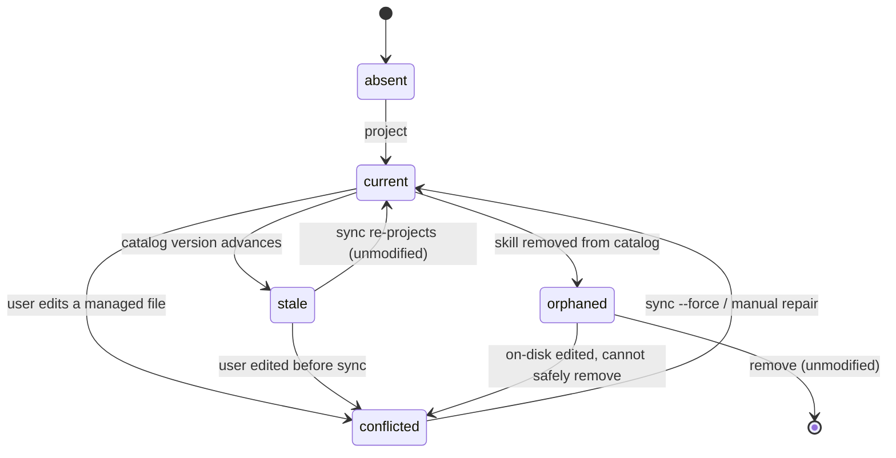

# RFC: SPEED Skill System

> See [speed-skill-system-prd.md](../product/speed-skill-system-prd.md) for product context.
> Feature note: [02-skill-system.md](../product/define-module/02-skill-system.md).
> Reference architecture (local, read-only): `../forge-foundry-primitives/forge_sync/`.

This RFC specifies the technical design for a SPEED-native skill system: a canonical skill catalog, a lean Python projection engine, managed-file identity, `speed skills` commands, and the first `workbench-draft` package. It commits to four decisions taken during design: a SPEED-native projector (not a vendored copy of Forge Foundry), the existing `speed` CLI namespace (not a new `workbench` binary), Claude Code as the first projection surface with Codex following, and a plan/spec deliverable that stops before implementation.

The scope here is packaging, projection, and lifecycle. The interview behavior of `workbench-draft` itself is owned by [03-guided-authoring.md](../product/define-module/03-guided-authoring.md) and is not redefined here.

## Basic Example

A maintainer adds one canonical package under the SPEED install tree:

```text
skills/workbench-draft/
├── SKILL.md
└── references/
    ├── shared-interview-contract.md
    └── question-banks/{prd,design,rfc,eval}.yaml
```

`SKILL.md` carries YAML front matter plus an agent-neutral instruction body:

```markdown
---
name: workbench-draft
description: >
  Run a guided PRD/design/RFC/eval interview and draft the matching SPEED
  spec, then self-review it. Use when asked to "draft a spec" or "run the interview".
x-speed-managed: true
x-speed-catalog-version: 0.3.0
---

# workbench-draft
...ordered workflow, prerequisites, outputs, completion gates...
```

A user runs setup, and the catalog projects into every detected surface:

```console
$ speed init
...
✓ Skills projected: 1 skill → .claude/skills/ (claude_code)

$ speed skills status
catalog 0.3.0 · 1 skill
  claude_code   .claude/skills/   current
  codex         (not detected)    unsupported

$ speed skills sync          # idempotent; re-running is a no-op when current
✓ Nothing to do: 1 skill current on 1 surface
```

From that point, the user invokes `/workbench-draft` directly inside Claude Code. No SPEED runtime process mediates the interview; the projection is the entire delivery mechanism for direct invocation. The `speed draft prd <feature>` convenience wrapper (Phase 4) launches the configured agent with the same skill and pre-filled arguments.

## Data Model

Three artifacts define the system: the canonical package on disk, the emitted projection, and the manifest that ties them together.

### Canonical package (source of truth)

Lives at `${SPEED_DIR}/skills/<skill-name>/`, alongside `templates/` and `agents/`. One directory per skill; the directory name is the skill name.

| Path | Required | Purpose |
|---|---|---|
| `SKILL.md` | yes | Front matter (`name`, `description`) + instruction body. `name` must equal the directory name. |
| `references/` | no | Material read at runtime: question banks, contracts, policies. |
| `scripts/` | no | Deterministic helpers the skill may call. Not a hidden second workflow. |
| `assets/` | no | Static templates or inputs copied or read by the skill. |

The catalog version is the SPEED release version, read from the existing version source (`speed --version` / install metadata). There is no per-skill version and no project-level skill selection file.

### Projection (generated, disposable)

For Claude Code, the projection is a mirror of the canonical package at `${PROJECT_ROOT}/.claude/skills/<skill-name>/`, with two differences from the source:

1. Front matter is normalized to the surface's expected keys, and SPEED provenance keys (`x-speed-managed: true`, `x-speed-catalog-version: <v>`, `x-speed-source: <skill-name>`) are injected.
2. Relative references (`references/…`) are preserved verbatim so the same body resolves on any surface.

Projection is deterministic: identical catalog input plus identical surface produces byte-identical output, so an unchanged sync writes nothing.

### Manifest (managed-file identity)

Stored at `${PROJECT_ROOT}/.speed/skills/manifest.json`. This is the record that lets sync tell SPEED-managed bytes from user edits. It is the single source for state classification.

```json
{
  "catalog_version": "0.3.0",
  "surfaces": {
    "claude_code": {
      "root": ".claude/skills",
      "skills": {
        "workbench-draft": {
          "source_hash": "sha256:…",
          "files": {
            "SKILL.md": "sha256:…",
            "references/shared-interview-contract.md": "sha256:…"
          },
          "projected_at_version": "0.3.0"
        }
      }
    }
  }
}
```

- `source_hash`: hash of the canonical package inputs, so a catalog change is detectable without diffing every file.
- `files.<relpath>`: hash of each emitted file *as SPEED wrote it*. On sync, the on-disk hash is recomputed and compared: equal means SPEED-managed and safe to update or remove; different means the user edited it and it must be preserved.
- The manifest lives under `.speed/` and is git-ignored alongside other runtime state (it describes a specific checkout's projections, not shared design intent).

## State Machine

Each `(surface, skill)` pair resolves to exactly one state at sync/status time. The manifest plus the on-disk hashes drive the classification; nothing else does.

| State | Condition | Sync action |
|---|---|---|
| `absent` | In catalog, no projection on disk, no manifest entry | Project it. |
| `current` | On disk, all file hashes match manifest, catalog version matches | No write. |
| `stale` | Catalog version advanced and every on-disk file still matches the *old* manifest hash (unmodified) | Re-project and update manifest. |
| `conflicted` | Any on-disk managed file's hash differs from its manifest hash | Preserve on-disk content; report; require `--force` or manual repair. |
| `orphaned` | Projection + manifest entry exist, skill no longer in catalog | Remove only if every file still matches manifest; else downgrade to `conflicted`. |
| `unsupported` | Surface not detected in the project (no `.claude/` etc.) | Skip; report as informational. |



Impossible/blocked transitions worth stating: `conflicted → current` never happens silently. It requires an explicit user action (`--force` or deleting the local copy), because silent overwrite is the exact failure the managed-file identity exists to prevent.

## API Surface

### CLI (bash dispatch → Python module)

Two new cases in the `speed` dispatch (`speed` case block) sourcing a new `lib/cmd/skills.sh`:

| Command | Behavior | Exit codes |
|---|---|---|
| `speed skills sync [--surface <id>] [--force] [--json]` | Converge every detected surface to the catalog. `--force` overwrites conflicted files. | `0` converged; `2` conflicts remain (no `--force`); `3` config/catalog error |
| `speed skills status [--json]` | Print catalog version, skill count, and per-surface state table. Read-only. | `0` all current; `1` drift/conflict present; `3` config error |
| `speed skills doctor [--json]` | Diagnose each non-`current` state and print exactly one usable repair command per problem. | `0` healthy; `1` issues found |
| `speed init` | Existing flow gains a step that calls `skills sync` for detected surfaces (non-fatal on partial failure). | unchanged |
| `speed draft <type> <feature>` *(Phase 4)* | Resolve `workbench-draft`, verify projection is `current`, launch the configured agent with type/feature pre-filled. | `0` launched; `3` skill missing/stale |

`skills.sh` is a thin wrapper. It resolves the Python interpreter with the established fallback chain (`SPEED_PYTHON` → `${SPEED_DIR}/.venv/bin/python3` → `${PROJECT_ROOT}/.venv/bin/python3` → `python3`, mirroring `context_bridge.sh`) and invokes `PYTHONPATH="${SPEED_DIR}" <py> -m lib.skills <subcommand> --project-root "${PROJECT_ROOT}" [flags]`.

### Python module (`lib/skills/`)

The engine is a small package. Each unit has one job and a typed boundary, so it can be tested without the others.

| Module | Responsibility | Key signature |
|---|---|---|
| `catalog.py` | Discover and load canonical packages from `${SPEED_DIR}/skills/` | `load_catalog(speed_dir) -> Catalog` |
| `validate.py` | Enforce the package contract | `validate_package(pkg) -> list[Violation]` |
| `targets.py` | Surface → destination + detection rules | `detect_surfaces(project_root) -> list[Surface]`, `dest_dir(surface, skill) -> Path` |
| `project.py` | Render one canonical package to one surface (pure, deterministic) | `render(pkg, surface) -> dict[relpath, bytes]` |
| `manifest.py` | Read/write manifest, hash files, classify state | `classify(pkg, surface, disk, manifest) -> State` |
| `sync.py` | Orchestrate detect → classify → apply → rewrite manifest | `sync(project_root, speed_dir, *, force, surface) -> SyncReport` |
| `__main__.py` | argparse CLI producing text or `--json` | `main(argv) -> int` |

`render` returns bytes in memory and never touches disk; `sync` is the only writer. That split keeps projection logic pure and trivially unit-testable, and it makes idempotency a property of `render` rather than of filesystem side effects.

## Validation Rules

Package validation runs at release time (catalog build) and defensively at load time. Every rule below maps to a fixture in `tests/skills/`.

| Field / condition | Constraint | On violation |
|---|---|---|
| `SKILL.md` presence | Must exist in each skill dir | reject package, name the dir |
| Front-matter `name` | Non-empty, `^[a-z0-9][a-z0-9-]*$`, equals directory name | reject, name expected vs actual |
| Front-matter `description` | Non-empty string | reject |
| Skill name uniqueness | Unique across the catalog | reject, name the collision |
| Relative references | Every path referenced in the body resolves inside the package | reject, name the missing path |
| Path safety | No absolute paths, no `..` escaping the package root, no symlinks leaving it | reject, name the offending path |
| Scripts | Must be files inside `scripts/`; not referenced as a full alternate workflow | reject |
| Projection completeness | Rendering drops no required file and preserves the body meaning | reject at build |
| Idempotency | Second `render` of the same input equals the first | fail build |

## Testing

### Acceptance Criteria

- A fresh `speed init` in a project containing `.claude/` produces `.claude/skills/workbench-draft/SKILL.md` with injected provenance front matter and every referenced file present.
- `speed skills status` reports `catalog <version> · N skills` and one row per detected surface whose state is one of those defined in the State Machine (`absent`, `current`, `stale`, `conflicted`, `orphaned`, `unsupported`).
- Running `speed skills sync` twice with no catalog change makes zero file writes on the second run (verified by mtime/hash), proving idempotency.
- Editing a projected `SKILL.md` and running `sync` leaves the edit intact and reports `conflicted`; the file is only overwritten under `--force`.
- Advancing the catalog version and running `sync` updates an unmodified projection and rewrites the manifest to the new version.
- Removing a skill from the catalog and running `sync` deletes an unmodified projection and leaves an edited one in place as `conflicted`.
- `speed skills doctor` prints exactly one runnable repair command for each non-`current` surface/skill.
- A package with a missing reference, an unsafe path, or a name/dir mismatch fails validation with the exact package, file, and reason, and never projects.
- Directly invoking `/workbench-draft` in Claude Code after a successful sync runs the interview with no additional SPEED process.

### Risks and Coverage

| Risk | Severity | Test Approach |
|---|---|---|
| Sync overwrites a user-edited projection | High | Unit: hash-mismatch classifies `conflicted`; integration: edit-then-sync preserves bytes |
| Interrupted sync leaves a half-written surface | High | Integration: kill between writes, re-run, assert convergence with no duplicates |
| Non-deterministic render breaks idempotency | High | Unit: `render(x) == render(x)`; golden-file snapshot per surface |
| Orphan removal recursively deletes a user directory | High | Unit: orphan with any modified file downgrades to `conflicted`, never deletes |
| Path traversal in a reference escapes the project | High | Unit: `../` and absolute paths rejected by `validate_package` |
| Provenance keys collide with a surface's reserved front matter | Medium | Contract test: Claude Code loads the projected SKILL.md and discovers the skill |
| Manifest and disk disagree after manual `.speed` deletion | Medium | Integration: delete manifest, `sync` re-derives state from disk hashes safely |

### Test Plan

**Unit tests** cover, in `tests/skills/`: the `validate.py` rule table (one case per row), `project.render` determinism and provenance injection, `manifest.classify` for all six states, `targets.detect_surfaces` for present/absent `.claude/`. New modules ship with tests; there is no prior coverage to regress.

**Integration tests** drive `lib.skills.__main__` end to end against a temp project: init→sync→status happy path, edit→conflict→force, version-bump→stale→update, remove→orphan→delete, and an interrupted-sync convergence case.

**End-to-end tests** run `speed init` and `speed skills sync` as the real bash commands, invoked as the real bash commands against a fixture repo, asserting the on-disk `.claude/skills/` tree and the status table. The `/workbench-draft` direct-invocation behavior is asserted at the contract level (skill discoverable, body/references intact), not by scripting Claude itself; model wording is not asserted.

**Visual/UI tests:** none. A read-only dashboard readiness view is out of scope for this RFC.

### Edge Cases

- Project has no supported surface (`.claude/` absent): `sync` succeeds, status shows `unsupported`, exit `0`.
- `.speed/skills/manifest.json` missing but projections present: classify from disk hashes; unmodified files adopt as `current`, modified as `conflicted` (never blind-overwrite).
- Skill renamed in catalog: old name orphaned (removed if unmodified), new name absent→projected; Phase 2 adds a forwarding note.
- Two skills reference the same relative filename: isolated per package, no collision.
- Read-only project directory: `sync` fails with a clear filesystem error and exit `3`, writing nothing.

### Out of Scope

- Codex `.agents/skills/` projection (Phase 3; adapter only, no workflow change).
- `speed draft` agent-launch invocation (Phase 4).
- Per-skill enable/disable and per-skill model selection (product decision SK-D2/SK-D3: never).
- Third-party/marketplace/user-authored skills and user-global installation.
- Dashboard readiness surface.

## Security & Controls

- **No new permissions.** A projected skill inherits the invoking agent surface's model, project permissions, and approval controls. Installing a skill grants nothing; there is no skill-specific model or credential.
- **No path escape.** Validation rejects absolute paths, `..` traversal, and symlinks leaving the package, so a catalog package cannot write or read outside its own tree or the target surface directory.
- **Bounded writes.** `sync` writes only under the detected surface roots (`.claude/skills/…`) and `.speed/skills/manifest.json`. It never touches unrelated agent configuration (`.claude/settings.json`, existing `.claude/agents/`, user skills it did not create).
- **Separation of generation and approval.** A skill run cannot ratify its own output; review/approval stays in the existing Define ownership flow. This RFC adds no bypass.
- **Helper honesty.** A helper-backed step that fails must surface the failure; the agent must not fabricate the missing result. Enforced by returning explicit error status from `scripts/`.
- **Input trust.** Canonical packages ship inside the SPEED release and are validated at build; the engine treats them as trusted-but-verified and still runs path-safety checks at load.

## Key Decisions

| Decision | Choice | Alternatives Considered | Rationale |
|---|---|---|---|
| Projection engine | SPEED-native lean Python module in `lib/skills/` | Vendor/trim Forge Foundry `forge_sync`; implement in bash | Forge carries 5 harnesses, aliases, CI, and usage hooks SPEED does not need; a ~7-module native package fits SPEED's `lib/*.py` style and is fully owned. Bash cannot track per-file hashes and idempotency cleanly. |
| CLI namespace | Extend `speed` (`speed skills …`, later `speed draft`) | Introduce a `workbench` top-level binary | The shipped CLI is `speed` with a case dispatch; adding cases is one-line integration. `workbench` remains product branding for docs, not a second binary to build and install. |
| First surface | Claude Code only, Codex as a follow-up phase | Both surfaces in the first slice | One adapter proves the contract end to end and unlocks direct `/workbench-draft` invocation immediately; `targets.py` isolates the second adapter to an additive change. |
| Managed-file identity | Manifest of per-file SHA-256 hashes + injected provenance front matter | Provenance marker only; timestamp comparison; git status | Content hashing is the only reliable way to distinguish SPEED-written bytes from user edits across interrupted syncs and manual deletion. Front-matter keys add human-readable provenance on top. |
| Manifest location | `.speed/skills/manifest.json` (git-ignored) | Commit the manifest; store under `.claude/` | The manifest describes one checkout's generated state, not shared intent, matching how `.speed/` runtime state is already treated. |
| Render purity | `render` returns bytes; `sync` is the sole writer | Write directly during render | Pure render makes idempotency and golden-file tests trivial and confines all filesystem risk to one reviewed function. |
| Direct invocation first | Ship projection before any `speed draft` launcher | Build the CLI launcher alongside | Direct `/workbench-draft` needs zero runtime code once projected, so the projection alone delivers user value; the launcher is pure convenience and can follow. |

## Drawbacks

- A SPEED-native engine is code SPEED now owns and tests, where vendoring Forge would have reused proven conflict logic. The mitigation is scope: seven small modules, each independently testable, modeled on a design already validated next door.
- Content hashing adds a manifest that can drift from disk if a user hand-deletes `.speed/`. The engine recovers by re-deriving state from disk, but the first post-deletion sync is more conservative (treats ambiguous files as conflicts).
- Provenance front-matter keys (`x-speed-*`) are visible in the projected `SKILL.md`. They are inert to the host agent but add three lines a curious user will see.
- Injecting front matter means the projected `SKILL.md` is not byte-identical to the canonical one, so "diff the copy against source" is not a valid conflict check; only the manifest hash is authoritative. This is called out so a future maintainer does not add a naive diff check.
- Claude-first means Codex users see `unsupported` until Phase 3. Status reports this honestly rather than silently doing nothing.

## Migration Strategy

There is no existing skill data to migrate; this is additive. Rollout is by phase, each independently shippable:

| Phase | Delivers | Unlocks |
|---|---|---|
| 1 | Catalog format, `validate`, Claude Code `project`/`render`, `manifest`, `sync`+`status`, `init` integration, `workbench-draft` package | Direct `/workbench-draft` in Claude Code |
| 2 | `doctor`, conflict/orphan/rename hardening, rollback-on-downgrade behavior | Safe upgrades and repair |
| 3 | Codex `targets`/adapter | Cross-surface parity |
| 4 | `speed draft` agent-launch routing + workflow provenance record | Command entry point + auditability (SK-S9) |

Rollback: because the catalog version equals the SPEED release, downgrading SPEED and running `speed skills sync` re-projects the previous release's catalog. Unmodified projections update down; conflicted ones are preserved. No data loss path exists because the canonical source is the release, not the project.

Feature-flag posture: `init` calling `sync` is non-fatal. If projection fails or no surface is detected, `init` completes and prints the repair path, so the skill system cannot break existing setup.

## File Impact

New:

- `skills/workbench-draft/SKILL.md` + `references/…`: first canonical package (body content owned by 03-guided-authoring).
- `lib/skills/{__init__,__main__,catalog,validate,targets,project,manifest,sync}.py`: the engine.
- `lib/cmd/skills.sh`: bash wrapper resolving the interpreter and dispatching `sync`/`status`/`doctor`.
- `tests/skills/…`: package fixtures + unit/integration suites.

Modified:

- `speed`: add `skills)` and (Phase 4) `draft)` cases to the dispatch block, and `source lib/cmd/skills.sh`.
- `lib/cmd/project.sh`: add a projection step to `cmd_init` after the existing numbered steps, calling `speed skills sync` for detected surfaces (non-fatal).
- `.speed/.gitignore` (or root `.gitignore` SPEED block): ignore `.speed/skills/`.

Unchanged and explicitly not touched: `.claude/settings.json`, existing `.claude/agents/`, `speed.toml` (no `[skills]` section is added), and any user-authored skill directories.

## Dependencies

- Python 3.12 with the project `.venv` (already required by `context_bridge.sh`, dashboard backend, and `toml.py`). Standard library only: `hashlib`, `json`, `pathlib`, `argparse`, plus a YAML reader. The repo already parses YAML/TOML in Python; the front-matter parser reuses that path rather than adding a new dependency.
- The SPEED version source, to stamp `catalog_version`.
- The `workbench-draft` interview contract and question banks from [03-guided-authoring.md](../product/define-module/03-guided-authoring.md). Phase 1 can ship the engine with a minimal placeholder `SKILL.md`; the full body lands when guided authoring is ready.

## Unresolved Questions

| Question | Blocks | Proposed path |
|---|---|---|
| YAML front-matter parsing: reuse an existing dependency or add `pyyaml`? | `project.render`, `validate` | Audit current `requirements.txt`/imports; front matter is simple key/value, so a minimal hand parser is viable if no YAML lib is already present. Resolve before Phase 1 coding. |
| Where does workflow provenance (catalog version + skill name) get recorded for a Define run? | SK-S9, Phase 4 | Reuse the existing ceremony/feature record under `.speed/`; confirm the schema with the Define orchestration owner. |
| Should `speed init` sync automatically on every run or only when a surface is newly detected? | `init` noise | Default to sync-if-detected and idempotent, so re-running `init` is quiet; revisit if it proves noisy. |
| When more than one supported agent surface is present, which hosts a `speed draft` CLI launch? | Phase 4 only | Add a single repository-level agent preference (reuse `speed.toml [agent].provider`); no per-skill model config. |
